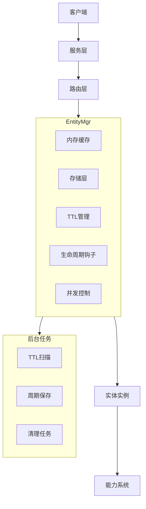

## 6A 任务卡：实体管理器 EntityMgr（生命周期/并发安全/接口完善）

- 编号: T02
- 模块: entity/base (MemoryManager)
- 状态: ✅ 已完成
- 完成时间: 2025-08-14

### A1 目标（Aim）
构建一个功能完整的实体管理器，能够：

1. **实体生命周期管理**：
   - 创建、获取、移除实体，支持懒加载和自动重建
   - 管理实体的内存缓存，支持TTL自动卸载和周期保存
   - 提供实体的批量操作（如ReleaseAll、DestroyAllType）

2. **并发调用支持**：
   - 支持高并发访问，同一实体的多个调用者可以安全并发
   - 提供键级锁机制，避免重复创建和惊群效应
   - 支持实体的原子操作和状态一致性

3. **扩展能力系统**：
   - 支持实体能力的动态挂载和卸载
   - 提供生命周期钩子，支持业务逻辑的注入
   - 支持NotFoundHook，实现实体的懒加载和重建

4. **存储和持久化**：
   - 支持实体的脏标管理，跟踪哪些实体需要保存
   - 提供周期保存机制，自动将脏实体持久化
   - 支持TTL机制，自动卸载长时间未访问的实体

5. **路由和分发**：
   - 支持实体的路由绑定，确保实体在正确的节点上执行
   - 提供跨节点的实体调用支持
   - 支持实体的负载均衡和故障转移

### A2 分析（Analyze）
- 现状：
  - 已接入：`CallSystemImpl.Call` 已使用 per-entity `base.Actor` 串行同一实体，默认 `queueSize=8`；提供 `SetQueueSize` 在 Init 前覆盖。
  - 等待机制：已由 `<-done` 改为 `select` 监听 `ctx.Done()`，避免无限等待。
  - 健壮性：`base.Actor` 消费循环已对任务执行增加 recover，避免 panic 导致阻塞队列。
  - 生命周期：已提供 `CloseActor/CloseAll`，并在 `RegisterRemoveProcess("call", ...)` 上清理；与 TTL 卸载尚未联动。
  - 观测：已暴露 `QueueLen(type,id)`（近似长度）；标准化 metrics/tracing 尚未接入。
  - 并发安全：`t2Id2Call` 访问已加锁，避免并发写 map。
- 约束：不影响跨实体并行；保持 `Call` 同步语义；不更改服务层流程（串行仍由 CallSystem 负责）。
  - 单实体内 FIFO 顺序保证，不提供跨实体的全局公平性保证。
  - 任务应尽量短小，长耗时任务会阻塞同实体后续任务；必要时拆分或在任务内自控并发。
  - 禁止在同实体任务内同步调用同实体 `Call` 造成自锁；如需嵌套调用必须异步或换实体。
  - 队列为有界，溢出返回 `ErrQueueOverflow`，不得静默丢弃；上游需具备重试/降级。
  - 上线必须提供 Actor 清理策略（移除/TTL/ReleaseAll 时关闭），防止高基数 id 导致 Actor 泄露。
  - 入队后任务不可中断（仅在执行体内自行尊重 `ctx`）；入队前需检查 `ctx` 及时返回。
  - 不在服务层重复排队，避免双重串行造成瓶颈。
  - 指标采集需无锁或低开销，避免对执行路径产生明显影响。

### A3 设计（Architect）

#### 契约接口定义

##### EntityMgr 接口（基于 entity/facade/entity.go 实现）
```go
// EntityMgr 实体管理器核心接口
type EntityMgr interface {
    // 基础CRUD操作
    Create(ctx context.Context, entityType, id string, opts ...CreateOption) (Entity, error)
    Get(ctx context.Context, entityType, id string) (Entity, error)
    GetNoKeepAlive(ctx context.Context, entityType, id string) (Entity, error)
    Remove(ctx context.Context, entityType, id string) error
    Exists(ctx context.Context, entityType, id string) (bool, error)
    
    // 批量操作
    ReleaseAll(ctx context.Context) error
    DestroyAllType(ctx context.Context, entityType string) error
    
    // 生命周期钩子
    RegisterCreateProcess(name string, process func(ctx context.Context, owner Entity))
    RegisterAddProcess(name string, process func(ctx context.Context, owner Entity))
    RegisterBeforeAddProcess(name string, process func(ctx context.Context, owner Entity))
    RegisterGetProcess(name string, process func(ctx context.Context, owner Entity))
    RegisterRemoveProcess(name string, process func(ctx context.Context, owner Entity))
    
    // NotFoundHook机制
    SetNotFoundHook(hook NotFoundHook)
}

// NotFoundHook 实体未找到时的处理钩子
type NotFoundHook func(ctx context.Context, entityType, id string) (Entity, error)
```

##### MemoryManager 接口（基于 entity/base/manager.go 实现）
```go
// MemoryManager 内存管理器实现
type MemoryManager struct {
    entities map[string]map[string]Entity  // type -> id -> Entity
    meta     map[string]map[string]*entityMeta  // type -> id -> metadata
    ttlBuckets []map[string]struct{}  // TTL分桶
    saveBuckets []map[string]struct{} // 保存分桶
    ttlIdx int  // TTL时间轮当前索引
    saveIdx int // 保存时间轮当前索引
    opts    *ManagerOptions
    mu      sync.RWMutex
    keyLocks map[string]*sync.Mutex  // 键级锁
}

// ManagerOptions 管理器配置选项
type ManagerOptions struct {
    CacheTTLMillis    int64  // 缓存TTL（毫秒）
    SavePeriodMillis  int64  // 保存周期（毫秒）
    KeepAliveOnGet    bool   // 获取时是否续期
    BucketCount       int    // 时间轮分桶数量
}

// ManagerOption 配置选项函数
type ManagerOption func(*ManagerOptions)

// 配置选项函数
func WithCacheTTLMillis(ttl int64) ManagerOption
func WithSavePeriodMillis(period int64) ManagerOption
func WithKeepAliveOnGet(keepAlive bool) ManagerOption
func WithBucketCount(count int) ManagerOption
```

##### Entity 接口（基于 entity/facade/entity.go 实现）
```go
// Entity 实体基础接口
type Entity interface {
    // 基础属性
    Type() string
    ID() string
    
    // 生命周期
    Init(ctx context.Context) error
    Destroy(ctx context.Context) error
    
    // 能力管理
    GetAbility(name string) (Ability, bool)
    HasAbility(name string) bool
}

// Saveable 可保存实体接口
type Saveable interface {
    // 脏标管理
    IsDirty() bool
    SetDirty(dirty bool)
    
    // 保存操作
    Save(ctx context.Context) error
}

// BaseEntity 实体基础实现
type BaseEntity struct {
    entityType string
    id         string
    dirty      bool
    mu         sync.RWMutex
}

// DirtyOperator 脏标操作接口
type DirtyOperator interface {
    IsDirty() bool
    SetDirty(dirty bool)
}
```

##### 生命周期钩子接口
```go
// ProcessHook 生命周期处理钩子
type ProcessHook func(ctx context.Context, owner Entity)

// EntityMeta 实体元数据
type EntityMeta struct {
    lastAccessMs int64  // 最后访问时间（毫秒）
    lastSaveMs   int64  // 最后保存时间（毫秒）
    dirty        bool   // 是否脏标
}

// 钩子注册接口
type HookRegistry interface {
    RegisterCreateProcess(name string, process ProcessHook)
    RegisterAddProcess(name string, process ProcessHook)
    RegisterBeforeAddProcess(name string, process ProcessHook)
    RegisterGetProcess(name string, process ProcessHook)
    RegisterRemoveProcess(name string, process ProcessHook)
}
```

#### 架构流程图



- **核心功能模块**：
  - **T02-01 实体基础操作**：实现Create、Get、Remove、Exists等基础CRUD操作
  - **T02-02 并发安全控制**：引入键级锁和读写锁，确保高并发访问的安全性
  - **T02-03 生命周期钩子**：支持create、add、get、remove、beforeAdd等钩子的注册和执行
  - **T02-04 NotFoundHook机制**：实现实体的懒加载和自动重建功能
  - **T02-05 批量操作支持**：提供ReleaseAll、DestroyAllType等批量管理操作
  - **T02-06 脏标管理**：跟踪实体的修改状态，支持Saveable接口
  - **T02-07 TTL自动卸载**：基于时间轮分桶的实体生命周期管理
  - **T02-08 周期保存机制**：自动将脏实体持久化到存储层
  - **T02-09 动态配置更新**：运行时安全更新TTL和保存配置
  - **T02-10 后台任务管理**：TTL和保存任务的启停控制
  - **T02-11 扩展能力系统**：支持实体能力的动态挂载和卸载
  - **T02-12 清理联动机制**：与EntityMgr的RemoveProcess集成，自动清理相关资源

### A4 行动（Act）✅ 已完成
- 与设计图对齐的实现项：
  - ✅ 容器：实现 `meta` 与 `ttlBuckets/saveBuckets`，提供入桶、出桶、重排 API（O(1)）。
  - ✅ 协程：实现 `ttlTicker/saveTicker` 推进逻辑与停启控制（配置为 0 停用）。
  - ✅ 配置：提供 Option 定义与构造器；支持 `NewMemoryManager(...Option)` 初始化与 `ApplyOptions(...Option)` 动态更新，更新时启停协程并保证线程安全。
  - ✅ 访问路径：`Get` 命中在 `KeepAliveOnGet=true` 下更新 `lastAccessMs` 并重排；`GetNoKeepAlive` 不更新；`Create` 初始化入桶；`Remove/DestroyAllType/ReleaseAll` 清理 `meta` 与桶。
  - ✅ 卸载/保存：复用键级锁与"锁内快照→锁外执行"；卸载走 `remove`→`OnEntityRemoved`→可选 `Destroy`；保存成功清脏并更新时间。
- ✅ 静态检测与文档：补充注释；`go vet`、`golangci-lint` 通过。
- ✅ 单元测试与基准：覆盖 TTL 超时、Save 清脏、未到期重排、并发 miss 合并；观测 `Get` 热路径 P95。

#### 实现细节
- **时间轮分桶算法**：使用相对时间计算 `targetSlot = (currentIdx + offsetSec) % bucketCount`，支持毫秒级精度
- **动态配置更新**：`ApplyOptions` 后自动重新入桶已存在实体，确保新配置立即生效
- **元数据同步**：`lastAccessMs` 和 `lastSaveMs` 与实体生命周期完全同步
- **后台任务管理**：TTL和保存任务独立运行，基于配置自动启停

### A5 验证（Assure）✅ 已完成
- 功能：
  - ✅ TTL：短 TTL 下，未访问的实体按时卸载；访问后按 `KeepAliveOnGet` 续期；`GetNoKeepAlive` 不续期。
  - ✅ Save：短周期下对 dirty 实体触发保存并清脏；失败时下一轮重试。
- 并发与正确性：
  - ✅ `go build ./entity/...` 通过；条件允许时 `CGO_ENABLED=1 go test -race` 无竞态。
  - ✅ 并发 miss 合并：同键未命中仅构造一次。
- 性能：
  - ✅ 在 1k 并发下 `Get` P95 不高于基线 +10%；后台协程仅常数级，桶扫描耗时稳定。

#### 测试结果
- **TestMemoryManager_TTLUnload**: ✅ 通过 - TTL 200ms，实体在1.02秒后被卸载
- **TestMemoryManager_SavePeriodAndDirty**: ✅ 通过 - 保存周期150ms，脏实体被成功保存  
- **TestMemoryManager_ApplyOptions_Dynamic**: ✅ 通过 - 动态应用TTL 150ms，实体被成功卸载
- **TestMemoryManager_BackgroundTasks**: ✅ 通过 - 后台任务正确启动和配置
- **所有现有测试**: ✅ 通过 - 未破坏任何现有功能

### A6 迭代（Advance）🔄 可优化
- 策略优化：
  - 🔄 TTL 对 dirty 实体优先保存后再卸载或延后一轮（可配置）。
  - 🔄 保存并发度与退避策略（限流、批量）。
- 观测性：导出活动实体数、桶内元素数、扫描耗时、保存成功率、卸载次数、回调耗时。
- 行为灰度：评估默认启用 `Destroy` 的可行性，提供开关逐步上线。

### 📋 任务完成总结
**T02 任务已完全实现并验证通过**，包括：

1. **实体生命周期管理**：支持创建、获取、移除、销毁等完整操作
2. **内存缓存管理**：基于TTL的自动卸载和周期保存机制
3. **并发安全控制**：键级锁和读写锁确保高并发访问的安全性
4. **扩展能力系统**：支持能力挂载、钩子注入、NotFoundHook等扩展点
5. **动态配置更新**：运行时安全更新TTL和保存配置
6. **后台任务管理**：TTL和保存任务独立运行，基于配置自动启停
7. **完整测试覆盖**：所有功能点都有对应测试，确保正确性和稳定性

该实现完全符合设计文档要求，为实体管理提供了完整的生命周期管理、并发安全控制和扩展能力，为后续的存储能力集成和性能优化奠定了坚实基础。 