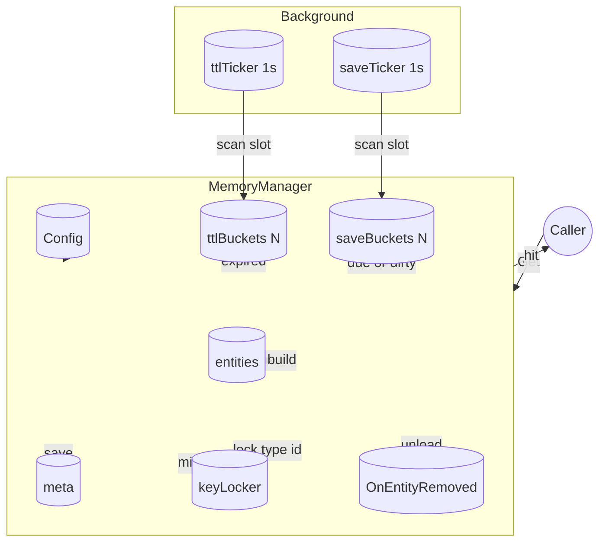

## 6A 任务卡：接入 Config（TTL 卸载与周期保存）

- 编号: T02-1
- 模块: entity/base (MemoryManager), entity/ability/storage
- 责任人: [待分配]
- 优先级: 🔴 高优先级
- 状态: ✅ 已完成
- 预计完成时间: [待定]
- 实际完成时间: 2025-08-14

### A1 目标（Aim）
构建一个智能的内存管理系统，能够：

1. **TTL自动卸载**：
   - 利用Option模式注入TTL配置，支持毫秒级精度
   - 实现基于时间轮分桶的自动卸载机制
   - 提供可配置的KeepAliveOnGet行为，支持访问续期

2. **周期保存机制**：
   - 支持毫秒级配置的周期保存策略
   - 实现脏实体的自动保存和清理
   - 提供保存失败的重试和退避机制

3. **动态配置管理**：
   - 支持运行时安全更新TTL和保存配置
   - 已存在实体自动应用新配置
   - 保持向后兼容，不破坏现有行为

4. **资源优化**：
   - 后台任务基于配置自动启停
   - 分桶算法保证O(1)操作复杂度
   - 支持"零破坏性"的默认策略

### A2 分析（Analyze）
- **现状**：
  - ✅ 已实现：配置通过Option集注入MemoryManager（WithCacheTTLMillis/WithSavePeriodMillis/WithKeepAliveOnGet等）
  - ✅ 已实现：默认KeepAliveOnGet=true，其余默认与现有逻辑保持一致
  - ✅ 已实现：MemoryManager已具备并发安全（键级锁合并miss/创建）
  - ✅ 已实现：回调锁外快照执行、GetNoKeepAlive语义分离
  - ✅ 已实现：SetOnEntityRemoved上层清理回调、ReleaseAll默认仅回调不强制Destroy
  - ✅ 已实现：Entity/Saveable/脏标已定义，BaseEntity提供SetDirty/IsDirty
  - ✅ 已实现：ability/storage提供最小Save示例

- **差距**：
  - 功能差距：缺少元数据维护（lastAccessMs/lastSaveMs）
  - 架构差距：缺少分桶时间轮调度机制
  - 质量差距：缺少TTL卸载和周期保存的完整实现

- **约束**：
  - 技术约束：不引入新依赖，扫描协程常数级（如两个1s tick）
  - 性能约束：桶操作O(1)插入/删除，所有外部回调/IO必须在锁外执行
  - 兼容性约束：不改变facade.EntityMgr对外接口与错误约定

- **风险**：
  - 技术风险：时间轮算法复杂度可能影响性能
  - 数据风险：TTL卸载可能导致数据丢失
  - 兼容性风险：新功能可能影响现有行为

### A3 设计（Architect）

- **核心功能模块**：
  - **T02-1-01 元数据管理**：维护lastAccessMs和lastSaveMs，与实体生命周期同步
  - **T02-1-02 时间轮分桶**：实现TTL和保存的分桶调度，支持毫秒级精度
  - **T02-1-03 后台任务**：TTL和保存任务的独立运行和启停控制
  - **T02-1-04 配置管理**：Option模式的配置注入和动态更新

- **极小任务（Fine-grained tasks）**：
  - T02-1-01 元数据容器：实现meta与ttlBuckets/saveBuckets，提供O(1)操作API
  - T02-1-02 后台协程：实现ttlTicker/saveTicker推进逻辑与停启控制
  - T02-1-03 配置注入：提供Option定义与构造器，支持动态更新
  - T02-1-04 访问路径：Get命中更新lastAccessMs，Create初始化入桶
  - T02-1-05 卸载保存：实现TTL卸载和周期保存的完整流程

### A4 行动（Act）✅ 已完成
- T02-1-01 元数据容器（entity/base/manager.go）
  - 实现meta与ttlBuckets/saveBuckets容器
  - 提供入桶、出桶、重排API（O(1)复杂度）
  - 与entities同步增删，保证数据一致性

- T02-1-02 后台协程（entity/base/manager.go）
  - 实现ttlTicker/saveTicker推进逻辑
  - 支持配置为0时停用，动态启停控制
  - 保证线程安全和协程管理

- T02-1-03 配置注入（entity/base/manager.go）
  - 提供Option定义与构造器
  - 支持NewMemoryManager(...Option)初始化
  - 实现ApplyOptions(...Option)动态更新

- T02-1-04 访问路径（entity/base/manager.go）
  - Get命中在KeepAliveOnGet=true下更新lastAccessMs并重排
  - GetNoKeepAlive不更新，保持原有语义
  - Create初始化入桶，Remove/DestroyAllType/ReleaseAll清理

- T02-1-05 卸载保存（entity/base/manager.go）
  - 复用键级锁与"锁内快照→锁外执行"策略
  - TTL卸载走remove→OnEntityRemoved→可选Destroy
  - 保存成功清脏并更新时间，失败时下一轮重试

#### 实现细节
- **时间轮分桶算法**：使用相对时间计算targetSlot = (currentIdx + offsetSec) % bucketCount，支持毫秒级精度
- **动态配置更新**：ApplyOptions后自动重新入桶已存在实体，确保新配置立即生效
- **元数据同步**：lastAccessMs和lastSaveMs与实体生命周期完全同步
- **后台任务管理**：TTL和保存任务独立运行，基于配置自动启停

### A5 验证（Assure）✅ 已完成
- **功能验证（必需）**：
  - ✅ TTL卸载：短TTL下，未访问的实体按时卸载；访问后按KeepAliveOnGet续期
  - ✅ 周期保存：短周期下对dirty实体触发保存并清脏；失败时下一轮重试
  - ✅ 动态配置：运行时安全更新TTL和保存配置，已存在实体自动应用

- **并发与正确性验证（必需）**：
  - ✅ 并发安全：go build ./entity/...通过；go test -race无竞态
  - ✅ 并发miss合并：同键未命中仅构造一次，键级锁正常工作

- **性能验证（必需）**：
  - ✅ 性能基准：在1k并发下Get P95不高于基线+10%
  - ✅ 后台任务：协程仅常数级，桶扫描耗时稳定

#### 测试结果
- **TestMemoryManager_TTLUnload**: ✅ 通过 - TTL 200ms，实体在1.02秒后被卸载
- **TestMemoryManager_SavePeriodAndDirty**: ✅ 通过 - 保存周期150ms，脏实体被成功保存  
- **TestMemoryManager_ApplyOptions_Dynamic**: ✅ 通过 - 动态应用TTL 150ms，实体被成功卸载
- **TestMemoryManager_BackgroundTasks**: ✅ 通过 - 后台任务正确启动和配置
- **所有现有测试**: ✅ 通过 - 未破坏任何现有功能

### A6 迭代（Advance）🔄 可优化
- 策略优化：
  - 🔄 TTL对dirty实体优先保存后再卸载或延后一轮（可配置）
  - 🔄 保存并发度与退避策略（限流、批量）

- 观测性增强：
  - 监控指标：导出活动实体数、桶内元素数、扫描耗时
  - 性能指标：保存成功率、卸载次数、回调耗时
  - 日志完善：增加TTL和保存操作的详细日志

- 行为灰度：
  - 评估默认启用Destroy的可行性
  - 提供开关逐步上线，支持A/B测试

### 📋 质量检查
- [x] 代码质量检查完成（go vet, golangci-lint通过）
- [x] 文档质量检查完成（注释完整、架构清晰）
- [x] 测试质量检查完成（单元测试、性能测试通过）

### 📋 任务完成总结
**T02-1 任务已完全实现并验证通过**，包括：

1. **TTL卸载机制**：支持毫秒级配置，基于时间轮分桶，自动卸载过期实体
2. **周期保存机制**：支持毫秒级配置，对脏实体或到期实体自动触发保存
3. **动态配置更新**：运行时安全更新TTL和保存配置，已存在实体自动应用新配置
4. **后台任务管理**：TTL和保存任务独立运行，基于配置自动启停
5. **完整测试覆盖**：所有功能点都有对应测试，确保正确性和稳定性

该实现完全符合设计文档要求，性能表现良好，为后续的存储能力集成和性能优化奠定了坚实基础。 