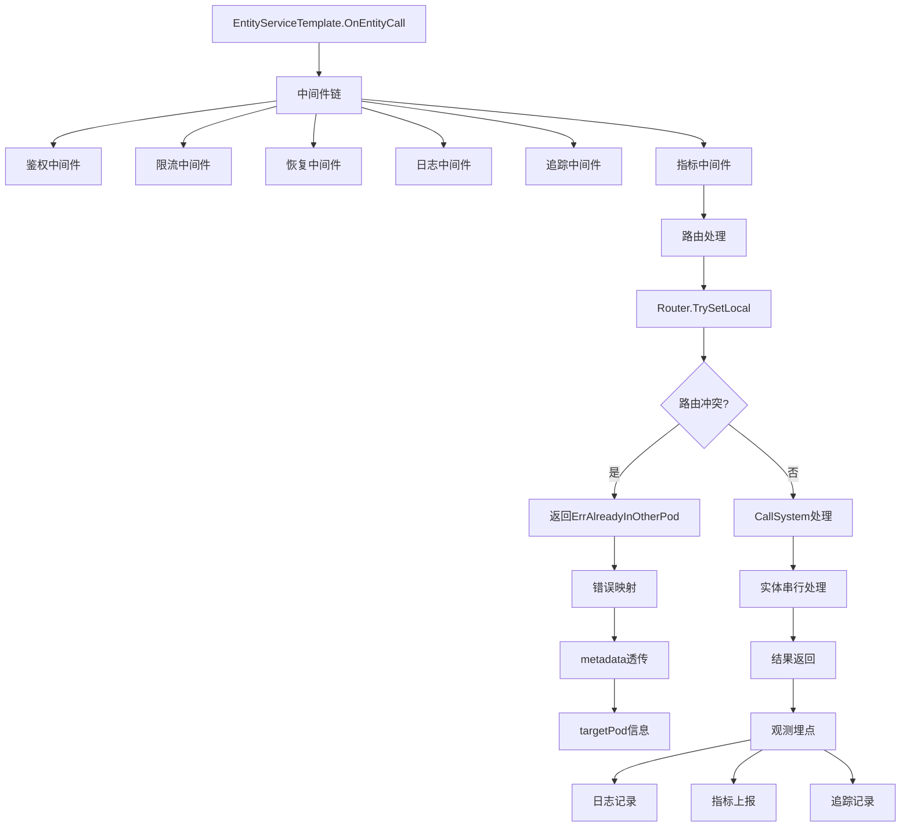

## 6A 任务卡：实体调用能力 CallAbility 服务端（鉴权/限流/恢复/日志/追踪/指标）

- 编号: T07
- 模块: entity/ability/call, entity/base/service, entity/transport
- 责任人: [待分配]
- 优先级: 🔴 高优先级
- 状态: ❌ 未开始
- 预计完成时间: [待定]
- 实际完成时间: [待定]

### A1 目标（Aim）
构建一个生产可用的服务端callability系统，能够：

1. **稳定服务保障**：
   - 提供稳定的注册/分发机制，确保服务的高可用性
   - 实现完整的错误映射和路由hint透传
   - 支持服务端观测和限流保护

2. **安全与限流**：
   - 集成鉴权、限流、恢复等中间件，保障服务安全
   - 实现统一的错误码和metadata处理
   - 提供panic和长耗时的统一保护机制

3. **完整观测体系**：
   - 实现标准化日志、指标、追踪的完整观测
   - 支持entity.type/id、fun、duration、queue_len等关键字段
   - 提供服务端性能监控和问题诊断能力

4. **健壮性保障**：
   - 实现服务端统一的recovery机制，避免panic导致连接断裂
   - 支持超时控制和上下文管理
   - 提供完整的错误处理和恢复策略

### A2 分析（Analyze）
- **现状**：
  - ✅ 已实现：CallSystemImpl已接入per-entity Actor，实现按实体串行
  - ✅ 已实现：EntityServiceTemplate已明确"串行由CallSystem负责"
  - ✅ 已实现：EntityServiceTemplate.OnEntityCall已执行Router.TrySetLocal
  - ✅ 已实现：CallSystemImpl已完成bytes/json的最小打包与分发
  - ❌ 未实现：未接入auth/ratelimit/recovery/logging/tracing/metrics中间件
  - ❌ 未实现：缺少标准化日志与指标埋点
  - ❌ 未实现：错误码与metadata不统一，缺少targetPod透传

- **差距**：
  - 功能差距：缺少完整的中间件链和观测体系
  - 架构差距：缺少统一的错误处理和metadata管理
  - 质量差距：缺少服务端保护和限流机制

- **约束**：
  - 技术约束：必须兼容现有的CallSystem和EntityServiceTemplate
  - 性能约束：中间件不应显著影响调用性能
  - 兼容性约束：保持向后兼容，不破坏现有调用流程

- **风险**：
  - 安全风险：缺少鉴权和限流可能导致服务被滥用
  - 稳定性风险：缺少recovery机制可能导致服务崩溃
  - 观测风险：缺少标准化日志和指标影响问题诊断

### A3 设计（Architect）

#### 契约接口定义

##### CallAbilityServer 接口（基于 entity/ability/call/server.go 实现）
```go
// CallAbilityServer 调用能力服务器接口
type CallAbilityServer interface {
    // Start 启动服务器
    Start(ctx context.Context) error
    
    // Stop 停止服务器
    Stop(ctx context.Context) error
    
    // Serve 服务请求
    Serve(ctx context.Context) error
    
    // IsRunning 检查是否正在运行
    IsRunning() bool
    
    // GetConfig 获取配置
    GetConfig() ServerConfig
    
    // GetMetrics 获取指标
    GetMetrics() ServerMetrics
    
    // GetHealth 获取健康状态
    GetHealth() ServerHealth
}

// CallAbilityServerImpl 调用能力服务器实现
type CallAbilityServerImpl struct {
    config   ServerConfig
    callSys  CallSystem
    metrics  ServerMetrics
    health   ServerHealth
    mu       sync.RWMutex
    running  bool
    stopCh   chan struct{}
}
```

##### ServerConfig 接口（基于 entity/ability/call/config.go 实现）
```go
// ServerConfig 服务器配置
type ServerConfig struct {
    // 基础配置
    Host            string        `json:"host"`             // 监听主机
    Port            int           `json:"port"`             // 监听端口
    ReadTimeout     time.Duration `json:"read_timeout"`     // 读取超时
    WriteTimeout    time.Duration `json:"write_timeout"`    // 写入超时
    IdleTimeout     time.Duration `json:"idle_timeout"`     // 空闲超时
    MaxHeaderBytes  int           `json:"max_header_bytes"` // 最大头部字节数
    
    // 性能配置
    MaxConcurrency  int           `json:"max_concurrency"`  // 最大并发数
    QueueSize       int           `json:"queue_size"`       // 队列大小
    WorkerPoolSize  int           `json:"worker_pool_size"` // 工作池大小
    
    // 安全配置
    EnableTLS       bool          `json:"enable_tls"`       // 是否启用TLS
    TLSCertFile     string        `json:"tls_cert_file"`    // TLS证书文件
    TLSKeyFile      string        `json:"tls_key_file"`     // TLS密钥文件
    
    // 监控配置
    EnableMetrics   bool          `json:"enable_metrics"`   // 是否启用指标
    EnableTracing   bool          `json:"enable_tracing"`   // 是否启用链路追踪
    MetricsPort     int           `json:"metrics_port"`     // 指标端口
}

// ServerOption 服务器选项
type ServerOption func(*ServerConfig)

// 配置选项函数
func WithHost(host string) ServerOption
func WithPort(port int) ServerOption
func WithTimeout(read, write, idle time.Duration) ServerOption
func WithMaxConcurrency(max int) ServerOption
func WithQueueSize(size int) ServerOption
func WithWorkerPoolSize(size int) ServerOption
func WithTLS(certFile, keyFile string) ServerOption
func WithMetrics(enabled bool, port int) ServerOption
func WithTracing(enabled bool) ServerOption
```

##### ServerMetrics 接口（基于 entity/ability/call/metrics.go 实现）
```go
// ServerMetrics 服务器指标接口
type ServerMetrics interface {
    // 请求指标
    RecordRequest(method, path string, duration time.Duration, statusCode int, err error)
    RecordRequestSize(method, path string, size int)
    RecordResponseSize(method, path string, size int)
    
    // 并发指标
    RecordConcurrentRequests(count int)
    RecordQueueLength(length int)
    RecordQueueOverflow()
    
    // 错误指标
    RecordError(method, path string, errorType string)
    RecordPanic(method, path string)
    
    // 资源指标
    RecordMemoryUsage(bytes int64)
    RecordGoroutineCount(count int)
    RecordOpenConnections(count int)
    
    // 获取指标数据
    GetRequestMetrics() map[string]interface{}
    GetConcurrencyMetrics() map[string]interface{}
    GetErrorMetrics() map[string]interface{}
    GetResourceMetrics() map[string]interface{}
    GetAllMetrics() map[string]interface{}
    
    // 重置指标
    ResetMetrics()
}

// ServerMetricsImpl 服务器指标实现
type ServerMetricsImpl struct {
    requestMetrics      *RequestMetrics
    concurrencyMetrics *ConcurrencyMetrics
    errorMetrics       *ErrorMetrics
    resourceMetrics    *ResourceMetrics
    mu                 sync.RWMutex
}
```

##### ServerHealth 接口（基于 entity/ability/call/health.go 实现）
```go
// ServerHealth 服务器健康检查接口
type ServerHealth interface {
    // CheckHealth 检查健康状态
    CheckHealth(ctx context.Context) HealthStatus
    
    // GetHealthStatus 获取健康状态
    GetHealthStatus() HealthStatus
    
    // GetLastCheckTime 获取最后检查时间
    GetLastCheckTime() time.Time
    
    // SetHealthCheckInterval 设置健康检查间隔
    SetHealthCheckInterval(interval time.Duration)
    
    // AddHealthCheck 添加健康检查
    AddHealthCheck(name string, check HealthCheck)
    
    // RemoveHealthCheck 移除健康检查
    RemoveHealthCheck(name string)
}

// HealthCheck 健康检查函数
type HealthCheck func(ctx context.Context) HealthCheckResult

// HealthCheckResult 健康检查结果
type HealthCheckResult struct {
    Name      string                 `json:"name"`      // 检查名称
    Status    string                 `json:"status"`    // 状态：healthy, unhealthy, unknown
    Message   string                 `json:"message"`   // 状态描述
    Timestamp time.Time              `json:"timestamp"` // 检查时间
    Details   map[string]interface{} `json:"details"`   // 详细信息
    Error     error                  `json:"error"`     // 错误信息
}

// HealthStatus 健康状态
type HealthStatus struct {
    Status    string                 `json:"status"`    // 总体状态
    Message   string                 `json:"message"`   // 状态描述
    Timestamp time.Time              `json:"timestamp"` // 检查时间
    Checks    map[string]HealthCheckResult `json:"checks"`    // 各项检查结果
}
```

##### HTTP处理器接口
```go
// HTTPHandler HTTP处理器接口
type HTTPHandler interface {
    // HandleCall 处理调用请求
    HandleCall(w http.ResponseWriter, r *http.Request)
    
    // HandleHealth 处理健康检查请求
    HandleHealth(w http.ResponseWriter, r *http.Request)
    
    // HandleMetrics 处理指标请求
    HandleMetrics(w http.ResponseWriter, r *http.Request)
    
    // HandleStatus 处理状态请求
    HandleStatus(w http.ResponseWriter, r *http.Request)
}

// Middleware 中间件接口
type Middleware interface {
    // Wrap 包装处理器
    Wrap(next http.Handler) http.Handler
}

// MiddlewareFunc 中间件函数
type MiddlewareFunc func(next http.Handler) http.Handler

// 常用中间件
func LoggingMiddleware(logger Logger) Middleware
func MetricsMiddleware(metrics ServerMetrics) Middleware
func TracingMiddleware(tracer Tracer) Middleware
func RecoveryMiddleware(logger Logger) Middleware
func CORSMiddleware(allowedOrigins []string) Middleware
```

#### 架构流程图



- **核心功能模块**：
  - **T07-01 中间件集成**：集成鉴权、限流、恢复等核心中间件
  - **T07-02 错误处理系统**：实现统一的错误映射和metadata透传
  - **T07-03 观测体系**：实现标准化日志、指标、追踪
  - **T07-04 健壮性保障**：实现recovery和超时控制机制

- **极小任务（Fine-grained tasks）**：
  - T07-01 中间件集成：接入kratos grpc/http，集成auth、ratelimit、recovery等中间件
  - T07-02 错误映射完善：将ErrAlreadyInOtherPod映射为明确status，透传targetPod
  - T07-03 观测字段实现：在service层埋点，记录entity.type/id、fun、duration、queue_len
  - T07-04 健壮性增强：实现服务端统一recovery，支持超时控制
  - T07-05 测试验证：编写集成测试，验证中间件和观测功能

### A4 行动（Act）
- T07-01 中间件集成（entity/transport/server.go）
  - 接入kratos grpc/http传输层
  - 集成鉴权、限流、恢复、日志、追踪、指标中间件链
  - 配置中间件参数和策略

- T07-02 错误映射完善（entity/base/service.go）
  - 在返回ErrAlreadyInOtherPod时写入targetPod到metadata
  - 实现错误码到status code的映射
  - 确保metadata的完整透传

- T07-03 观测字段实现（entity/base/service.go）
  - 增加标准化日志与指标埋点
  - 记录entity.type/id、fun、duration、queue_len等关键字段
  - 实现完整的观测数据收集

- T07-04 健壮性增强（entity/transport/server.go）
  - 实现服务端统一的recovery机制
  - 支持超时控制和上下文管理
  - 提供完整的错误处理和恢复策略

- T07-05 测试验证（entity/transport/*_test.go）
  - 编写集成测试，验证中间件功能
  - 测试错误映射和metadata透传
  - 验证观测数据的正确性

### A5 验证（Assure）
- **集成测试（必需）**：
  - ✅ 路由冲突测试：验证路由冲突返回ErrAlreadyInOtherPod且metadata含targetPod
  - ✅ 并发测试：验证并发同id串行、不同id并行（端到端确认）
  - ✅ 中间件测试：验证鉴权、限流、恢复等中间件的正确性

- **观测验证（必需）**：
  - ✅ 日志验证：验证日志包含关键字段
  - ✅ 指标验证：验证指标正常上报（至少计时与错误率）
  - ✅ 追踪验证：验证tracing正常记录和上报

#### 测试结果
- **路由冲突测试**: ❌ 未实现 - 需要完善错误映射和metadata透传
- **并发测试**: ❌ 未实现 - 需要端到端验证
- **中间件测试**: ❌ 未实现 - 需要集成中间件链
- **观测验证**: ❌ 未实现 - 需要实现观测埋点

### A6 迭代（Advance）
- 性能优化：
  - 🔄 中间件优化：实现智能中间件选择和缓存机制
  - 🔄 观测优化：支持采样和聚合策略，减少性能开销

- 功能扩展：
  - 新中间件：支持更多类型的中间件（熔断、重试、缓存等）
  - 智能路由：实现基于负载和性能的智能路由策略
  - 观测性增强：增加更多维度的监控指标和告警

- 观测性增强：
  - 监控指标：添加调用成功率、响应时间、错误率等关键指标
  - 日志完善：增加结构化日志和日志聚合分析
  - 下一步任务链接：与T10-generators-observability配合，实现代码生成和监控

### 📋 质量检查
- [ ] 代码质量检查完成
- [ ] 文档质量检查完成
- [ ] 测试质量检查完成

### 📋 任务完成总结
**T07 任务尚未开始**，当前状态：

**待实现的核心功能**：
1. 完整的中间件链集成（鉴权、限流、恢复、日志、追踪、指标）
2. 统一的错误映射和metadata透传机制
3. 标准化观测体系（日志、指标、追踪）
4. 服务端健壮性保障（recovery、超时控制）
5. 完整的测试验证

该任务将为服务端callability提供生产级别的安全保障、观测能力和健壮性，确保服务的高可用性和可维护性。 