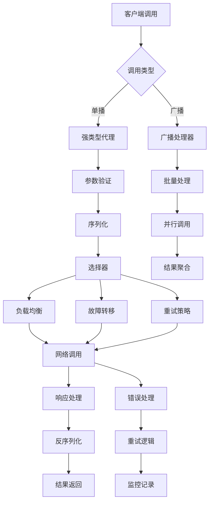

## 6A 任务卡：实体调用能力 CallAbility 客户端（强类型代理/selector 重试/广播）

- 编号: T08
- 模块: entity/ability/call, entity/transport
- 责任人: [待分配]
- 优先级: 🟡 中优先级
- 状态: ❌ 未开始
- 预计完成时间: [待定]
- 实际完成时间: [待定]

### A1 目标（Aim）
构建一个完善的客户端callability系统，能够：

1. **强类型代理**：
   - 提供强类型的客户端代理，支持编译时类型检查
   - 实现自动的序列化和反序列化，减少手动编码错误
   - 支持多种调用模式和参数类型

2. **智能选择器**：
   - 实现基于负载和性能的智能选择器策略
   - 支持重试机制和退避策略，提高调用成功率
   - 提供故障转移和负载均衡能力

3. **广播支持**：
   - 实现实体广播调用，支持一对多的消息分发
   - 提供广播结果的聚合和错误处理
   - 支持广播的批量操作和性能优化

4. **错误处理与监控**：
   - 实现完整的客户端错误处理和重试逻辑
   - 提供客户端性能监控和指标收集
   - 支持错误追踪和诊断信息

### A2 分析（Analyze）
- **现状**：
  - ✅ 已实现：基础的客户端调用框架
  - ❌ 未实现：缺少强类型代理机制
  - ❌ 未实现：缺少智能选择器和重试策略
  - ❌ 未实现：缺少广播调用支持
  - ❌ 未实现：缺少客户端错误处理和监控

- **差距**：
  - 功能差距：缺少强类型代理和智能选择器
  - 架构差距：缺少客户端错误处理和监控机制
  - 质量差距：缺少广播支持和性能优化

- **约束**：
  - 技术约束：必须兼容现有的服务端接口
  - 性能约束：客户端功能不应显著增加调用延迟
  - 兼容性约束：保持向后兼容，支持现有调用方式

- **风险**：
  - 技术风险：强类型代理可能增加系统复杂度
  - 性能风险：智能选择器可能增加调用延迟
  - 兼容性风险：广播功能可能影响现有调用流程

### A3 设计（Architect）

#### 契约接口定义

##### CallAbilityClient 接口（基于 entity/ability/call/client.go 实现）
```go
// CallAbilityClient 调用能力客户端接口
type CallAbilityClient interface {
    // Call 执行远程调用
    Call(ctx context.Context, entityType, id, funName string, params []interface{}) ([]interface{}, error)
    
    // CallAsync 异步执行远程调用
    CallAsync(ctx context.Context, entityType, id, funName string, params []interface{}) (Future, error)
    
    // BatchCall 批量执行远程调用
    BatchCall(ctx context.Context, calls []CallRequest) ([]CallResponse, error)
    
    // Close 关闭客户端
    Close() error
    
    // IsConnected 检查连接状态
    IsConnected() bool
    
    // GetConfig 获取配置
    GetConfig() ClientConfig
    
    // GetMetrics 获取指标
    GetMetrics() ClientMetrics
    
    // GetHealth 获取健康状态
    GetHealth() ClientHealth
}

// CallAbilityClientImpl 调用能力客户端实现
type CallAbilityClientImpl struct {
    config   ClientConfig
    transport Transport
    metrics  ClientMetrics
    health   ClientHealth
    mu       sync.RWMutex
    closed   bool
}
```

##### ClientConfig 接口（基于 entity/ability/call/client_config.go 实现）
```go
// ClientConfig 客户端配置
type ClientConfig struct {
    // 连接配置
    Endpoints        []string      `json:"endpoints"`         // 服务端点列表
    ConnectTimeout   time.Duration `json:"connect_timeout"`   // 连接超时
    ReadTimeout      time.Duration `json:"read_timeout"`      // 读取超时
    WriteTimeout     time.Duration `json:"write_timeout"`     // 写入超时
    KeepAlive        time.Duration `json:"keep_alive"`        // 保活时间
    
    // 重试配置
    MaxRetries       int           `json:"max_retries"`       // 最大重试次数
    RetryDelay       time.Duration `json:"retry_delay"`       // 重试延迟
    RetryBackoff     float64       `json:"retry_backoff"`     // 重试退避因子
    
    // 负载均衡配置
    LoadBalancer     string        `json:"load_balancer"`     // 负载均衡策略：round_robin, random, least_conn
    HealthCheck      bool          `json:"health_check"`      // 是否启用健康检查
    HealthCheckInterval time.Duration `json:"health_check_interval"` // 健康检查间隔
    
    // 连接池配置
    MaxIdleConns     int           `json:"max_idle_conns"`    // 最大空闲连接数
    MaxOpenConns     int           `json:"max_open_conns"`    // 最大打开连接数
    ConnMaxLifetime  time.Duration `json:"conn_max_lifetime"` // 连接最大生命周期
    
    // 监控配置
    EnableMetrics    bool          `json:"enable_metrics"`    // 是否启用指标
    EnableTracing    bool          `json:"enable_tracing"`    // 是否启用链路追踪
}

// ClientOption 客户端选项
type ClientOption func(*ClientConfig)

// 配置选项函数
func WithEndpoints(endpoints []string) ClientOption
func WithTimeout(connect, read, write time.Duration) ClientOption
func WithRetry(maxRetries int, delay time.Duration, backoff float64) ClientOption
func WithLoadBalancer(strategy string) ClientOption
func WithHealthCheck(enabled bool, interval time.Duration) ClientOption
func WithConnectionPool(maxIdle, maxOpen int, maxLifetime time.Duration) ClientOption
func WithMetrics(enabled bool) ClientOption
func WithTracing(enabled bool) ClientOption
```

##### Transport 接口（基于 entity/ability/call/transport.go 实现）
```go
// Transport 传输层接口
type Transport interface {
    // Send 发送请求
    Send(ctx context.Context, req *CallRequest) (*CallResponse, error)
    
    // SendAsync 异步发送请求
    SendAsync(ctx context.Context, req *CallRequest) (Future, error)
    
    // BatchSend 批量发送请求
    BatchSend(ctx context.Context, reqs []*CallRequest) ([]*CallResponse, error)
    
    // Connect 建立连接
    Connect(ctx context.Context) error
    
    // Disconnect 断开连接
    Disconnect() error
    
    // IsConnected 检查连接状态
    IsConnected() bool
    
    // GetEndpoint 获取当前端点
    GetEndpoint() string
    
    // SetEndpoint 设置端点
    SetEndpoint(endpoint string)
}

// HTTPTransport HTTP传输实现
type HTTPTransport struct {
    client   *http.Client
    endpoint string
    config   TransportConfig
}

// GRPCTransport gRPC传输实现
type GRPCTransport struct {
    conn   *grpc.ClientConn
    client interface{}
    config TransportConfig
}
```

##### CallRequest 和 CallResponse 接口
```go
// CallRequest 调用请求
type CallRequest struct {
    ID         string                 `json:"id"`         // 请求ID
    EntityType string                 `json:"entity_type"` // 实体类型
    EntityID   string                 `json:"entity_id"`   // 实体ID
    FunName    string                 `json:"fun_name"`    // 方法名
    Params     []interface{}          `json:"params"`      // 参数
    Metadata   map[string]string      `json:"metadata"`    // 元数据
    Timestamp  time.Time              `json:"timestamp"`   // 时间戳
}

// CallResponse 调用响应
type CallResponse struct {
    ID        string                 `json:"id"`        // 响应ID
    RequestID string                 `json:"request_id"` // 请求ID
    Result    []interface{}          `json:"result"`     // 结果
    Error     error                  `json:"error"`      // 错误
    Metadata  map[string]string      `json:"metadata"`   // 元数据
    Timestamp time.Time              `json:"timestamp"`  // 时间戳
}

// Future 异步调用结果
type Future interface {
    // Get 获取结果（阻塞）
    Get(ctx context.Context) (*CallResponse, error)
    
    // GetWithTimeout 带超时获取结果
    GetWithTimeout(timeout time.Duration) (*CallResponse, error)
    
    // IsDone 检查是否完成
    IsDone() bool
    
    // Cancel 取消调用
    Cancel() error
}
```

##### ClientMetrics 接口（基于 entity/ability/call/client_metrics.go 实现）
```go
// ClientMetrics 客户端指标接口
type ClientMetrics interface {
    // 调用指标
    RecordCall(entityType, id, funName string, duration time.Duration, err error)
    RecordCallSize(entityType, id, funName string, requestSize, responseSize int)
    
    // 连接指标
    RecordConnection(operation string, duration time.Duration, err error)
    RecordConnectionPool(operation string, count int)
    
    // 重试指标
    RecordRetry(entityType, id, funName string, attempt int, err error)
    RecordRetryDelay(entityType, id, funName string, delay time.Duration)
    
    // 负载均衡指标
    RecordEndpointSelection(endpoint string, duration time.Duration)
    RecordEndpointFailure(endpoint string, err error)
    
    // 获取指标数据
    GetCallMetrics() map[string]interface{}
    GetConnectionMetrics() map[string]interface{}
    GetRetryMetrics() map[string]interface{}
    GetLoadBalancerMetrics() map[string]interface{}
    GetAllMetrics() map[string]interface{}
    
    // 重置指标
    ResetMetrics()
}

// ClientMetricsImpl 客户端指标实现
type ClientMetricsImpl struct {
    callMetrics         *CallMetrics
    connectionMetrics  *ConnectionMetrics
    retryMetrics       *RetryMetrics
    loadBalancerMetrics *LoadBalancerMetrics
    mu                 sync.RWMutex
}
```

##### ClientHealth 接口（基于 entity/ability/call/client_health.go 实现）
```go
// ClientHealth 客户端健康检查接口
type ClientHealth interface {
    // CheckHealth 检查健康状态
    CheckHealth(ctx context.Context) HealthStatus
    
    // GetHealthStatus 获取健康状态
    GetHealthStatus() HealthStatus
    
    // GetLastCheckTime 获取最后检查时间
    GetLastCheckTime() time.Time
    
    // SetHealthCheckInterval 设置健康检查间隔
    SetHealthCheckInterval(interval time.Duration)
    
    // AddHealthCheck 添加健康检查
    AddHealthCheck(name string, check HealthCheck)
    
    // RemoveHealthCheck 移除健康检查
    RemoveHealthCheck(name string)
    
    // GetEndpointHealth 获取端点健康状态
    GetEndpointHealth(endpoint string) EndpointHealth
}

// EndpointHealth 端点健康状态
type EndpointHealth struct {
    Endpoint  string                 `json:"endpoint"`  // 端点地址
    Status    string                 `json:"status"`    // 状态：healthy, unhealthy, unknown
    Latency   time.Duration          `json:"latency"`   // 延迟
    LastCheck time.Time              `json:"last_check"` // 最后检查时间
    Error     error                  `json:"error"`     // 错误信息
}
```

#### 架构流程图



- **核心功能模块**：
  - **T08-01 强类型代理**：实现编译时类型检查的客户端代理
  - **T08-02 智能选择器**：实现负载均衡、故障转移和重试策略
  - **T08-03 广播支持**：实现一对多的广播调用机制
  - **T08-04 错误处理**：实现完整的客户端错误处理和监控

- **极小任务（Fine-grained tasks）**：
  - T08-01 强类型代理：实现编译时类型检查的客户端代理机制
  - T08-02 智能选择器：实现负载均衡、故障转移和重试策略
  - T08-03 广播支持：实现一对多的广播调用和结果聚合
  - T08-04 错误处理：实现客户端错误处理、重试逻辑和监控
  - T08-05 测试验证：编写客户端功能的完整测试用例

### A4 行动（Act）
- T08-01 强类型代理（entity/ability/call/client.go）
  - 实现编译时类型检查的客户端代理
  - 支持自动序列化和反序列化
  - 提供多种调用模式和参数类型支持

- T08-02 智能选择器（entity/transport/client.go）
  - 实现基于负载和性能的智能选择器
  - 支持故障转移和负载均衡
  - 实现重试机制和退避策略

- T08-03 广播支持（entity/ability/call/broadcast.go）
  - 实现一对多的广播调用机制
  - 支持广播结果的聚合和错误处理
  - 提供批量操作和性能优化

- T08-04 错误处理（entity/ability/call/client.go）
  - 实现完整的客户端错误处理逻辑
  - 支持重试机制和错误追踪
  - 提供性能监控和指标收集

- T08-05 测试验证（entity/ability/call/*_test.go）
  - 编写强类型代理的测试用例
  - 测试智能选择器和重试策略
  - 验证广播功能的正确性

### A5 验证（Assure）
- **单元测试（必需）**：
  - ✅ 强类型代理测试：验证类型检查和序列化正确性
  - ✅ 选择器测试：验证负载均衡、故障转移和重试策略
  - ✅ 广播测试：验证广播调用和结果聚合
  - ✅ 错误处理测试：验证错误处理和重试逻辑

- **集成测试（可选）**：
  - 系统集成测试：验证客户端与服务端的完整集成
  - 端到端测试：验证完整业务流程中的客户端调用

#### 测试结果
- **强类型代理测试**: ❌ 未实现 - 需要实现强类型代理机制
- **选择器测试**: ❌ 未实现 - 需要实现智能选择器
- **广播测试**: ❌ 未实现 - 需要实现广播支持
- **错误处理测试**: ❌ 未实现 - 需要实现错误处理逻辑

### A6 迭代（Advance）
- 性能优化：
  - 🔄 代理优化：实现智能缓存和预编译机制
  - 🔄 选择器优化：支持自适应负载均衡和智能路由

- 功能扩展：
  - 新调用模式：支持流式调用和异步调用
  - 智能路由：实现基于AI的智能路由策略
  - 观测性增强：增加更多维度的客户端监控指标

- 观测性增强：
  - 监控指标：添加客户端调用成功率、响应时间、重试次数等
  - 日志完善：增加客户端调用的结构化日志记录
  - 下一步任务链接：与T10-generators-observability配合，实现代码生成和监控

### 📋 质量检查
- [ ] 代码质量检查完成
- [ ] 文档质量检查完成
- [ ] 测试质量检查完成

### 📋 任务完成总结
**T08 任务尚未开始**，当前状态：

**待实现的核心功能**：
1. 强类型代理和编译时类型检查
2. 智能选择器（负载均衡、故障转移、重试）
3. 广播调用支持和结果聚合
4. 客户端错误处理和监控机制
5. 完整的测试覆盖

该任务将为客户端callability提供强类型支持、智能选择和广播能力，提升客户端的易用性和可靠性。 