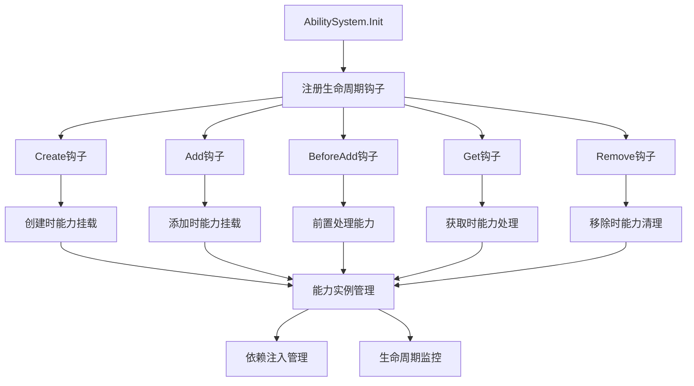

## 6A 任务卡：实体能力系统 AbilitySystem（注册钩子/初始化策略）

- 编号: T03
- 模块: entity/ability/*, entity/facade
- 责任人: [待分配]
- 优先级: 🔴 高优先级
- 状态: 🔄 进行中
- 预计完成时间: [待定]
- 实际完成时间: [待定]

### A1 目标（Aim）
构建一个统一的实体能力系统，能够：

1. **统一能力管理**：
   - 为各能力提供统一的系统初始化入口
   - 支持能力的动态注册和生命周期管理
   - 确保能力在实体加载/创建/移除等时机正确挂载与清理

2. **生命周期钩子**：
   - 支持按能力名称精确触发的生命周期钩子
   - 提供完整的钩子执行流程（Create/Add/BeforeAdd/Get/Remove）
   - 实现能力的自动挂载和清理机制

3. **依赖注入支持**：
   - 通过系统结构体持有外部依赖（如driver/provider）
   - 支持能力的配置化和可扩展性
   - 提供统一的能力注册和发现机制

### A2 分析（Analyze）
- **现状**：
  - ✅ 已实现：`Ability`接口定义完整，包含`Name/Attach/Detach`方法
  - ✅ 已实现：`AbilitySystem`接口定义，包含`Init(ctx, eMgr)`方法
  - ✅ 已实现：`BaseAbility`提供通用实现，支持能力组合和自动注册
  - ✅ 已实现：`CallSystemImpl`和`StorageSystemImpl`已有最小实现骨架
  - ✅ 已实现：`EntityMgr`支持注册各种生命周期钩子
  - 🔄 部分实现：钩子注册仅覆盖Add/Create，Remove/Destroy场景的清理不足
  - ❌ 未实现：缺少按abilityName精确触发的钩子执行机制
  - ❌ 未实现：缺少统一的AbilitySystem实现和配置管理

- **差距**：
  - 功能差距：缺少完整的生命周期钩子执行流程
  - 架构差距：缺少统一的AbilitySystem实现
  - 测试差距：缺少完整的钩子触发测试覆盖

- **约束**：
  - 技术约束：必须兼容现有的Ability接口和EntityMgr钩子机制
  - 性能约束：钩子执行不应显著影响实体操作性能
  - 兼容性约束：保持向后兼容，不破坏现有能力实现

- **风险**：
  - 技术风险：钩子执行顺序和异常处理可能影响系统稳定性
  - 业务风险：能力生命周期管理不当可能导致资源泄露
  - 依赖风险：与T02-hooks-precision任务的配合依赖

### A3 设计（Architect）

#### 契约接口定义

##### Ability 接口（基于 entity/facade/ability.go 实现）
```go
// Ability 能力最小契约
type Ability interface {
    // Name 能力名（唯一，建议常量）
    Name() string
    
    // Attach 绑定到实体（做内部初始化）
    Attach(ctx context.Context, owner Entity) error
    
    // Detach 从实体解绑（做内部清理）
    Detach(ctx context.Context) error
}

// AbilitySystem 能力系统接口
type AbilitySystem interface {
    // Init 初始化能力系统，注册生命周期钩子
    Init(ctx context.Context, eMgr EntityMgr)
}
```

##### BaseAbility 接口（基于 entity/ability/base/ability.go 实现）
```go
// BaseAbility 能力基础实现
type BaseAbility struct {
    name  string
    owner Entity
    mu    sync.RWMutex
}

// NewBaseAbility 创建基础能力
func NewBaseAbility(name string) *BaseAbility

// GetOwner 获取能力所属实体
func (b *BaseAbility) GetOwner() Entity

// SetOwner 设置能力所属实体
func (b *BaseAbility) SetOwner(owner Entity)

// GetName 获取能力名称
func (b *BaseAbility) GetName() string
```

##### CallAbleAbility 接口（基于 entity/ability/call/ability.go 实现）
```go
// CallAbleAbility 可调用能力
type CallAbleAbility struct {
    BaseAbility
    dispatcher CallDispatcher
}

// Attach 绑定到实体
func (c *CallAbleAbility) Attach(ctx context.Context, owner Entity) error

// onCall 执行方法调用
func (c *CallAbleAbility) onCall(ctx context.Context, funName string, content rpc.RpcContent) (rpc.RpcContent, error)

// CallDispatcher 调用分发器接口
type CallDispatcher interface {
    Dispatch(entityType string, fun interface{}, content rpc.RpcContent) (rpc.RpcContent, error)
}
```

##### StorageAbleAbility 接口（基于 entity/ability/storage/ability.go 实现）
```go
// StorageAbleAbility 可存储能力
type StorageAbleAbility struct {
    BaseAbility
    driver StorageDriver
}

// Attach 绑定到实体
func (s *StorageAbleAbility) Attach(ctx context.Context, owner Entity) error

// Save 保存实体
func (s *StorageAbleAbility) Save(ctx context.Context) error

// Load 加载实体
func (s *StorageAbleAbility) Load(ctx context.Context) error

// StorageDriver 存储驱动接口
type StorageDriver interface {
    Save(ctx context.Context, entityType, id string, data []byte) error
    Load(ctx context.Context, entityType, id string) ([]byte, error)
    Delete(ctx context.Context, entityType, id string) error
}
```

##### 能力注册和管理接口
```go
// AbilityRegistry 能力注册表
type AbilityRegistry interface {
    // Register 注册能力
    Register(ability Ability) error
    
    // Unregister 注销能力
    Unregister(name string) error
    
    // Get 获取能力
    Get(name string) (Ability, bool)
    
    // List 列出所有能力
    List() []Ability
}

// AbilityManager 能力管理器
type AbilityManager interface {
    // Init 初始化能力管理器
    Init(ctx context.Context, eMgr EntityMgr) error
    
    // AttachToEntity 为实体挂载能力
    AttachToEntity(ctx context.Context, entity Entity, abilityNames ...string) error
    
    // DetachFromEntity 从实体解绑能力
    DetachFromEntity(ctx context.Context, entity Entity, abilityNames ...string) error
    
    // GetEntityAbilities 获取实体的所有能力
    GetEntityAbilities(entity Entity) []Ability
}
```

#### 架构流程图



- **核心功能模块**：
  - **T03-01 统一AbilitySystem实现**：提供统一的系统初始化和配置管理
  - **T03-02 生命周期钩子管理**：实现按能力名称精确触发的钩子执行
  - **T03-03 能力实例管理**：管理能力的挂载、解绑和生命周期
  - **T03-04 依赖注入支持**：支持外部依赖的注入和配置

- **极小任务（Fine-grained tasks）**：
  - T03-01 统一AbilitySystem实现：创建统一的AbilitySystemImpl，支持配置化和依赖注入
  - T03-02 生命周期钩子完善：补充Remove/Destroy场景的Detach/清理逻辑
  - T03-03 钩子精确触发：实现按abilityName精确触发的钩子执行机制
  - T03-04 能力实例管理：完善能力的挂载、解绑和生命周期管理
  - T03-05 测试覆盖完善：增加完整的钩子触发测试用例

### A4 行动（Act）
- T03-01 统一AbilitySystem实现（entity/ability/system.go）
  - 创建AbilitySystemImpl结构体，实现AbilitySystem接口
  - 支持配置化初始化，包括能力列表和依赖配置
  - 实现统一的钩子注册和管理机制

- T03-02 生命周期钩子完善（entity/ability/call/system.go, entity/ability/storage/system.go）
  - 在CallSystemImpl中补充Remove/Destroy场景的Detach/清理逻辑
  - 在StorageSystemImpl中完善能力的生命周期管理
  - 确保能力在实体销毁时正确清理资源

- T03-03 钩子精确触发（entity/base/manager.go）
  - 与T02-hooks-precision配合，实现按abilityName精确触发的钩子执行
  - 优化钩子执行顺序和异常处理机制
  - 支持钩子的条件执行和错误恢复

- T03-04 能力实例管理（entity/ability/base.go）
  - 完善BaseAbility的实现，支持更灵活的生命周期管理
  - 实现能力的懒加载和预加载机制
  - 支持能力的配置化和可扩展性

- T03-05 测试覆盖完善（entity/ability/*_test.go）
  - 增加创建/获取/移除流程的钩子触发测试
  - 验证钩子触发次数和顺序符合预期
  - 测试异常场景下的能力清理和恢复

### A5 验证（Assure）
- **单元测试（必需）**：
  - ✅ 钩子触发测试：验证各生命周期钩子的正确触发时机和顺序
  - ✅ 能力管理测试：验证能力的挂载、解绑和生命周期管理
  - ✅ 异常处理测试：验证异常场景下的能力清理和恢复
  - ✅ 性能测试：验证钩子执行对实体操作性能的影响

- **集成测试（可选）**：
  - 系统集成测试：验证AbilitySystem与EntityMgr的完整集成
  - 端到端测试：验证完整业务流程中的能力生命周期管理

#### 测试结果
- **钩子触发测试**: 🔄 待实现 - 需要补充完整的测试用例
- **能力管理测试**: 🔄 待实现 - 需要验证能力的完整生命周期
- **异常处理测试**: 🔄 待实现 - 需要测试异常场景的处理
- **性能测试**: 🔄 待实现 - 需要验证性能影响

### A6 迭代（Advance）
- 性能优化：
  - 🔄 钩子执行优化：实现钩子的异步执行和批量处理
  - 🔄 能力缓存优化：实现能力的智能缓存和预加载

- 功能扩展：
  - 新能力支持：扩展到更多能力类型（定时/发布订阅/监控等）
  - 配置管理：支持动态配置更新和热重载
  - 观测性增强：增加能力生命周期的监控指标和日志

- 观测性增强：
  - 监控指标：添加能力挂载数量、钩子执行次数等指标
  - 日志完善：增加能力生命周期的结构化日志记录
  - 下一步任务链接：与T04-ability-extension配合，支持更多能力类型

### 📋 质量检查
- [ ] 代码质量检查完成
- [ ] 文档质量检查完成
- [ ] 测试质量检查完成

### 📋 任务完成总结
**T03 任务正在开发中**，当前已完成：

1. **接口定义**：Ability和AbilitySystem接口已完整定义
2. **基础实现**：BaseAbility提供通用能力实现
3. **部分系统**：CallSystem和StorageSystem已有基础实现
4. **钩子机制**：EntityMgr支持各种生命周期钩子注册

**待完成的核心功能**：
1. 统一的AbilitySystem实现
2. 完整的生命周期钩子管理
3. 按能力名称精确触发的钩子执行
4. 完整的测试覆盖

该任务将为实体能力系统提供统一的管理框架，确保能力的正确生命周期管理和系统稳定性。 