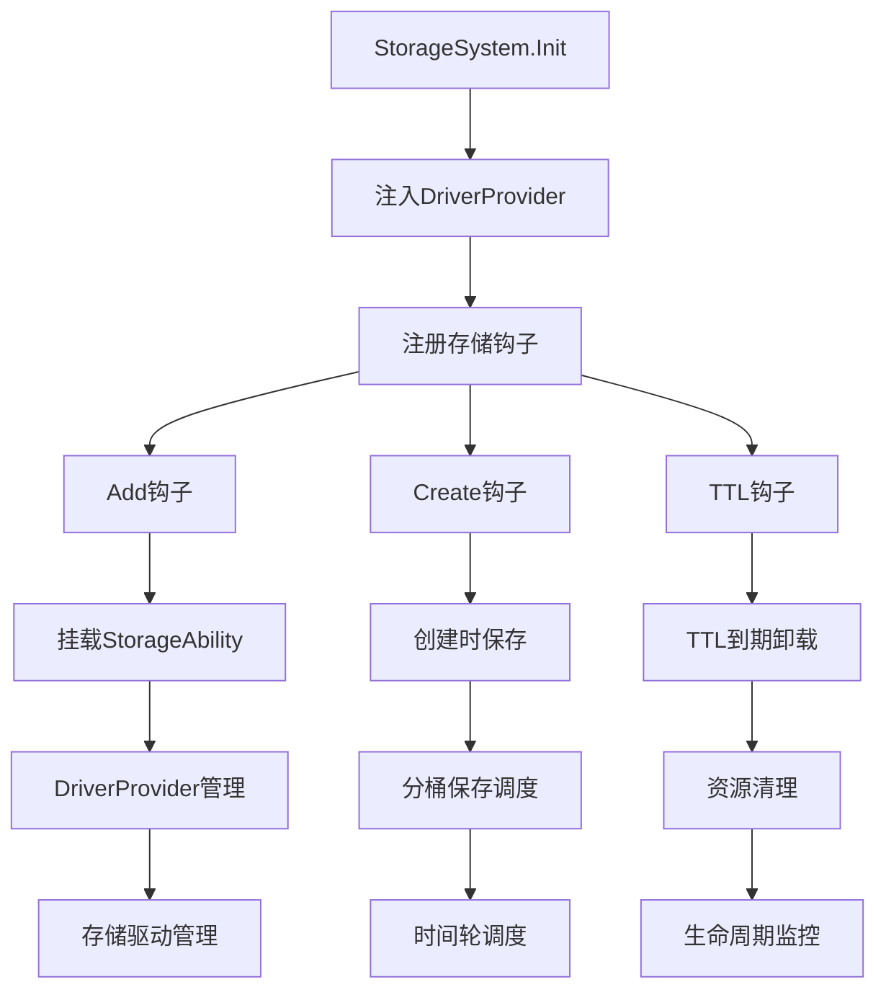

## 6A 任务卡：存储系统 StorageSystem（管理 StorageAbility/定时保存/TTL）

- 编号: T04
- 模块: entity/ability/storage, entity/base, entity/facade
- 责任人: [待分配]
- 优先级: 🔴 高优先级
- 状态: ❌ 未开始
- 预计完成时间: [待定]
- 实际完成时间: [待定]

### A1 目标（Aim）
构建一个统一的存储系统，能够：

1. **统一存储管理**：
   - 统一管理存储能力的挂载、定时保存与TTL卸载
   - 支持多种存储驱动的动态注入和配置
   - 保障数据可靠性与资源可控性

2. **智能调度机制**：
   - 实现分桶调度，统一时间轮扫描TTL与周期保存
   - 支持按实体类型的差异化存储策略
   - 提供可配置的保存频率和TTL策略

3. **错误处理与监控**：
   - 实现保存失败的重试机制和退避策略
   - 提供完整的错误分类和指标记录
   - 支持存储状态的实时监控和告警

### A2 分析（Analyze）
- **现状**：
  - ✅ 已实现：StorageSystemImpl基础框架，支持Add/Create钩子注册
  - ✅ 已实现：StorageAbility基础实现，支持Save方法
  - ✅ 已实现：EntityMgr支持存储相关的生命周期钩子
  - ❌ 未实现：缺少driver注入机制，当前driver为空
  - ❌ 未实现：缺少TTL卸载和周期保存机制
  - ❌ 未实现：缺少错误处理和重试机制

- **差距**：
  - 功能差距：缺少完整的存储生命周期管理
  - 架构差距：缺少统一的驱动管理和配置机制
  - 性能差距：缺少分桶调度，每实体ticker将导致资源浪费

- **约束**：
  - 技术约束：必须兼容现有的StorageAbility接口和EntityMgr钩子机制
  - 性能约束：存储操作不应显著影响实体操作性能
  - 兼容性约束：保持向后兼容，不破坏现有存储实现

- **风险**：
  - 技术风险：driver为空时可能导致存储失败
  - 性能风险：每实体ticker可能导致资源浪费和性能下降
  - 数据风险：保存失败无重试可能导致数据丢失

### A3 设计（Architect）

#### 契约接口定义

##### StorageSystem 接口（基于 entity/ability/storage/system.go 实现）
```go
// StorageSystem 存储系统核心接口
type StorageSystem interface {
    // Init 初始化存储系统
    Init(ctx context.Context, eMgr EntityMgr) error
    
    // Save 保存实体
    Save(ctx context.Context, entityType, id string, data []byte) error
    
    // Load 加载实体
    Load(ctx context.Context, entityType, id string) ([]byte, error)
    
    // Delete 删除实体
    Delete(ctx context.Context, entityType, id string) error
    
    // Exists 检查实体是否存在
    Exists(ctx context.Context, entityType, id string) (bool, error)
    
    // List 列出指定类型的实体
    List(ctx context.Context, entityType string) ([]string, error)
}

// StorageSystemImpl 存储系统实现
type StorageSystemImpl struct {
    entityMgr facade.EntityMgr
    driver    StorageDriver
    mu        sync.RWMutex
}
```

##### StorageDriver 接口（基于 entity/ability/storage/driver.go 实现）
```go
// StorageDriver 存储驱动接口
type StorageDriver interface {
    // Save 保存数据
    Save(ctx context.Context, entityType, id string, data []byte) error
    
    // Load 加载数据
    Load(ctx context.Context, entityType, id string) ([]byte, error)
    
    // Delete 删除数据
    Delete(ctx context.Context, entityType, id string) error
    
    // Exists 检查数据是否存在
    Exists(ctx context.Context, entityType, id string) (bool, error)
    
    // List 列出指定类型的所有ID
    List(ctx context.Context, entityType string) ([]string, error)
    
    // Close 关闭驱动
    Close() error
}

// DriverFactory 驱动工厂接口
type DriverFactory interface {
    // CreateDriver 创建存储驱动
    CreateDriver(config StorageConfig) (StorageDriver, error)
    
    // SupportedTypes 支持的存储类型
    SupportedTypes() []string
}
```

##### StorageProvider 接口（基于 entity/ability/storage/provider.go 实现）
```go
// StorageProvider 存储提供者接口
type StorageProvider interface {
    // GetDriver 获取存储驱动
    GetDriver() StorageDriver
    
    // GetConfig 获取配置
    GetConfig() StorageConfig
    
    // Validate 验证配置
    Validate() error
    
    // HealthCheck 健康检查
    HealthCheck(ctx context.Context) error
}

// StorageConfig 存储配置
type StorageConfig struct {
    Type        string            `json:"type"`        // 存储类型
    Endpoint    string            `json:"endpoint"`    // 存储端点
    Credentials map[string]string `json:"credentials"` // 认证信息
    Options     map[string]string `json:"options"`     // 其他选项
}
```

##### 存储策略接口
```go
// StorageStrategy 存储策略接口
type StorageStrategy interface {
    // ShouldSave 判断是否应该保存
    ShouldSave(ctx context.Context, entity Entity) bool
    
    // GetSavePriority 获取保存优先级
    GetSavePriority(ctx context.Context, entity Entity) int
    
    // GetRetryPolicy 获取重试策略
    GetRetryPolicy(ctx context.Context, entity Entity) RetryPolicy
}

// RetryPolicy 重试策略
type RetryPolicy struct {
    MaxRetries int           `json:"max_retries"` // 最大重试次数
    Backoff    time.Duration `json:"backoff"`     // 退避时间
    Jitter     float64       `json:"jitter"`      // 抖动因子
}

// BatchStorage 批量存储接口
type BatchStorage interface {
    // BatchSave 批量保存
    BatchSave(ctx context.Context, entities []Entity) error
    
    // BatchLoad 批量加载
    BatchLoad(ctx context.Context, entityType string, ids []string) (map[string][]byte, error)
    
    // BatchDelete 批量删除
    BatchDelete(ctx context.Context, entityType string, ids []string) error
}
```

##### 存储监控接口
```go
// StorageMetrics 存储指标接口
type StorageMetrics interface {
    // RecordSave 记录保存操作
    RecordSave(entityType, id string, duration time.Duration, err error)
    
    // RecordLoad 记录加载操作
    RecordLoad(entityType, id string, duration time.Duration, err error)
    
    // RecordDelete 记录删除操作
    RecordDelete(entityType, id string, duration time.Duration, err error)
    
    // GetMetrics 获取指标数据
    GetMetrics() map[string]interface{}
}

// StorageHealth 存储健康检查接口
type StorageHealth interface {
    // CheckHealth 检查健康状态
    CheckHealth(ctx context.Context) HealthStatus
    
    // GetHealthStatus 获取健康状态
    GetHealthStatus() HealthStatus
}

// HealthStatus 健康状态
type HealthStatus struct {
    Status    string                 `json:"status"`    // 状态：healthy, unhealthy, unknown
    Message   string                 `json:"message"`   // 状态描述
    Timestamp time.Time              `json:"timestamp"` // 检查时间
    Details   map[string]interface{} `json:"details"`   // 详细信息
}
```

#### 架构流程图



- **核心功能模块**：
  - **T04-01 DriverProvider管理**：实现按typeName获取driver的机制
  - **T04-02 分桶调度系统**：实现统一时间轮扫描TTL与周期保存
  - **T04-03 错误处理机制**：实现保存失败重试和指标记录
  - **T04-04 配置化管理**：支持存储策略的动态配置

- **极小任务（Fine-grained tasks）**：
  - T04-01 DriverProvider实现：创建DriverProvider接口和实现，支持按typeName获取driver
  - T04-02 分桶保存机制：实现分桶保存与TTL扫描的骨架（与Task-03配合）
  - T04-03 错误处理完善：实现保存失败重试、backoff策略和指标记录
  - T04-04 配置注入：改造StorageSystem使用工厂模式注入依赖
  - T04-05 测试覆盖：编写driver注入、保存成功/失败路径的测试用例

### A4 行动（Act）
- T04-01 DriverProvider实现（entity/ability/storage/provider.go）
  - 创建DriverProvider接口，定义按typeName获取driver的方法
  - 实现DefaultDriverProvider，支持配置化driver管理
  - 在StorageSystem.Init中注入DriverProvider

- T04-02 分桶调度系统（entity/ability/storage/system.go）
  - 改造StorageSystemImpl，集成时间轮调度机制
  - 实现分桶保存与TTL扫描的骨架
  - 与Task-03的AbilitySystem配合，实现统一调度

- T04-03 错误处理完善（entity/ability/storage/ability.go）
  - 在StorageAbility中实现保存失败重试机制
  - 添加backoff策略和重试次数限制
  - 实现错误分类和指标记录

- T04-04 配置注入（entity/ability/storage/system.go）
  - 改造StorageSystem使用工厂模式NewStorageAbility(driver,typeName)
  - 支持配置化的存储策略管理
  - 实现动态配置更新机制

- T04-05 测试覆盖（entity/ability/storage/*_test.go）
  - 编写driver注入的测试用例
  - 测试保存成功/失败的各种路径
  - 验证TTL到期卸载行为

### A5 验证（Assure）
- **单元测试（必需）**：
  - ✅ Driver注入测试：验证driver注入机制的正确性
  - ✅ 保存路径测试：验证保存成功和失败的各种路径
  - ✅ TTL卸载测试：验证TTL到期卸载行为符合预期
  - ✅ 错误处理测试：验证保存失败重试和指标记录

- **集成测试（可选）**：
  - 系统集成测试：验证StorageSystem与EntityMgr的完整集成
  - 端到端测试：验证完整业务流程中的存储生命周期管理

#### 测试结果
- **Driver注入测试**: ❌ 未实现 - 需要实现DriverProvider机制
- **保存路径测试**: ❌ 未实现 - 需要完善错误处理逻辑
- **TTL卸载测试**: ❌ 未实现 - 需要实现TTL机制
- **错误处理测试**: ❌ 未实现 - 需要实现重试和指标机制

### A6 迭代（Advance）
- 性能优化：
  - 🔄 分桶调度优化：实现智能分桶策略，减少资源浪费
  - 🔄 批量操作优化：支持批量保存和批量TTL处理

- 功能扩展：
  - 新存储后端：支持更多存储类型（Redis、MySQL、对象存储等）
  - 配置管理：支持动态配置更新和热重载
  - 观测性增强：增加存储操作的监控指标和日志

- 观测性增强：
  - 监控指标：添加存储成功率、重试次数、TTL卸载数量等指标
  - 日志完善：增加存储操作的结构化日志记录
  - 下一步任务链接：与T05-storage-ability配合，完善序列化和schema管理

### 📋 质量检查
- [ ] 代码质量检查完成
- [ ] 文档质量检查完成
- [ ] 测试质量检查完成

### 📋 任务完成总结
**T04 任务尚未开始**，当前状态：

**待实现的核心功能**：
1. DriverProvider机制和driver注入
2. 分桶调度系统和TTL机制
3. 错误处理和重试机制
4. 配置化管理和动态更新
5. 完整的测试覆盖

该任务将为存储系统提供统一的管理框架，实现智能的存储调度和错误处理，确保数据的可靠性和系统的性能。 