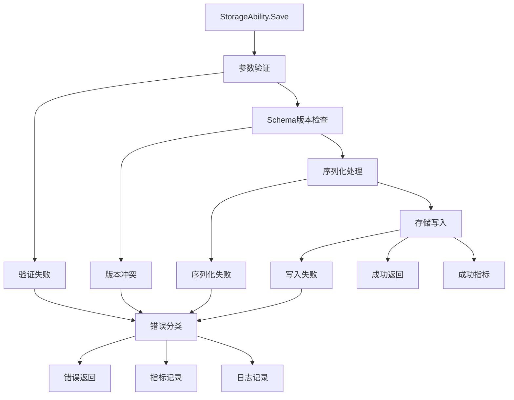

## 6A 任务卡：存储能力 StorageAbility（序列化/schema/错误处理）

- 编号: T05
- 模块: entity/ability/storage
- 责任人: [待分配]
- 优先级: 🔴 高优先级
- 状态: ❌ 未开始
- 预计完成时间: [待定]
- 实际完成时间: [待定]

### A1 目标（Aim）
构建一个完善的存储能力系统，能够：

1. **稳定序列化**：
   - 基于facade.SaveObject实现稳定的序列化和反序列化
   - 严格处理Marshal/Unmarshal错误，提供清晰的错误分类
   - 支持多种序列化格式和编码策略

2. **Schema版本管理**：
   - 通过GetSchemaVersion()实现版本信息的集中管理
   - 支持schema版本升级和向后兼容
   - 提供版本冲突检测和自动迁移机制

3. **错误处理与监控**：
   - 实现明确的错误分类（ErrNotFound/ErrEncode等）
   - 提供统一的错误返回体和状态码
   - 支持错误追踪和性能监控

4. **依赖注入支持**：
   - 通过工厂模式NewStorageAbility(driver,typeName)注入依赖
   - 支持配置化的存储策略管理
   - 实现动态配置更新和热重载

### A2 分析（Analyze）
- **现状**：
  - ✅ 已实现：StorageAbility基础结构，支持Save(ctx)方法
  - ✅ 已实现：facade.SaveObject接口定义，包含MarshalBinary/UnmarshalBinary
  - ✅ 已实现：基础的存储能力挂载机制
  - ❌ 未实现：缺少driver和typeName的依赖注入
  - ❌ 未实现：缺少完整的错误分类和处理机制
  - ❌ 未实现：缺少schema版本管理功能

- **差距**：
  - 功能差距：缺少完整的序列化错误处理和schema管理
  - 架构差距：缺少依赖注入和配置管理机制
  - 质量差距：缺少错误路径的测试覆盖

- **约束**：
  - 技术约束：必须兼容现有的facade.SaveObject接口和StorageAbility结构
  - 性能约束：序列化操作不应显著影响存储性能
  - 兼容性约束：保持向后兼容，支持旧版本schema

- **风险**：
  - 技术风险：序列化失败可能导致数据丢失或损坏
  - 数据风险：schema版本冲突可能导致数据不一致
  - 性能风险：错误处理不当可能影响系统性能

### A3 设计（Architect）

#### 契约接口定义

##### StorageAbleAbility 接口（基于 entity/ability/storage/ability.go 实现）
```go
// StorageAbleAbility 可存储能力
type StorageAbleAbility struct {
    BaseAbility
    driver StorageDriver
    config StorageConfig
}

// Attach 绑定到实体
func (s *StorageAbleAbility) Attach(ctx context.Context, owner Entity) error

// Detach 从实体解绑
func (s *StorageAbleAbility) Detach(ctx context.Context) error

// Save 保存实体
func (s *StorageAbleAbility) Save(ctx context.Context) error

// Load 加载实体
func (s *StorageAbleAbility) Load(ctx context.Context) error

// Delete 删除实体
func (s *StorageAbleAbility) Delete(ctx context.Context) error

// Exists 检查实体是否存在
func (s *StorageAbleAbility) Exists(ctx context.Context) (bool, error)

// GetDriver 获取存储驱动
func (s *StorageAbleAbility) GetDriver() StorageDriver

// SetDriver 设置存储驱动
func (s *StorageAbleAbility) SetDriver(driver StorageDriver)
```

##### StorageDriver 接口（基于 entity/ability/storage/driver.go 实现）
```go
// StorageDriver 存储驱动接口
type StorageDriver interface {
    // Save 保存数据
    Save(ctx context.Context, entityType, id string, data []byte) error
    
    // Load 加载数据
    Load(ctx context.Context, entityType, id string) ([]byte, error)
    
    // Delete 删除数据
    Delete(ctx context.Context, entityType, id string) error
    
    // Exists 检查数据是否存在
    Exists(ctx context.Context, entityType, id string) (bool, error)
    
    // List 列出指定类型的所有ID
    List(ctx context.Context, entityType string) ([]string, error)
    
    // Close 关闭驱动
    Close() error
    
    // HealthCheck 健康检查
    HealthCheck(ctx context.Context) error
}

// MemoryDriver 内存存储驱动
type MemoryDriver struct {
    data map[string]map[string][]byte  // type -> id -> data
    mu   sync.RWMutex
}

// FileDriver 文件存储驱动
type FileDriver struct {
    basePath string
    mu       sync.RWMutex
}

// DatabaseDriver 数据库存储驱动
type DatabaseDriver struct {
    db   *sql.DB
    config DatabaseConfig
}
```

##### StorageProvider 接口（基于 entity/ability/storage/provider.go 实现）
```go
// StorageProvider 存储提供者接口
type StorageProvider interface {
    // GetDriver 获取存储驱动
    GetDriver() StorageDriver
    
    // GetConfig 获取配置
    GetConfig() StorageConfig
    
    // Validate 验证配置
    Validate() error
    
    // HealthCheck 健康检查
    HealthCheck(ctx context.Context) error
    
    // GetSupportedTypes 获取支持的存储类型
    GetSupportedTypes() []string
}

// StorageConfig 存储配置
type StorageConfig struct {
    Type        string            `json:"type"`        // 存储类型：memory, file, database
    Endpoint    string            `json:"endpoint"`    // 存储端点
    Credentials map[string]string `json:"credentials"` // 认证信息
    Options     map[string]string `json:"options"`     // 其他选项
    Timeout     time.Duration     `json:"timeout"`     // 超时时间
    Retries     int               `json:"retries"`     // 重试次数
}

// DatabaseConfig 数据库配置
type DatabaseConfig struct {
    Driver   string `json:"driver"`   // 数据库驱动：mysql, postgres, sqlite
    Host     string `json:"host"`     // 主机地址
    Port     int    `json:"port"`     // 端口号
    Database string `json:"database"` // 数据库名
    Username string `json:"username"` // 用户名
    Password string `json:"password"` // 密码
    SSLMode  string `json:"ssl_mode"` // SSL模式
}
```

##### 存储策略和优化接口
```go
// StorageStrategy 存储策略接口
type StorageStrategy interface {
    // ShouldSave 判断是否应该保存
    ShouldSave(ctx context.Context, entity Entity) bool
    
    // GetSavePriority 获取保存优先级
    GetSavePriority(ctx context.Context, entity Entity) int
    
    // GetRetryPolicy 获取重试策略
    GetRetryPolicy(ctx context.Context, entity Entity) RetryPolicy
    
    // GetCompressionPolicy 获取压缩策略
    GetCompressionPolicy(ctx context.Context, entity Entity) CompressionPolicy
}

// RetryPolicy 重试策略
type RetryPolicy struct {
    MaxRetries int           `json:"max_retries"` // 最大重试次数
    Backoff    time.Duration `json:"backoff"`     // 退避时间
    Jitter     float64       `json:"jitter"`      // 抖动因子
}

// CompressionPolicy 压缩策略
type CompressionPolicy struct {
    Enabled     bool   `json:"enabled"`      // 是否启用压缩
    Algorithm   string `json:"algorithm"`    // 压缩算法：gzip, lz4, zstd
    MinSize     int    `json:"min_size"`     // 最小压缩大小
    Compression int    `json:"compression"`  // 压缩级别
}

// BatchStorage 批量存储接口
type BatchStorage interface {
    // BatchSave 批量保存
    BatchSave(ctx context.Context, entities []Entity) error
    
    // BatchLoad 批量加载
    BatchLoad(ctx context.Context, entityType string, ids []string) (map[string][]byte, error)
    
    // BatchDelete 批量删除
    BatchDelete(ctx context.Context, entityType string, ids []string) error
    
    // BatchExists 批量检查存在性
    BatchExists(ctx context.Context, entityType string, ids []string) (map[string]bool, error)
}
```

##### 存储监控和指标接口
```go
// StorageMetrics 存储指标接口
type StorageMetrics interface {
    // RecordSave 记录保存操作
    RecordSave(entityType, id string, duration time.Duration, size int, err error)
    
    // RecordLoad 记录加载操作
    RecordLoad(entityType, id string, duration time.Duration, size int, err error)
    
    // RecordDelete 记录删除操作
    RecordDelete(entityType, id string, duration time.Duration, err error)
    
    // RecordBatch 记录批量操作
    RecordBatch(operation string, entityType string, count int, duration time.Duration, err error)
    
    // GetMetrics 获取指标数据
    GetMetrics() map[string]interface{}
    
    // ResetMetrics 重置指标
    ResetMetrics()
}

// StorageHealth 存储健康检查接口
type StorageHealth interface {
    // CheckHealth 检查健康状态
    CheckHealth(ctx context.Context) HealthStatus
    
    // GetHealthStatus 获取健康状态
    GetHealthStatus() HealthStatus
    
    // GetLastCheckTime 获取最后检查时间
    GetLastCheckTime() time.Time
    
    // SetHealthCheckInterval 设置健康检查间隔
    SetHealthCheckInterval(interval time.Duration)
}

// HealthStatus 健康状态
type HealthStatus struct {
    Status    string                 `json:"status"`    // 状态：healthy, unhealthy, unknown
    Message   string                 `json:"message"`   // 状态描述
    Timestamp time.Time              `json:"timestamp"` // 检查时间
    Details   map[string]interface{} `json:"details"`   // 详细信息
    Error     error                  `json:"error"`     // 错误信息
}
```

#### 架构流程图



- **核心功能模块**：
  - **T05-01 序列化引擎**：实现稳定的序列化和反序列化机制
  - **T05-02 Schema管理器**：实现版本管理和冲突检测
  - **T05-03 错误处理器**：实现完整的错误分类和处理
  - **T05-04 依赖注入器**：实现工厂模式和配置管理

- **极小任务（Fine-grained tasks）**：
  - T05-01 序列化引擎完善：实现严格的错误检查和异常处理
  - T05-02 Schema版本管理：实现GetSchemaVersion()和版本冲突检测
  - T05-03 错误分类系统：定义ErrNotFound/ErrEncode等错误类型
  - T05-04 工厂模式重构：实现NewStorageAbility(driver,typeName)工厂方法
  - T05-05 测试覆盖完善：编写序列化失败/写入失败等测试用例

### A4 行动（Act）
- T05-01 序列化引擎完善（entity/ability/storage/ability.go）
  - 在Save方法中实现严格的参数验证
  - 添加序列化失败的错误处理和分类
  - 实现序列化性能监控和指标记录

- T05-02 Schema版本管理（entity/ability/storage/schema.go）
  - 创建SchemaManager接口，管理版本信息
  - 实现版本冲突检测和自动迁移机制
  - 支持向后兼容的schema升级策略

- T05-03 错误分类系统（entity/ability/storage/errors.go）
  - 定义明确的错误类型和错误码
  - 实现统一的错误返回体格式
  - 提供错误追踪和诊断信息

- T05-04 工厂模式重构（entity/ability/storage/ability.go）
  - 重构StorageAbility构造函数，支持依赖注入
  - 实现NewStorageAbility(driver,typeName)工厂方法
  - 支持配置化的存储策略管理

- T05-05 测试覆盖完善（entity/ability/storage/*_test.go）
  - 编写序列化失败的测试用例
  - 测试写入失败的各种错误路径
  - 验证schema版本管理的正确性

### A5 验证（Assure）
- **单元测试（必需）**：
  - ✅ 序列化测试：验证序列化成功和失败的各种路径
  - ✅ Schema管理测试：验证版本检查和冲突检测
  - ✅ 错误处理测试：验证错误分类和返回格式
  - ✅ 依赖注入测试：验证工厂模式和配置管理

- **集成测试（可选）**：
  - 系统集成测试：验证StorageAbility与StorageSystem的完整集成
  - 端到端测试：验证完整业务流程中的存储操作

#### 测试结果
- **序列化测试**: ❌ 未实现 - 需要完善错误处理逻辑
- **Schema管理测试**: ❌ 未实现 - 需要实现版本管理机制
- **错误处理测试**: ❌ 未实现 - 需要实现错误分类系统
- **依赖注入测试**: ❌ 未实现 - 需要实现工厂模式

### A6 迭代（Advance）
- 性能优化：
  - 🔄 序列化优化：实现智能序列化策略和缓存机制
  - 🔄 批量操作优化：支持批量序列化和批量存储

- 功能扩展：
  - 新序列化格式：支持更多序列化格式（Protocol Buffers、MessagePack等）
  - 压缩策略：支持数据压缩和加密存储
  - 观测性增强：增加序列化性能的监控指标和日志

- 观测性增强：
  - 监控指标：添加序列化成功率、性能指标、schema版本分布等
  - 日志完善：增加序列化操作的结构化日志记录
  - 下一步任务链接：与T04-storage-system配合，实现完整的存储生命周期管理

### 📋 质量检查
- [ ] 代码质量检查完成
- [ ] 文档质量检查完成
- [ ] 测试质量检查完成

### 📋 任务完成总结
**T05 任务尚未开始**，当前状态：

**待实现的核心功能**：
1. 完整的序列化错误处理和异常管理
2. Schema版本管理和冲突检测机制
3. 统一的错误分类和返回格式
4. 工厂模式和依赖注入机制
5. 完整的测试覆盖

该任务将为存储能力提供完善的序列化、schema管理和错误处理机制，确保存储操作的稳定性和可靠性。 