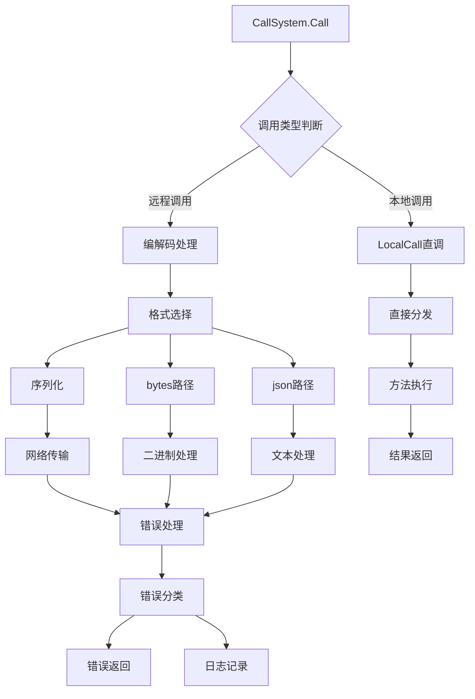

## 6A 任务卡：调用系统 CallSystem（分发表/打包/LocalCall）

- 编号: T06
- 模块: entity/ability/call, entity/rpc
- 责任人: [待分配]
- 优先级: 🟡 中优先级
- 状态: ❌ 未开始
- 预计完成时间: [待定]
- 实际完成时间: [待定]

### A1 目标（Aim）
构建一个完善的调用系统，能够：

1. **智能分发表管理**：
   - 规范和完善反射分发表的注册和管理机制
   - 支持动态能力注册和分发表更新
   - 提供分发表的一致性和完整性验证

2. **灵活编解码支持**：
   - 明确定义bytes/json路径与错误码映射
   - 支持多种序列化格式和编码策略
   - 实现智能的格式选择和自动回退机制

3. **高性能本地调用**：
   - 实现LocalCall直接调度dispatcher，绕过编解码开销
   - 提供本地调用的性能优化和缓存机制
   - 支持同步和异步两种调用模式

4. **完善的错误处理**：
   - 实现准确的错误分类（MethodNotFound/AbilityNotFound/Decode/Encode）
   - 提供详细的错误信息和诊断数据
   - 支持错误追踪和性能监控

### A2 分析（Analyze）
- **现状**：
  - ✅ 已实现：反射分发表已建立，支持funName到abilityType的映射
  - ✅ 已实现：json/bytes打包按packer选择，支持基本的编解码
  - ✅ 已实现：CallDispatcher基础框架，支持方法分发
  - ❌ 未实现：LocalCall方法尚未实现
  - ❌ 未实现：缺少完整的错误分类和错误码映射
  - ❌ 未实现：缺少分发表的验证和一致性检查

- **差距**：
  - 功能差距：缺少LocalCall本地调用能力
  - 架构差距：缺少完整的错误分类和处理机制
  - 质量差距：缺少分发表的一致性和完整性验证

- **约束**：
  - 技术约束：必须兼容现有的CallDispatcher和分发表机制
  - 性能约束：LocalCall不应显著增加系统复杂度
  - 兼容性约束：保持向后兼容，不破坏现有调用流程

- **风险**：
  - 技术风险：分发表不一致可能导致方法调用失败
  - 性能风险：编解码开销可能影响调用性能
  - 兼容性风险：错误分类不当可能影响错误处理逻辑

### A3 设计（Architect）

#### 契约接口定义

##### CallSystem 接口（基于 entity/ability/call/system.go 实现）
```go
// CallSystem 调用系统核心接口
type CallSystem interface {
    // Call 执行实体方法调用，保证同实体串行
    Call(ctx context.Context, srcName, funName string, req *entity.EntityRequest) ([][]byte, error)
    
    // LocalCall 本地直接调用（待实现）
    LocalCall(ctx context.Context, srcName, funName string, params []any) ([]any, error)
    
    // QueueLen 获取指定实体的队列长度
    QueueLen(entityType, id string) int
    
    // CloseActor 关闭指定实体的Actor
    CloseActor(entityType, id string)
    
    // CloseAll 关闭所有Actor
    CloseAll()
    
    // Init 初始化CallSystem，注册生命周期钩子
    Init(ctx context.Context, eMgr EntityMgr)
    
    // SetQueueSize 在 Init 之前设置默认队列大小
    SetQueueSize(size int)
}

// CallSystemImpl 调用系统实现
type CallSystemImpl struct {
    entityMgr    facade.EntityMgr
    t2Id2Call    map[string]map[string]*CallAbleAbility  // type -> id -> CallAbleAbility
    t2Id2Actor   map[string]map[string]*base.Actor       // type -> id -> per-entity actor
    mu           sync.Mutex
    queueSize    int
}
```

##### CallDispatcher 接口（基于 entity/ability/call/dispatcher.go 实现）
```go
// CallDispatcher 调用分发器接口
type CallDispatcher interface {
    // Dispatch 分发调用到具体的方法
    Dispatch(entityType string, fun interface{}, content rpc.RpcContent) (rpc.RpcContent, error)
    
    // RegisterMethod 注册方法
    RegisterMethod(name string, method interface{}) error
    
    // UnregisterMethod 注销方法
    UnregisterMethod(name string) error
    
    // GetMethod 获取方法
    GetMethod(name string) (interface{}, bool)
    
    // ListMethods 列出所有方法
    ListMethods() []string
}

// CallDispatcherImpl 调用分发器实现
type CallDispatcherImpl struct {
    methods map[string]interface{}  // 方法名 -> 方法实现
    mu      sync.RWMutex
}
```

##### RpcContent 接口（基于 rpc/rpc.go 实现）
```go
// RpcContent RPC内容接口
type RpcContent interface {
    // Type 获取内容类型
    Type() RpcContentType
    
    // Data 获取数据
    Data() interface{}
    
    // Bytes 获取字节数据
    Bytes() []byte
    
    // String 获取字符串数据
    String() string
}

// RpcContentType RPC内容类型
type RpcContentType int

const (
    RpcContentBytes RpcContentType = iota
    RpcContentJson
    RpcContentProto
    RpcContentForm
)

// Content 通用内容实现
type Content[T any] struct {
    CType RpcContentType
    Dt    T
}

// EntityRequest 实体请求
type EntityRequest struct {
    Type    string     `json:"type"`    // 实体类型
    Id      string     `json:"id"`      // 实体ID
    Content [][]byte   `json:"content"` // 请求内容
}
```

##### CallAbleAbility 接口（基于 entity/ability/call/ability.go 实现）
```go
// CallAbleAbility 可调用能力
type CallAbleAbility struct {
    BaseAbility
    dispatcher CallDispatcher
}

// Attach 绑定到实体
func (c *CallAbleAbility) Attach(ctx context.Context, owner Entity) error

// onCall 执行方法调用
func (c *CallAbleAbility) onCall(ctx context.Context, funName string, content rpc.RpcContent) (rpc.RpcContent, error)

// GetDispatcher 获取分发器
func (c *CallAbleAbility) GetDispatcher() CallDispatcher

// SetDispatcher 设置分发器
func (c *CallAbleAbility) SetDispatcher(dispatcher CallDispatcher)
```

##### 调用配置和选项接口
```go
// CallConfig 调用配置
type CallConfig struct {
    QueueSize       int           `json:"queue_size"`        // 队列大小
    Timeout         time.Duration `json:"timeout"`           // 超时时间
    Retries         int           `json:"retries"`           // 重试次数
    MaxConcurrency  int           `json:"max_concurrency"`  // 最大并发数
    EnableMetrics   bool          `json:"enable_metrics"`   // 是否启用指标
    EnableTracing   bool          `json:"enable_tracing"`   // 是否启用链路追踪
}

// CallOption 调用选项
type CallOption func(*CallConfig)

// 配置选项函数
func WithQueueSize(size int) CallOption
func WithTimeout(timeout time.Duration) CallOption
func WithRetries(retries int) CallOption
func WithMaxConcurrency(max int) CallOption
func WithMetrics(enabled bool) CallOption
func WithTracing(enabled bool) CallOption
```

##### 调用监控和指标接口
```go
// CallMetrics 调用指标接口
type CallMetrics interface {
    // RecordCall 记录调用
    RecordCall(entityType, id, funName string, duration time.Duration, err error)
    
    // RecordQueueLength 记录队列长度
    RecordQueueLength(entityType, id string, length int)
    
    // RecordQueueOverflow 记录队列溢出
    RecordQueueOverflow(entityType, id string)
    
    // RecordActorCreation 记录Actor创建
    RecordActorCreation(entityType, id string)
    
    // RecordActorCleanup 记录Actor清理
    RecordActorCleanup(entityType, id string)
    
    // GetMetrics 获取指标数据
    GetMetrics() map[string]interface{}
}

// CallTracing 调用链路追踪接口
type CallTracing interface {
    // StartSpan 开始追踪
    StartSpan(ctx context.Context, operation string, entityType, id string) (context.Context, Span)
    
    // EndSpan 结束追踪
    EndSpan(span Span, err error)
    
    // AddEvent 添加事件
    AddEvent(span Span, name string, attributes map[string]interface{})
    
    // SetAttributes 设置属性
    SetAttributes(span Span, attributes map[string]interface{})
}

// Span 追踪跨度
type Span interface {
    // Context 获取上下文
    Context() context.Context
    
    // End 结束跨度
    End()
    
    // AddEvent 添加事件
    AddEvent(name string, attributes map[string]interface{})
    
    // SetAttributes 设置属性
    SetAttributes(attributes map[string]interface{})
}
```

#### 架构流程图



- **核心功能模块**：
  - **T06-01 分发表管理器**：规范和完善分发表的注册和验证
  - **T06-02 编解码引擎**：实现智能的格式选择和编解码处理
  - **T06-03 LocalCall实现**：实现高性能的本地调用机制
  - **T06-04 错误分类系统**：实现完整的错误分类和处理

- **极小任务（Fine-grained tasks）**：
  - T06-01 分发表规范：规范RegisterType机制，增加一致性验证
  - T06-02 编解码完善：明确定义bytes/json路径与错误码映射
  - T06-03 LocalCall实现：实现LocalCall方法，绕过编解码开销
  - T06-04 错误处理增强：实现完整的错误分类和日志记录
  - T06-05 测试覆盖完善：编写bytes/json/LocalCall一致性测试

### A4 行动（Act）
- T06-01 分发表规范（entity/ability/call/ability.go）
  - 规范RegisterType方法，增加参数验证和错误处理
  - 实现分发表的一致性检查和完整性验证
  - 支持动态分发表的更新和清理机制

- T06-02 编解码完善（entity/ability/call/system.go）
  - 明确定义bytes和json两种编解码路径
  - 实现智能的格式选择策略和自动回退机制
  - 完善错误码映射和错误信息

- T06-03 LocalCall实现（entity/ability/call/system.go）
  - 实现LocalCall方法，直接调用dispatcher
  - 绕过编解码开销，提供高性能本地调用
  - 支持同步和异步两种调用模式

- T06-04 错误处理增强（entity/ability/call/errors.go）
  - 实现完整的错误分类（MethodNotFound/AbilityNotFound/Decode/Encode）
  - 提供详细的错误信息和诊断数据
  - 增加错误追踪和性能监控

- T06-05 测试覆盖完善（entity/ability/call/*_test.go）
  - 编写bytes/json/LocalCall一致性测试
  - 测试各种错误场景和边界条件
  - 验证分发表的一致性和完整性

### A5 验证（Assure）
- **单元测试（必需）**：
  - ✅ 分发表测试：验证分发表的一致性和完整性
  - ✅ 编解码测试：验证bytes/json路径的正确性
  - ✅ LocalCall测试：验证LocalCall与Call返回一致
  - ✅ 错误处理测试：验证错误分类的准确性

- **集成测试（可选）**：
  - 系统集成测试：验证CallSystem与整个调用链路的集成
  - 端到端测试：验证完整业务流程中的调用处理

#### 测试结果
- **分发表测试**: ❌ 未实现 - 需要实现一致性验证
- **编解码测试**: ❌ 未实现 - 需要完善错误码映射
- **LocalCall测试**: ❌ 未实现 - 需要实现LocalCall方法
- **错误处理测试**: ❌ 未实现 - 需要实现错误分类系统

### A6 迭代（Advance）
- 性能优化：
  - 🔄 分发表优化：实现智能缓存和预加载机制
  - 🔄 编解码优化：支持批量编解码和压缩策略

- 功能扩展：
  - 新序列化格式：支持更多序列化格式（Protocol Buffers、MessagePack等）
  - 智能路由：实现基于负载和性能的智能路由策略
  - 观测性增强：增加调用性能的监控指标和日志

- 观测性增强：
  - 监控指标：添加调用成功率、性能指标、错误分布等
  - 日志完善：增加调用操作的结构化日志记录
  - 下一步任务链接：与T10-generators-observability配合，实现代码生成和监控

### 📋 质量检查
- [ ] 代码质量检查完成
- [ ] 文档质量检查完成
- [ ] 测试质量检查完成

### 📋 任务完成总结
**T06 任务尚未开始**，当前状态：

**待实现的核心功能**：
1. 分发表的规范化和一致性验证
2. 完整的编解码路径和错误码映射
3. LocalCall高性能本地调用机制
4. 完整的错误分类和处理系统
5. 全面的测试覆盖

该任务将为调用系统提供完善的分发表管理、编解码支持和本地调用能力，提升系统的性能和可靠性。 