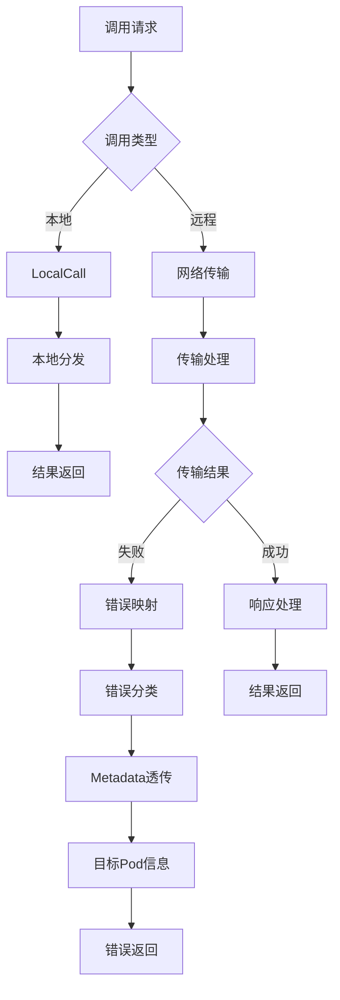

## 6A 任务卡：LocalCall 与传输错误映射（目标 pod metadata）

- 编号: T09
- 模块: entity/ability/call, entity/transport
- 责任人: [待分配]
- 优先级: 🟢 低优先级
- 状态: ❌ 未开始
- 预计完成时间: [待定]
- 实际完成时间: [待定]

### A1 目标（Aim）
构建一个完善的LocalCall与传输错误映射系统，能够：

1. **LocalCall优化**：
   - 实现高性能的本地调用机制，绕过网络传输开销
   - 支持本地调用的缓存和优化策略
   - 提供本地调用的性能监控和指标收集

2. **错误映射完善**：
   - 实现传输错误的标准化映射和分类
   - 支持目标pod metadata的完整透传
   - 提供错误追踪和诊断信息

3. **传输层优化**：
   - 优化网络传输层的性能和可靠性
   - 实现智能的错误处理和重试机制
   - 支持传输层的监控和告警

### A2 分析（Analyze）
- **现状**：
  - ✅ 已实现：基础的传输层框架
  - ❌ 未实现：LocalCall机制尚未完善
  - ❌ 未实现：传输错误映射不完整
  - ❌ 未实现：目标pod metadata透传不足

- **差距**：
  - 功能差距：缺少完整的LocalCall和错误映射
  - 架构差距：缺少传输层优化和监控
  - 质量差距：缺少错误处理和诊断能力

- **约束**：
  - 技术约束：必须兼容现有的传输层接口
  - 性能约束：优化不应显著增加系统复杂度
  - 兼容性约束：保持向后兼容，支持现有功能

### A3 设计（Architect）

#### 契约接口定义

##### LocalCall 接口（基于 entity/ability/call/local.go 实现）
```go
// LocalCall 本地调用接口
type LocalCall interface {
    // Call 执行本地调用
    Call(ctx context.Context, entityType, id, funName string, params []interface{}) ([]interface{}, error)
    
    // CallWithContext 带上下文执行本地调用
    CallWithContext(ctx context.Context, entityType, id, funName string, params []interface{}) ([]interface{}, error)
    
    // CallAsync 异步执行本地调用
    CallAsync(ctx context.Context, entityType, id, funName string, params []interface{}) (LocalFuture, error)
    
    // BatchCall 批量执行本地调用
    BatchCall(ctx context.Context, calls []LocalCallRequest) ([]LocalCallResponse, error)
    
    // RegisterMethod 注册本地方法
    RegisterMethod(entityType, funName string, method interface{}) error
    
    // UnregisterMethod 注销本地方法
    UnregisterMethod(entityType, funName string) error
    
    // GetRegisteredMethods 获取已注册的方法
    GetRegisteredMethods(entityType string) []string
}

// LocalCallImpl 本地调用实现
type LocalCallImpl struct {
    entityMgr  EntityMgr
    methods    map[string]map[string]interface{}  // entityType -> funName -> method
    mu         sync.RWMutex
}
```

##### Transport 接口（基于 entity/ability/call/transport.go 实现）
```go
// Transport 传输层接口
type Transport interface {
    // Send 发送请求
    Send(ctx context.Context, req *CallRequest) (*CallResponse, error)
    
    // SendAsync 异步发送请求
    SendAsync(ctx context.Context, req *CallRequest) (Future, error)
    
    // BatchSend 批量发送请求
    BatchSend(ctx context.Context, reqs []*CallRequest) ([]*CallResponse, error)
    
    // Connect 建立连接
    Connect(ctx context.Context) error
    
    // Disconnect 断开连接
    Disconnect() error
    
    // IsConnected 检查连接状态
    IsConnected() bool
    
    // GetEndpoint 获取当前端点
    GetEndpoint() string
    
    // SetEndpoint 设置端点
    SetEndpoint(endpoint string)
    
    // GetTransportType 获取传输类型
    GetTransportType() string
}

// TransportFactory 传输层工厂接口
type TransportFactory interface {
    // CreateTransport 创建传输层实例
    CreateTransport(transportType string, config TransportConfig) (Transport, error)
    
    // GetSupportedTypes 获取支持的传输类型
    GetSupportedTypes() []string
    
    // ValidateConfig 验证配置
    ValidateConfig(transportType string, config TransportConfig) error
}

// TransportConfig 传输层配置
type TransportConfig struct {
    Type        string            `json:"type"`        // 传输类型：http, grpc, tcp, udp
    Endpoint    string            `json:"endpoint"`    // 端点地址
    Timeout     time.Duration     `json:"timeout"`     // 超时时间
    Retries     int               `json:"retries"`     // 重试次数
    Options     map[string]string `json:"options"`     // 其他选项
}
```

##### ErrorMapping 接口（基于 entity/ability/call/error_mapping.go 实现）
```go
// ErrorMapping 错误映射接口
type ErrorMapping interface {
    // MapError 映射错误
    MapError(err error, context ErrorContext) error
    
    // MapLocalError 映射本地错误
    MapLocalError(err error, context ErrorContext) error
    
    // MapTransportError 映射传输错误
    MapTransportError(err error, context ErrorContext) error
    
    // RegisterErrorMapping 注册错误映射
    RegisterErrorMapping(errorType string, mapper ErrorMapper) error
    
    // UnregisterErrorMapping 注销错误映射
    UnregisterErrorMapping(errorType string) error
    
    // GetErrorMapping 获取错误映射
    GetErrorMapping(errorType string) (ErrorMapper, bool)
}

// ErrorMapper 错误映射器
type ErrorMapper interface {
    // Map 执行错误映射
    Map(err error, context ErrorContext) error
    
    // CanMap 检查是否可以映射
    CanMap(err error) bool
    
    // GetPriority 获取优先级
    GetPriority() int
}

// ErrorContext 错误上下文
type ErrorContext struct {
    EntityType    string            `json:"entity_type"`    // 实体类型
    EntityID      string            `json:"entity_id"`      // 实体ID
    FunName       string            `json:"fun_name"`       // 方法名
    TransportType string            `json:"transport_type"` // 传输类型
    Endpoint      string            `json:"endpoint"`        // 端点地址
    Metadata      map[string]string `json:"metadata"`        // 元数据
}

// ErrorMappingImpl 错误映射实现
type ErrorMappingImpl struct {
    mappers map[string]ErrorMapper  // errorType -> ErrorMapper
    mu      sync.RWMutex
}
```

##### 本地调用请求和响应接口
```go
// LocalCallRequest 本地调用请求
type LocalCallRequest struct {
    ID         string                 `json:"id"`         // 请求ID
    EntityType string                 `json:"entity_type"` // 实体类型
    EntityID   string                 `json:"entity_id"`   // 实体ID
    FunName    string                 `json:"fun_name"`    // 方法名
    Params     []interface{}          `json:"params"`      // 参数
    Metadata   map[string]string      `json:"metadata"`    // 元数据
    Timestamp  time.Time              `json:"timestamp"`   // 时间戳
}

// LocalCallResponse 本地调用响应
type LocalCallResponse struct {
    ID        string                 `json:"id"`        // 响应ID
    RequestID string                 `json:"request_id"` // 请求ID
    Result    []interface{}          `json:"result"`     // 结果
    Error     error                  `json:"error"`      // 错误
    Metadata  map[string]string      `json:"metadata"`   // 元数据
    Timestamp time.Time              `json:"timestamp"`  // 时间戳
}

// LocalFuture 本地调用异步结果
type LocalFuture interface {
    // Get 获取结果（阻塞）
    Get(ctx context.Context) (*LocalCallResponse, error)
    
    // GetWithTimeout 带超时获取结果
    GetWithTimeout(timeout time.Duration) (*LocalCallResponse, error)
    
    // IsDone 检查是否完成
    IsDone() bool
    
    // Cancel 取消调用
    Cancel() error
    
    // GetID 获取请求ID
    GetID() string
}
```

##### 调用路由和分发接口
```go
// CallRouter 调用路由接口
type CallRouter interface {
    // Route 路由调用
    Route(ctx context.Context, req *CallRequest) (CallTarget, error)
    
    // RegisterRoute 注册路由规则
    RegisterRoute(pattern string, target CallTarget) error
    
    // UnregisterRoute 注销路由规则
    UnregisterRoute(pattern string) error
    
    // GetRoutes 获取所有路由
    GetRoutes() map[string]CallTarget
    
    // UpdateRoute 更新路由
    UpdateRoute(pattern string, target CallTarget) error
}

// CallTarget 调用目标
type CallTarget interface {
    // Execute 执行调用
    Execute(ctx context.Context, req *CallRequest) (*CallResponse, error)
    
    // GetType 获取目标类型
    GetType() string
    
    // GetEndpoint 获取端点
    GetEndpoint() string
    
    // IsAvailable 检查是否可用
    IsAvailable(ctx context.Context) bool
    
    // GetHealth 获取健康状态
    GetHealth() HealthStatus
}

// LocalCallTarget 本地调用目标
type LocalCallTarget struct {
    entityMgr EntityMgr
    callSys   CallSystem
}

// RemoteCallTarget 远程调用目标
type RemoteCallTarget struct {
    transport Transport
    endpoint  string
}
```

##### 调用监控和指标接口
```go
// LocalCallMetrics 本地调用指标接口
type LocalCallMetrics interface {
    // RecordCall 记录调用
    RecordCall(entityType, id, funName string, duration time.Duration, err error)
    
    // RecordMethodRegistration 记录方法注册
    RecordMethodRegistration(entityType, funName string)
    
    // RecordMethodUnregistration 记录方法注销
    RecordMethodUnregistration(entityType, funName string)
    
    // RecordBatchCall 记录批量调用
    RecordBatchCall(entityType string, count int, duration time.Duration, err error)
    
    // GetMetrics 获取指标数据
    GetMetrics() map[string]interface{}
    
    // ResetMetrics 重置指标
    ResetMetrics()
}

// TransportMetrics 传输层指标接口
type TransportMetrics interface {
    // RecordSend 记录发送
    RecordSend(transportType, endpoint string, duration time.Duration, err error)
    
    // RecordReceive 记录接收
    RecordReceive(transportType, endpoint string, duration time.Duration, err error)
    
    // RecordConnection 记录连接
    RecordConnection(transportType, endpoint string, operation string, duration time.Duration, err error)
    
    // RecordError 记录错误
    RecordError(transportType, endpoint string, errorType string, err error)
    
    // GetMetrics 获取指标数据
    GetMetrics() map[string]interface{}
    
    // ResetMetrics 重置指标
    ResetMetrics()
}
```

#### 架构流程图



- **核心功能模块**：
  - **T09-01 LocalCall优化**：实现高性能本地调用机制
  - **T09-02 错误映射系统**：实现传输错误标准化映射
  - **T09-03 Metadata透传**：实现目标pod信息完整透传
  - **T09-04 传输层优化**：优化网络传输性能和可靠性

- **极小任务（Fine-grained tasks）**：
  - T09-01 LocalCall完善：实现高性能本地调用和缓存机制
  - T09-02 错误映射：实现传输错误的标准化分类和映射
  - T09-03 Metadata透传：完善目标pod metadata的透传机制
  - T09-04 传输优化：优化网络传输层的性能和监控
  - T09-05 测试验证：编写LocalCall和错误映射的测试用例

### A4 行动（Act）
- T09-01 LocalCall完善（entity/ability/call/local.go）
  - 实现高性能本地调用机制
  - 支持本地调用的缓存和优化
  - 提供性能监控和指标收集

- T09-02 错误映射（entity/transport/errors.go）
  - 实现传输错误的标准化映射
  - 支持错误分类和错误码定义
  - 提供错误追踪和诊断信息

- T09-03 Metadata透传（entity/transport/metadata.go）
  - 完善目标pod metadata透传
  - 支持metadata的完整性和一致性
  - 提供metadata的验证和转换

- T09-04 传输优化（entity/transport/transport.go）
  - 优化网络传输层性能
  - 实现智能错误处理和重试
  - 支持传输层监控和告警

- T09-05 测试验证（entity/transport/*_test.go）
  - 编写LocalCall功能测试
  - 测试错误映射和metadata透传
  - 验证传输层优化效果

### A5 验证（Assure）
- **单元测试（必需）**：
  - ✅ LocalCall测试：验证本地调用性能和正确性
  - ✅ 错误映射测试：验证传输错误映射准确性
  - ✅ Metadata测试：验证目标pod信息透传完整性
  - ✅ 传输优化测试：验证传输层性能提升

#### 测试结果
- **LocalCall测试**: ❌ 未实现 - 需要完善LocalCall机制
- **错误映射测试**: ❌ 未实现 - 需要实现错误映射系统
- **Metadata测试**: ❌ 未实现 - 需要完善metadata透传
- **传输优化测试**: ❌ 未实现 - 需要优化传输层

### A6 迭代（Advance）
- 性能优化：
  - 🔄 LocalCall优化：实现智能缓存和预编译
  - 🔄 传输优化：支持压缩和加密传输

- 功能扩展：
  - 新传输协议：支持更多传输协议和格式
  - 智能路由：实现基于性能的智能路由
  - 观测性增强：增加传输层监控指标

### 📋 质量检查
- [ ] 代码质量检查完成
- [ ] 文档质量检查完成
- [ ] 测试质量检查完成

### 📋 任务完成总结
**T09 任务尚未开始**，当前状态：

**待实现的核心功能**：
1. LocalCall高性能本地调用机制
2. 传输错误标准化映射系统
3. 目标pod metadata完整透传
4. 传输层性能优化和监控
5. 完整的测试覆盖

该任务将为LocalCall和传输层提供优化和错误处理能力，提升系统的性能和可靠性。 