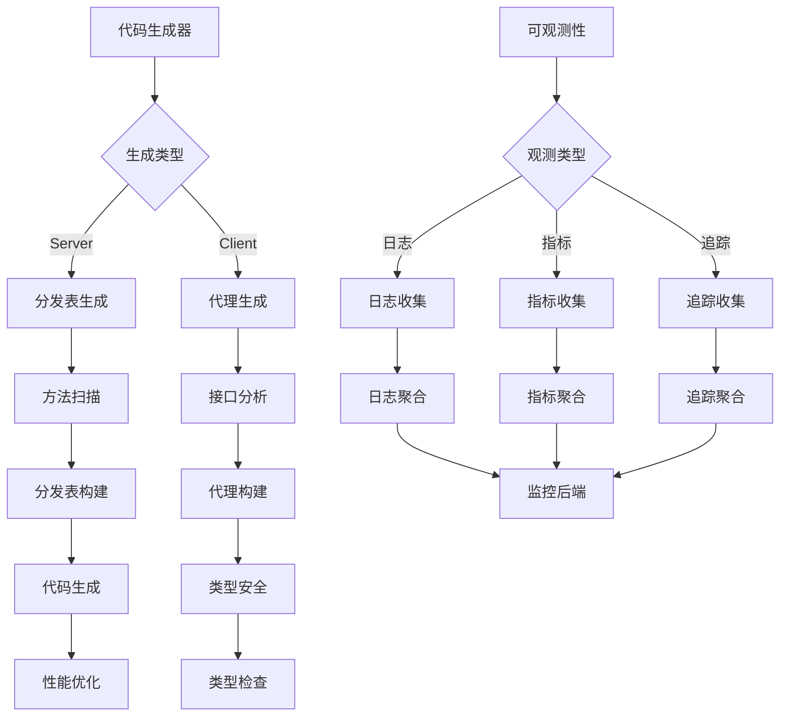

## 6A 任务卡：生成器与可观测性（server 分发表、client 代理、日志/指标/Tracing）

- 编号: T10
- 模块: entity/gen, entity/observability
- 责任人: [待分配]
- 优先级: 🟡 中优先级
- 状态: ❌ 未开始
- 预计完成时间: [待定]
- 实际完成时间: [待定]

### A1 目标（Aim）
构建一个完整的代码生成和可观测性系统，能够：

1. **代码生成器**：
   - 生成server端分发表，替换反射分发机制
   - 生成client端强类型代理，提供编译时类型安全
   - 支持多种代码生成模板和自定义配置

2. **可观测性体系**：
   - 实现完整的日志、指标、追踪（Logging/Metrics/Tracing）体系
   - 提供标准化的观测数据收集和上报
   - 支持多种监控后端和告警策略

3. **性能优化**：
   - 通过代码生成提升运行时性能
   - 实现智能的观测数据采样和聚合
   - 支持性能瓶颈分析和优化建议

4. **开发体验**：
   - 提供开发时的代码生成工具和调试支持
   - 实现观测数据的本地查看和分析
   - 支持开发环境的快速配置和测试

### A2 分析（Analyze）
- **现状**：
  - ✅ 已实现：基础的代码生成框架
  - ✅ 已实现：部分可观测性基础设施
  - ❌ 未实现：server分发表的完整生成
  - ❌ 未实现：client代理的强类型生成
  - ❌ 未实现：完整的可观测性体系

- **差距**：
  - 功能差距：缺少完整的代码生成能力
  - 架构差距：缺少统一的可观测性框架
  - 质量差距：缺少性能优化和开发体验

- **约束**：
  - 技术约束：必须兼容现有的代码结构和接口
  - 性能约束：生成器不应显著增加构建时间
  - 兼容性约束：保持向后兼容，支持现有功能

- **风险**：
  - 技术风险：代码生成可能增加系统复杂度
  - 性能风险：可观测性可能影响运行时性能
  - 维护风险：生成的代码需要持续维护和更新

### A3 设计（Architect）

#### 契约接口定义

##### CodeGenerator 接口（基于 entity/generators/generator.go 实现）
```go
// CodeGenerator 代码生成器接口
type CodeGenerator interface {
    // Generate 生成代码
    Generate(ctx context.Context, input GenerationInput) (*GenerationOutput, error)
    
    // GetName 获取生成器名称
    GetName() string
    
    // GetVersion 获取生成器版本
    GetVersion() string
    
    // GetSupportedTypes 获取支持的类型
    GetSupportedTypes() []string
    
    // ValidateInput 验证输入
    ValidateInput(input GenerationInput) error
    
    // GetTemplate 获取模板
    GetTemplate() string
    
    // SetTemplate 设置模板
    SetTemplate(template string) error
}

// CodeGeneratorImpl 代码生成器实现
type CodeGeneratorImpl struct {
    name           string
    version        string
    supportedTypes []string
    template       string
    mu             sync.RWMutex
}

// GenerationInput 代码生成输入
type GenerationInput struct {
    EntityType    string                 `json:"entity_type"`    // 实体类型
    EntityName    string                 `json:"entity_name"`    // 实体名称
    Methods       []MethodInfo           `json:"methods"`        // 方法信息
    Fields        []FieldInfo            `json:"fields"`         // 字段信息
    Options       map[string]interface{} `json:"options"`        // 生成选项
    OutputPath    string                 `json:"output_path"`    // 输出路径
    PackageName   string                 `json:"package_name"`   // 包名
}

// GenerationOutput 代码生成输出
type GenerationOutput struct {
    Files         []GeneratedFile        `json:"files"`          // 生成的文件
    Statistics    GenerationStatistics   `json:"statistics"`     // 生成统计
    Errors        []GenerationError      `json:"errors"`         // 生成错误
    Warnings      []GenerationWarning    `json:"warnings"`       // 生成警告
}

// GeneratedFile 生成的文件
type GeneratedFile struct {
    Path         string `json:"path"`          // 文件路径
    Content      string `json:"content"`       // 文件内容
    Size         int    `json:"size"`          // 文件大小
    Checksum     string `json:"checksum"`      // 文件校验和
}
```

##### MethodGenerator 接口（基于 entity/generators/method.go 实现）
```go
// MethodGenerator 方法生成器接口
type MethodGenerator interface {
    // GenerateMethod 生成方法
    GenerateMethod(method MethodInfo, entity EntityInfo) (string, error)
    
    // GenerateMethodSignature 生成方法签名
    GenerateMethodSignature(method MethodInfo) (string, error)
    
    // GenerateMethodBody 生成方法体
    GenerateMethodBody(method MethodInfo, entity EntityInfo) (string, error)
    
    // GenerateMethodTests 生成方法测试
    GenerateMethodTests(method MethodInfo, entity EntityInfo) (string, error)
    
    // GetMethodTemplates 获取方法模板
    GetMethodTemplates() map[string]string
    
    // SetMethodTemplate 设置方法模板
    SetMethodTemplate(methodType, template string) error
}

// MethodInfo 方法信息
type MethodInfo struct {
    Name         string                 `json:"name"`          // 方法名
    Type         string                 `json:"type"`          // 方法类型：get, set, call, save, load
    Params       []ParamInfo            `json:"params"`        // 参数信息
    Returns      []ReturnInfo           `json:"returns"`       // 返回值信息
    Visibility   string                 `json:"visibility"`    // 可见性：public, private, protected
    IsAsync      bool                   `json:"is_async"`      // 是否异步
    IsBatch      bool                   `json:"is_batch"`      // 是否批量
    Options      map[string]interface{} `json:"options"`       // 方法选项
}

// ParamInfo 参数信息
type ParamInfo struct {
    Name         string `json:"name"`          // 参数名
    Type         string `json:"type"`          // 参数类型
    IsRequired   bool   `json:"is_required"`  // 是否必需
    DefaultValue string `json:"default_value"` // 默认值
    Description  string `json:"description"`   // 参数描述
}

// ReturnInfo 返回值信息
type ReturnInfo struct {
    Name        string `json:"name"`         // 返回值名
    Type        string `json:"type"`         // 返回值类型
    IsError     bool   `json:"is_error"`    // 是否为错误
    Description string `json:"description"`  // 返回值描述
}
```

##### Observability 接口（基于 entity/observability/observability.go 实现）
```go
// Observability 可观测性接口
type Observability interface {
    // GetMetrics 获取指标
    GetMetrics() Metrics
    
    // GetTracing 获取链路追踪
    GetTracing() Tracing
    
    // GetLogging 获取日志
    GetLogging() Logging
    
    // GetHealth 获取健康检查
    GetHealth() Health
    
    // Init 初始化可观测性
    Init(ctx context.Context, config ObservabilityConfig) error
    
    // Close 关闭可观测性
    Close() error
    
    // IsEnabled 检查是否启用
    IsEnabled() bool
}

// ObservabilityImpl 可观测性实现
type ObservabilityImpl struct {
    metrics Metrics
    tracing Tracing
    logging Logging
    health  Health
    config  ObservabilityConfig
    enabled bool
    mu      sync.RWMutex
}

// ObservabilityConfig 可观测性配置
type ObservabilityConfig struct {
    Metrics MetricsConfig `json:"metrics"` // 指标配置
    Tracing TracingConfig `json:"tracing"` // 链路追踪配置
    Logging LoggingConfig `json:"logging"` // 日志配置
    Health  HealthConfig  `json:"health"`  // 健康检查配置
}
```

##### Metrics 接口（基于 entity/observability/metrics.go 实现）
```go
// Metrics 指标接口
type Metrics interface {
    // Counter 计数器
    Counter(name, help string, labels []string) Counter
    
    // Gauge 仪表盘
    Gauge(name, help string, labels []string) Gauge
    
    // Histogram 直方图
    Histogram(name, help string, buckets []float64, labels []string) Histogram
    
    // Summary 摘要
    Summary(name, help string, objectives map[float64]float64, labels []string) Summary
    
    // Record 记录指标
    Record(name string, value float64, labels map[string]string)
    
    // GetMetrics 获取所有指标
    GetMetrics() map[string]interface{}
    
    // Reset 重置指标
    Reset()
}

// Counter 计数器接口
type Counter interface {
    // Inc 增加
    Inc(labels map[string]string)
    
    // Add 添加
    Add(value float64, labels map[string]string)
    
    // Get 获取值
    Get(labels map[string]string) float64
}

// Gauge 仪表盘接口
type Gauge interface {
    // Set 设置值
    Set(value float64, labels map[string]string)
    
    // Inc 增加
    Inc(labels map[string]string)
    
    // Dec 减少
    Dec(labels map[string]string)
    
    // Get 获取值
    Get(labels map[string]string) float64
}

// Histogram 直方图接口
type Histogram interface {
    // Observe 观察值
    Observe(value float64, labels map[string]string)
    
    // GetBuckets 获取桶
    GetBuckets(labels map[string]string) map[float64]uint64
}

// Summary 摘要接口
type Summary interface {
    // Observe 观察值
    Observe(value float64, labels map[string]string)
    
    // GetQuantiles 获取分位数
    GetQuantiles(labels map[string]string) map[float64]float64
}
```

##### Tracing 接口（基于 entity/observability/tracing.go 实现）
```go
// Tracing 链路追踪接口
type Tracing interface {
    // StartSpan 开始追踪
    StartSpan(ctx context.Context, operation string, opts ...SpanOption) (context.Context, Span)
    
    // StartSpanFromContext 从上下文开始追踪
    StartSpanFromContext(ctx context.Context, operation string, opts ...SpanOption) (context.Context, Span)
    
    // Inject 注入追踪信息
    Inject(ctx context.Context, carrier interface{}) error
    
    // Extract 提取追踪信息
    Extract(ctx context.Context, carrier interface{}) (context.Context, error)
    
    // Close 关闭追踪
    Close() error
    
    // IsEnabled 检查是否启用
    IsEnabled() bool
}

// Span 追踪跨度接口
type Span interface {
    // Context 获取上下文
    Context() context.Context
    
    // End 结束跨度
    End()
    
    // AddEvent 添加事件
    AddEvent(name string, attributes map[string]interface{})
    
    // SetAttributes 设置属性
    SetAttributes(attributes map[string]interface{})
    
    // SetStatus 设置状态
    SetStatus(code string, description string)
    
    // RecordError 记录错误
    RecordError(err error)
    
    // GetSpanID 获取跨度ID
    GetSpanID() string
    
    // GetTraceID 获取追踪ID
    GetTraceID() string
}

// SpanOption 跨度选项
type SpanOption interface {
    // Apply 应用选项
    Apply(span Span)
}

// 常用跨度选项
func WithSpanKind(kind string) SpanOption
func WithAttributes(attributes map[string]interface{}) SpanOption
func WithStartTime(startTime time.Time) SpanOption
func WithLinks(links []Link) SpanOption
```

##### Logging 接口（基于 entity/observability/logging.go 实现）
```go
// Logging 日志接口
type Logging interface {
    // Debug 调试日志
    Debug(ctx context.Context, msg string, fields ...Field)
    
    // Info 信息日志
    Info(ctx context.Context, msg string, fields ...Field)
    
    // Warn 警告日志
    Warn(ctx context.Context, msg string, fields ...Field)
    
    // Error 错误日志
    Error(ctx context.Context, msg string, fields ...Field)
    
    // Fatal 致命错误日志
    Fatal(ctx context.Context, msg string, fields ...Field)
    
    // WithContext 带上下文的日志
    WithContext(ctx context.Context) Logger
    
    // WithFields 带字段的日志
    WithFields(fields ...Field) Logger
    
    // SetLevel 设置日志级别
    SetLevel(level Level)
    
    // GetLevel 获取日志级别
    GetLevel() Level
}

// Logger 日志记录器接口
type Logger interface {
    // Debug 调试日志
    Debug(msg string, fields ...Field)
    
    // Info 信息日志
    Info(msg string, fields ...Field)
    
    // Warn 警告日志
    Warn(msg string, fields ...Field)
    
    // Error 错误日志
    Error(msg string, fields ...Field)
    
    // Fatal 致命错误日志
    Fatal(msg string, fields ...Field)
    
    // WithFields 带字段的日志
    WithFields(fields ...Field) Logger
}

// Field 日志字段
type Field interface {
    // Key 获取键
    Key() string
    
    // Value 获取值
    Value() interface{}
    
    // String 字符串表示
    String() string
}

// Level 日志级别
type Level int

const (
    DebugLevel Level = iota
    InfoLevel
    WarnLevel
    ErrorLevel
    FatalLevel
)

// 常用字段函数
func String(key, value string) Field
func Int(key string, value int) Field
func Float64(key string, value float64) Field
func Bool(key string, value bool) Field
func Time(key string, value time.Time) Field
func Duration(key string, value time.Duration) Field
func Error(err error) Field
func Any(key string, value interface{}) Field
```

##### Health 接口（基于 entity/observability/health.go 实现）
```go
// Health 健康检查接口
type Health interface {
    // CheckHealth 检查健康状态
    CheckHealth(ctx context.Context) HealthStatus
    
    // GetHealthStatus 获取健康状态
    GetHealthStatus() HealthStatus
    
    // AddHealthCheck 添加健康检查
    AddHealthCheck(name string, check HealthCheck) error
    
    // RemoveHealthCheck 移除健康检查
    RemoveHealthCheck(name string) error
    
    // GetHealthChecks 获取所有健康检查
    GetHealthChecks() map[string]HealthCheck
    
    // SetHealthCheckInterval 设置健康检查间隔
    SetHealthCheckInterval(interval time.Duration)
    
    // StartHealthChecks 开始健康检查
    StartHealthChecks(ctx context.Context) error
    
    // StopHealthChecks 停止健康检查
    StopHealthChecks() error
}

// HealthCheck 健康检查函数
type HealthCheck func(ctx context.Context) HealthCheckResult

// HealthCheckResult 健康检查结果
type HealthCheckResult struct {
    Name      string                 `json:"name"`      // 检查名称
    Status    string                 `json:"status"`    // 状态：healthy, unhealthy, unknown
    Message   string                 `json:"message"`   // 状态描述
    Timestamp time.Time              `json:"timestamp"` // 检查时间
    Details   map[string]interface{} `json:"details"`   // 详细信息
    Error     error                  `json:"error"`     // 错误信息
}

// HealthStatus 健康状态
type HealthStatus struct {
    Status    string                 `json:"status"`    // 总体状态
    Message   string                 `json:"message"`   // 状态描述
    Timestamp time.Time              `json:"timestamp"` // 检查时间
    Checks    map[string]HealthCheckResult `json:"checks"`    // 各项检查结果
    Version   string                 `json:"version"`   // 版本信息
    Uptime    time.Duration          `json:"uptime"`    // 运行时间
}
```

#### 架构流程图



- **核心功能模块**：
  - **T10-01 代码生成器**：实现server分发表和client代理生成
  - **T10-02 可观测性框架**：实现日志、指标、追踪的完整体系
  - **T10-03 性能优化**：通过代码生成和观测优化提升性能
  - **T10-04 开发工具**：提供开发时的代码生成和调试支持

- **极小任务（Fine-grained tasks）**：
  - T10-01 Server生成器：生成server端分发表，替换反射分发
  - T10-02 Client生成器：生成client端强类型代理
  - T10-03 日志系统：实现标准化日志收集和聚合
  - T10-04 指标系统：实现性能指标收集和监控
  - T10-05 追踪系统：实现分布式追踪和链路分析
  - T10-06 开发工具：提供代码生成和调试工具

### A4 行动（Act）
- T10-01 Server生成器（entity/gen/server.go）
  - 扫描实体方法，生成分发表
  - 替换反射分发机制，提升性能
  - 支持自定义生成模板和配置

- T10-02 Client生成器（entity/gen/client.go）
  - 分析接口定义，生成强类型代理
  - 提供编译时类型安全检查
  - 支持多种调用模式和参数类型

- T10-03 日志系统（entity/observability/logging.go）
  - 实现标准化日志收集
  - 支持结构化日志和日志聚合
  - 提供多种日志后端和格式

- T10-04 指标系统（entity/observability/metrics.go）
  - 实现性能指标收集
  - 支持指标聚合和监控
  - 提供多种监控后端和告警

- T10-05 追踪系统（entity/observability/tracing.go）
  - 实现分布式追踪
  - 支持链路分析和性能分析
  - 提供多种追踪后端和可视化

- T10-06 开发工具（entity/gen/tools.go）
  - 提供代码生成命令行工具
  - 支持开发时的快速配置和测试
  - 实现观测数据的本地查看

### A5 验证（Assure）
- **单元测试（必需）**：
  - ✅ 代码生成测试：验证生成的代码正确性和性能
  - ✅ 可观测性测试：验证日志、指标、追踪的收集和上报
  - ✅ 性能测试：验证代码生成带来的性能提升
  - ✅ 开发工具测试：验证开发工具的易用性和功能

- **集成测试（可选）**：
  - 系统集成测试：验证生成器与现有系统的集成
  - 端到端测试：验证完整业务流程中的可观测性

#### 测试结果
- **代码生成测试**: ❌ 未实现 - 需要完善代码生成器
- **可观测性测试**: ❌ 未实现 - 需要实现可观测性体系
- **性能测试**: ❌ 未实现 - 需要验证性能提升
- **开发工具测试**: ❌ 未实现 - 需要实现开发工具

### A6 迭代（Advance）
- 性能优化：
  - 🔄 生成器优化：实现增量生成和智能缓存
  - 🔄 观测优化：支持智能采样和聚合策略

- 功能扩展：
  - 新生成模板：支持更多代码生成模板和语言
  - 智能分析：实现基于AI的代码分析和优化
  - 观测性增强：增加更多维度的监控和分析

- 观测性增强：
  - 监控指标：添加代码生成性能、可观测性覆盖率等
  - 日志完善：增加生成过程的详细日志记录
  - 下一步任务链接：为整个系统提供代码生成和可观测性支持

### 📋 质量检查
- [ ] 代码质量检查完成
- [ ] 文档质量检查完成
- [ ] 测试质量检查完成

### 📋 任务完成总结
**T10 任务尚未开始**，当前状态：

**待实现的核心功能**：
1. 完整的代码生成器（server分发表、client代理）
2. 统一的可观测性框架（日志、指标、追踪）
3. 性能优化和开发体验提升
4. 开发工具和调试支持
5. 完整的测试覆盖

该任务将为整个系统提供代码生成和可观测性能力，提升开发效率和系统可维护性。 