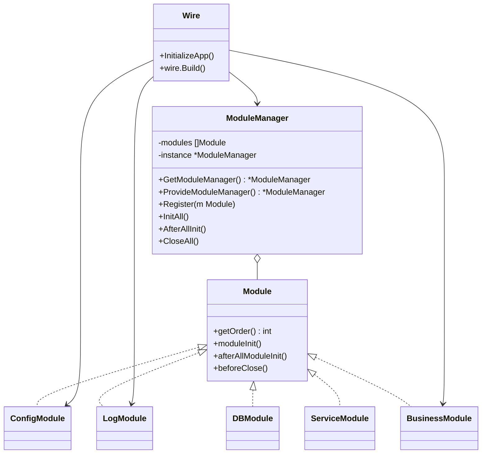

# ModuleKit 模块需求文档

## 1. 项目背景

在微服务与模块化架构中，系统由多个独立模块组成，这些模块之间存在依赖关系。

### 目前问题

- **模块初始化顺序、关闭顺序需要手动控制**，易出错
- **不同模块重复实现生命周期管理逻辑**，开发成本高

### 目标

- 提供一个**基础模块 Kit（ModuleKit）**，统一管理模块的注册、初始化、关闭
- 各业务模块只需实现 `Module` 接口并注册到 `ModuleManager`，即可自动管理生命周期
- `ModuleKit` 可以作为其他模块依赖模块，保证模块间统一生命周期管理

## 2. 功能目标

- 提供统一 `Module` 接口及 `ModuleManager`，用于模块生命周期管理
- 自动按优先级初始化、反向关闭
- 业务模块无需关心生命周期管理细节，只需注册
- `ModuleKit` 可作为基础依赖模块被业务模块调用

### 可量化指标

- 新增模块仅需注册即可，初始化顺序、关闭顺序无需人工控制
- 业务模块依赖的基础模块（日志、配置、数据库）由 `ModuleKit` 管理并保证初始化完成

## 3. 功能需求（FR）

| 编号 | 功能描述 | 优先级 | 验收标准 |
|------|----------|--------|----------|
| FR-01 | 提供统一 Module 接口 | 🔴 高 | 所有模块实现该接口即可被 ModuleKit 管理 |
| FR-02 | 自动注册与排序 | 🔴 高 | 注册多个模块时，ModuleManager 按 order 值排序 |
| FR-03 | 模块初始化 | 🔴 高 | 低 order 模块优先初始化，业务模块无需关心顺序 |
| FR-04 | 全局初始化回调 | 🟠 中 | 所有模块初始化完成后，ModuleManager 调用 afterAllModuleInit |
| FR-05 | 优雅关闭机制 | 🔴 高 | 服务关闭时，ModuleManager 按反向顺序调用 beforeClose |
| FR-06 | 模块依赖管理 | 🔴 高 | 业务模块可依赖基础 ModuleKit 提供的能力，无需重复实现逻辑 |
| FR-07 | 异常隔离 | 🟡 中 | 某模块初始化失败不影响已初始化模块的关闭 |

## 4. 非功能需求（NFR）

- **可扩展性**：支持多种类型模块（RootModule、SupportModule、DriverModule、ServiceModule）
- **隔离性**：模块异常不会影响系统整体稳定性
- **灵活性**：模块可动态注册、注销
- **通用性**：适用于 Kratos、Go 单体服务等场景

## 5. 核心设计规则

1. **单一职责**：每个模块只关注自身逻辑
2. **接口优先**：统一实现 Module 接口
3. **可扩展性**：ModuleKit 可作为基础模块被其他模块依赖
4. **模块边界清晰**：模块之间仅通过接口交互
5. **观测性内建**：记录模块初始化与关闭顺序
6. **失败优雅降级**：某模块异常不影响其他模块

## 6. 核心设计

### 架构图



### 核心接口

#### Module 接口

```go
type Module interface {
    Order() int                          // 模块优先级，值越小越先执行
    Init(ctx context.Context) error      // 模块初始化
    AfterAllInit(ctx context.Context)    // 全部模块初始化完成后回调
    BeforeClose(ctx context.Context)     // 服务关闭前回调
}
```

#### ModuleManager 单例接口

```go
// 全局单例获取
func GetModuleManager() *ModuleManager

// 依赖注入 Provider
func ProvideModuleManager() *ModuleManager

// 核心方法
type ModuleManager struct {
    // 私有字段，确保单例
}

func (mm *ModuleManager) Register(m Module)           // 注册模块
func (mm *ModuleManager) InitAll(ctx context.Context) error    // 初始化所有模块
func (mm *ModuleManager) AfterAllInit(ctx context.Context)     // 全局初始化回调
func (mm *ModuleManager) CloseAll(ctx context.Context) error   // 关闭所有模块
```

#### ModuleManager

管理模块注册、按优先级排序初始化、全局初始化回调、反向关闭。

**设计特点：**
- **单例模式**：全局唯一实例，确保模块管理的一致性
- **Wire 注册**：支持依赖注入框架，便于模块注册和配置
- **线程安全**：支持并发注册和初始化操作

业务模块无需管理生命周期，由 `ModuleKit` 完成。

### 数据模型与协议

- **初始化顺序**：order 越小越先初始化
- **关闭顺序**：反向关闭（业务模块 → Service → Driver → Support → Root）
- **模块依赖**：业务模块可依赖基础 ModuleKit 模块（如日志、配置、数据库）

### 使用示例

#### 方式一：直接使用单例

```go
// 基础日志模块
type LogModule struct {}

func (l *LogModule) Order() int { return 10 }
func (l *LogModule) Init(ctx context.Context) error { 
    fmt.Println("Init Log")
    return nil 
}
func (l *LogModule) AfterAllInit(ctx context.Context) { 
    fmt.Println("Log Ready") 
}
func (l *LogModule) BeforeClose(ctx context.Context) { 
    fmt.Println("Close Log") 
}

// 业务模块
type QuestModule struct {}

func (q *QuestModule) Order() int { return 100 }
func (q *QuestModule) Init(ctx context.Context) error { 
    fmt.Println("Init Quest")
    return nil 
}
func (q *QuestModule) AfterAllInit(ctx context.Context) { 
    fmt.Println("Quest Ready") 
}
func (q *QuestModule) BeforeClose(ctx context.Context) { 
    fmt.Println("Close Quest") 
}

// 使用全局单例
mm := module.GetModuleManager()
mm.Register(&LogModule{})
mm.Register(&QuestModule{})

mm.InitAll(ctx)        // 按顺序初始化模块
mm.AfterAllInit(ctx)   // 所有模块初始化完成后回调
// ...
mm.CloseAll(ctx)       // 按反向顺序关闭模块
```

#### 方式二：Wire 依赖注入

```go
// wire.go
//go:build wireinject
// +build wireinject

package main

import (
    "github.com/google/wire"
    "your-project/module"
    "your-project/log"
    "your-project/config"
    "your-project/quest"
)

func InitializeApp() (*App, error) {
    wire.Build(
        // 提供 ModuleManager 单例
        module.ProvideModuleManager,
        
        // 提供各模块
        log.ProvideLogModule,
        config.ProvideConfigModule,
        quest.ProvideQuestModule,
        
        // 构建应用
        wire.Struct(new(App), "*"),
    )
    return nil, nil
}

// 各模块的 Provider 函数
// log/provider.go
func ProvideLogModule() module.Module {
    return &log.LogModule{}
}

// config/provider.go  
func ProvideConfigModule() module.Module {
    return &config.ConfigModule{}
}

// quest/provider.go
func ProvideQuestModule() module.Module {
    return &quest.QuestModule{}
}
```

## 7. 约束与边界

- **依赖模块**：日志、配置、数据库等基础模块由 ModuleKit 管理
- **功能边界**：只管理模块生命周期、优先级，不涉及业务逻辑
- **支持功能**：模块注入、初始化顺序、关闭顺序、异常隔离、依赖管理

## 8. 模块目录规划与文件说明

```
/module                    # ModuleKit 核心包
├── manager.go            # ModuleManager 核心实现
│                         # - 管理模块生命周期（初始化、关闭）
│                         # - 支持按 order 排序和并发初始化
│                         # - 提供 AfterAllInit 全局回调
│                         # - 单例模式，确保全局唯一
│
├── interfaces.go         # Module 接口定义
│                         # - 定义模块生命周期方法：Init、AfterAllInit、BeforeClose
│                         # - 定义 order 属性，用于优先级排序
│
└── provider.go           # Wire 依赖注入支持
                          # - 提供 ModuleManager 单例的 Provider 函数
                          # - 支持模块的自动注入和管理

# 其他模块可以独立存在，通过实现 Module 接口加入管理
/log                      # 日志模块，依赖 ModuleKit
├── log.go               # 实现 Module 接口
└── README.md            # 模块说明

/config                   # 配置模块，依赖 ModuleKit
├── config.go            # 实现 Module 接口
└── README.md            # 模块说明

/database                 # 数据库模块，依赖 ModuleKit
├── db.go                # 实现 Module 接口
└── README.md            # 模块说明

/service                  # 服务模块，依赖 ModuleKit
├── service.go           # 实现 Module 接口
└── README.md            # 模块说明

/quest                    # 业务模块示例，依赖 ModuleKit
├── quest.go             # 实现 Module 接口
└── README.md            # 模块说明
```

### 文件职责说明

| 文件/目录 | 职责 |
|-----------|------|
| `/module/interfaces.go` | 定义 Module 接口，包含生命周期方法（Init、AfterAllInit、BeforeClose）及 order 属性 |
| `/module/manager.go` | 实现 ModuleManager 单例，负责模块生命周期管理、排序、初始化、全局回调和反向关闭 |
| `/module/provider.go` | 提供 Wire 依赖注入的 Provider 函数，支持模块的自动注入 |
| `/log/log.go` | 日志模块实现 Module 接口，依赖 ModuleKit 进行生命周期管理 |
| `/config/config.go` | 配置模块实现 Module 接口，依赖 ModuleKit 进行生命周期管理 |
| `/database/db.go` | 数据库模块实现 Module 接口，依赖 ModuleKit 进行生命周期管理 |
| `/service/service.go` | 服务模块实现 Module 接口，依赖 ModuleKit 进行生命周期管理 |
| `/quest/quest.go` | 业务模块示例，实现 Module 接口，展示如何集成到 ModuleKit 中 |

### 模块关系说明

- **ModuleKit** (`/module`)：作为基础框架，提供模块生命周期管理能力
- **业务模块**：独立存在，通过实现 `Module` 接口，可以加入到 ModuleKit 的管理中
- **依赖关系**：业务模块依赖 ModuleKit，但 ModuleKit 不依赖具体的业务模块
- **注入方式**：业务模块通过 Wire 依赖注入到 ModuleManager，由 ModuleKit 统一管理生命周期

### Wire 集成说明

- **单例管理**：ModuleManager 采用单例模式，确保全局唯一性
- **自动注入**：通过 Wire 的 Provider 函数，模块可以自动注入到 ModuleManager
- **依赖注入**：支持 Wire 框架的依赖注入，简化模块配置和初始化
- **线程安全**：单例实例支持并发操作，确保模块注入和管理的线程安全

## 9. 验收标准

- ✅ **基础模块**（日志、配置、数据库）能被 ModuleManager 管理，初始化顺序正确
- ✅ **业务模块**注入后能按 order 自动初始化、全局回调和关闭
- ✅ **模块异常**不会影响其他模块生命周期管理
- ✅ **模块间依赖关系**正确（业务模块可安全依赖基础 ModuleKit 模块）