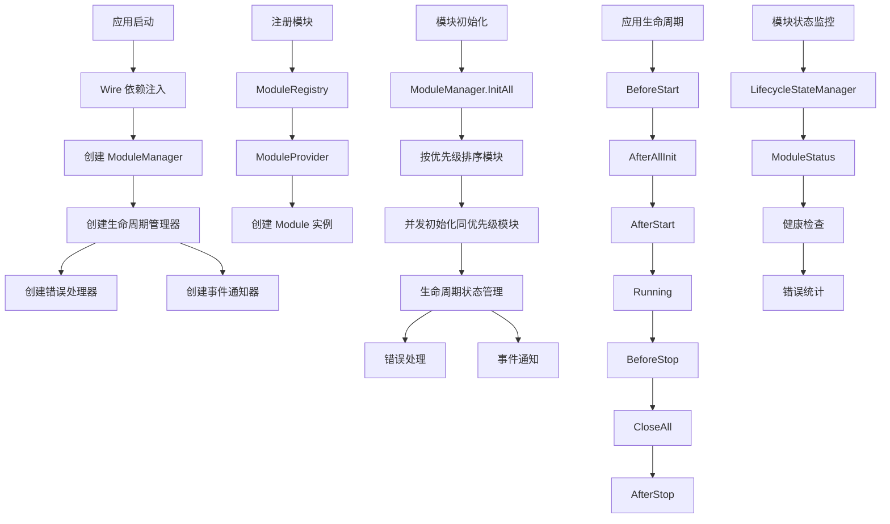

# ModuleKit 模块管理框架任务清单

## 1. 功能目录结构图及文件规划信息

```
module/
├── interfaces.go           # 核心接口定义（Module、ModuleManager）
├── types.go               # 类型定义（错误码、生命周期阶段、状态类型）
├── manager.go             # ModuleManager 实现
├── lifecycle_manager.go   # 生命周期状态管理
├── wire.go                # Wire 依赖注入配置
├── providers.go           # 模块提供者函数
├── config.go              # 配置管理
├── registry.go            # 模块注册和发现
├── examples/              # 示例代码
│   ├── user_module.go     # 用户模块示例
│   └── wire_example.go    # Wire 使用示例
├── todo/                  # 6A 工作流任务文档
│   ├── todolist.md        # 任务清单
│   ├── Task-01-定义核心接口和类型.md
│   ├── Task-02-实现ModuleManager管理器.md
│   ├── Task-03-实现模块生命周期管理.md
│   ├── Task-04-实现Wire依赖注入支持.md
│   └── Task-05-编写单元测试和集成测试.md
└── README.md              # 模块说明
```

## 2. 类图

```mermaid
classDiagram
    class Module {
        <<interface>>
        +Name() string
        +Order() int
        +Init(ctx context.Context) error
        +AfterAllInit(ctx context.Context)
        +AfterStart(ctx context.Context)
        +BeforeClose(ctx context.Context) error
        +AfterStop(ctx context.Context)
    }
    
    class ModuleManager {
        <<interface>>
        +SetModules(modules []Module)
        +GetModules() []Module
        +InitAll(ctx context.Context) error
        +AfterAllInit(ctx context.Context)
        +AfterStart(ctx context.Context)
        +CloseAll(ctx context.Context) error
        +AfterStop(ctx context.Context)
        +RegisterToApp(app interface{}) error
    }
    
    class DefaultModuleManager {
        -mu sync.RWMutex
        -modules []Module
        -startTime time.Time
        -stateManager *LifecycleStateManager
        -errorHandler *LifecycleErrorHandler
        -eventNotifier *LifecycleEventNotifier
        +SetModules(modules []Module)
        +GetModules() []Module
        +InitAll(ctx context.Context) error
        +AfterAllInit(ctx context.Context)
        +AfterStart(ctx context.Context)
        +CloseAll(ctx context.Context) error
        +AfterStop(ctx context.Context)
    }
    
    class LifecycleStateManager {
        -mu sync.RWMutex
        -states map[string]*ModuleStatus
        -startTime time.Time
        +SetModuleState(moduleName string, stage LifecycleStage)
        +GetModuleState(moduleName string) (*ModuleStatus, bool)
        +GetAllStates() map[string]*ModuleStatus
    }
    
    class ModuleStatus {
        +Name string
        +Order int
        +Stage LifecycleStage
        +InitTime time.Time
        +StartTime time.Time
        +LastUpdate time.Time
        +LastError error
        +IsInitialized bool
        +IsStarted bool
        +IsRunning bool
        +IsClosed bool
        +SetError(err error)
        +ClearError()
        +IsHealthy() bool
    }
    
    class LifecycleErrorHandler {
        -errorCounts map[string]int
        -maxRetries int
        -mu sync.RWMutex
        +HandleError(moduleName string, err error) error
        +GetErrorCount(moduleName string) int
        +ResetErrorCount(moduleName string)
    }
    
    class LifecycleEventNotifier {
        -listeners map[string][]chan LifecycleEvent
        -mu sync.RWMutex
        +Subscribe(moduleName string) chan LifecycleEvent
        +Notify(event LifecycleEvent)
    }
    
    class ModuleProvider {
        <<interface>>
        +Provide(ctx context.Context) (Module, error)
        +GetName() string
        +GetPriority() int
    }
    
    class DefaultModuleProvider {
        -name string
        -priority int
        -factory func() Module
        +Provide(ctx context.Context) (Module, error)
        +GetName() string
        +GetPriority() int
    }
    
    class ConfigManager {
        -configs map[string]*ModuleConfig
        -mu sync.RWMutex
        +SetConfig(name string, config *ModuleConfig)
        +GetConfig(name string) (*ModuleConfig, bool)
        +GetAllConfigs() map[string]*ModuleConfig
        +RemoveConfig(name string)
    }
    
    class ModuleRegistry {
        -providers map[string]ModuleProvider
        -modules map[string]Module
        -mu sync.RWMutex
        +RegisterProvider(provider ModuleProvider)
        +GetProvider(name string) (ModuleProvider, bool)
        +GetAllProviders() map[string]ModuleProvider
        +DiscoverModules(ctx context.Context) ([]Module, error)
        +GetModule(name string) (Module, bool)
        +GetAllModules() map[string]Module
    }
    
    Module <|.. DefaultModuleManager
    ModuleManager <|.. DefaultModuleManager
    DefaultModuleManager --> LifecycleStateManager
    DefaultModuleManager --> LifecycleErrorHandler
    DefaultModuleManager --> LifecycleEventNotifier
    LifecycleStateManager --> ModuleStatus
    ModuleProvider <|.. DefaultModuleProvider
    ModuleRegistry --> ModuleProvider
    ModuleRegistry --> Module
```

## 3. 调用流程图



## 4. 任务列表

| 任务 | 状态 | 优先级 | 完成度 | 责任人 | 预计完成时间 | 备注 |
|------|------|--------|--------|--------|--------------|------|
| Task-01 | ❌ 未开始 | 🔴 高 | 0% | 待分配 | - | 定义核心接口和类型 |
| Task-02 | ❌ 未开始 | 🔴 高 | 0% | 待分配 | - | 实现 ModuleManager 管理器 |
| Task-03 | ❌ 未开始 | 🔴 高 | 0% | 待分配 | - | 实现模块生命周期管理 |
| Task-04 | ❌ 未开始 | 🔴 高 | 0% | 待分配 | - | 实现 Wire 依赖注入支持 |
| Task-05 | ❌ 未开始 | 🟡 中 | 0% | 待分配 | - | 编写单元测试和集成测试 |

## 5. 设计说明

本框架采用 Wire 依赖注入，主要包含：

1. **核心接口设计**：Module 接口定义模块生命周期，ModuleManager 接口定义模块管理
2. **生命周期管理**：完整的模块生命周期状态跟踪、错误处理和事件通知
3. **Wire 集成**：使用 Google Wire 进行依赖注入，简化架构设计
4. **配置管理**：支持模块配置的动态管理
5. **模块注册**：支持模块的自动注册和发现
6. **并发安全**：所有操作都保证并发安全
7. **错误处理**：完整的错误处理和恢复机制
8. **状态监控**：实时监控模块状态和健康度

## 6. 技术栈

- **框架**：Go 标准库
- **依赖注入**：Google Wire
- **并发控制**：sync.RWMutex
- **错误处理**：Kratos errors
- **测试**：Go testing + testify
- **配置**：YAML/JSON
- **设计原则**：接口优先、依赖注入、并发安全、错误处理

## 7. 使用示例

### 7.1 定义模块

```go
type UserModule struct {
    // 通过 Wire 注入的依赖
}

func (um *UserModule) Name() string { return "user" }
func (um *UserModule) Order() int { return 1 }

func (um *UserModule) Init(ctx context.Context) error {
    // 依赖通过 Wire 自动注入，不需要手动传递
    return nil
}

func (um *UserModule) AfterAllInit(ctx context.Context) { /* ... */ }
func (um *UserModule) AfterStart(ctx context.Context) { /* ... */ }
func (um *UserModule) BeforeClose(ctx context.Context) error { /* ... */ }
func (um *UserModule) AfterStop(ctx context.Context) { /* ... */ }
```

### 7.2 Wire 配置

```go
// wire.go
var ProviderSet = wire.NewSet(
    ProvideModuleManager,
    ProvideModuleSlice,
)

func ProvideModuleManager(modules []Module) *ModuleManager {
    return NewModuleManager(modules)
}

func ProvideModuleSlice() []Module {
    return []Module{}
}
```

### 7.3 使用模块管理器

```go
func main() {
    // 使用 Wire 进行依赖注入
    app := wire.Build(
        ProviderSet,
        ProvideUserModule,
        ProvideMatchModule,
        ProvideChatModule,
    )
    
    // 启动应用
    if err := app.Run(); err != nil {
        log.Fatal(err)
    }
}
```

## 8. 核心特性

- **模块生命周期管理**：完整的初始化、启动、运行、关闭生命周期
- **优先级管理**：支持模块初始化优先级排序
- **并发安全**：所有操作都保证并发安全
- **错误处理**：完整的错误处理和恢复机制
- **状态监控**：实时监控模块状态和健康度
- **事件通知**：支持生命周期事件通知
- **配置管理**：支持模块配置的动态管理
- **Wire 集成**：使用 Google Wire 进行依赖注入