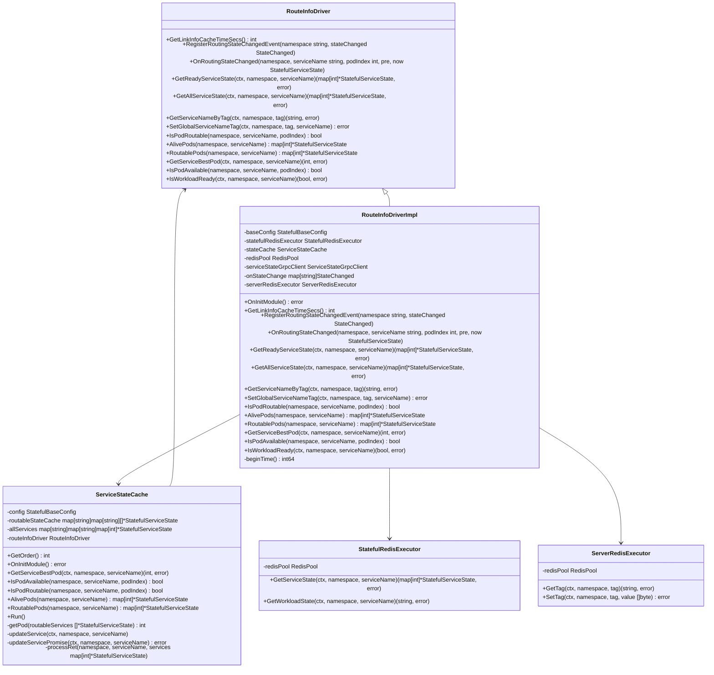

# Route模块 6A迁移任务清单

## 1. 目录结构图
```
route/
├── interfaces.go       # RouteInfoDriver接口定义 + StateChanged回调接口
├── types.go               # 所有数据模型定义（服务状态、负载状态、工作负载状态、状态工具、基础配置、枚举等） 
├── driver/                 # 驱动接口和实现
│   └── route_driver.go     # RouteInfoDriverImpl主实现 + 驱动工厂功能 
├── cache/              # 核心组件
│       └── state_cache.go         # ServiceStateCache服务状态缓存 + 缓存管理 + 配置
│       └── examples/              # 使用示例

```

## 📋 目录结构实现状态

### ✅ 已完成设计（Task-01 ~ Task-02）
- **Task-01**: `route/interfaces.go` - RouteInfoDriver核心接口（已完成）
- **Task-02**: `route/types.go` - 完整数据模型和状态枚举（已完成）

### ✅ 已完成设计（Task-01 ~ Task-03）
- **Task-01**: `route/interfaces.go` - RouteInfoDriver核心接口（已完成）
- **Task-02**: `route/types.go` - 完整数据模型和状态枚举（已完成）
- **Task-03**: `route/cache/` - ServiceStateCache缓存组件（已完成）
  - `route/cache/state_cache.go` - ServiceStateCache服务状态缓存 + 缓存管理 + 配置

### ❌ 待实现（Task-04 ~ Task-10）
- **Task-04**: `redis/` - StatefulRedisExecutor Redis执行器
- **Task-05**: `redis/` - ServerRedisExecutor 服务Redis执行器
- **Task-06**: `driver/` - RouteInfoDriverImpl 主驱动实现 + 驱动工厂功能
- **Task-07**: `grpc/` - gRPC客户端集成
- **Task-08**: `config/` - 配置管理和依赖注入
- **Task-09**: `tests/` - 单元测试和集成测试
- **Task-10**: 性能优化和监控指标

## 2. 类图


## 3. 调用流程图

```mermaid
sequenceDiagram
    participant Client
    participant RouteInfoDriverImpl
    participant ServiceStateCache
    participant StatefulRedisExecutor
    participant ServerRedisExecutor
    participant Redis
    participant gRPC
    
    Client->>RouteInfoDriverImpl: GetReadyServiceState()
    RouteInfoDriverImpl->>RouteInfoDriverImpl: GetAllServiceState()
    alt 本命名空间
        RouteInfoDriverImpl->>StatefulRedisExecutor: GetServiceState()
        StatefulRedisExecutor->>Redis: 查询服务状态
        Redis-->>StatefulRedisExecutor: 返回状态数据
        StatefulRedisExecutor-->>RouteInfoDriverImpl: 返回结果
    else 跨命名空间
        RouteInfoDriverImpl->>gRPC: 查询服务状态
        gRPC-->>RouteInfoDriverImpl: 返回状态数据
    end
    RouteInfoDriverImpl->>RouteInfoDriverImpl: 过滤Ready状态
    RouteInfoDriverImpl-->>Client: 返回Ready服务列表
```


## 4. 任务列表

| 任务 | 状态 | 优先级 | 完成度 | 责任人 | 预计完成时间 | 备注 |
|---|---|-----|-----|-----|-----|---|
| Task-01 | ✅ 已完成 | 🔴 高 | 100% | AI助手 | 2025-01-27 | 定义RouteInfoDriver核心接口 |
| Task-02 | ✅ 已完成 | 🔴 高 | 100% | AI助手 | 2025-01-27 | 定义数据模型和状态枚举（合并到types.go） |
| Task-03 | ✅ 已完成 | 🔴 高 | 100% | AI助手 | 2025-01-27 | 实现ServiceStateCache缓存组件 |
| Task-04 | ❌ 未开始 | 🔴 高 | 0% | 待分配 | - | 实现StatefulRedisExecutor Redis执行器 |
| Task-05 | ❌ 未开始 | 🔴 高 | 0% | 待分配 | - | 实现ServerRedisExecutor 服务Redis执行器 |
| Task-06 | ❌ 未开始 | 🔴 高 | 0% | 待分配 | - | 实现RouteInfoDriverImpl 主驱动实现 + 驱动工厂功能 |
| Task-07 | ❌ 未开始 | 🟡 中 | 0% | 待分配 | - | 实现gRPC客户端集成 |
| Task-08 | ❌ 未开始 | 🟡 中 | 0% | 待分配 | - | 配置管理和依赖注入 |
| Task-09 | ❌ 未开始 | 🟢 低 | 0% | 待分配 | - | 单元测试和集成测试 |
| Task-10 | ❌ 未开始 | 🟢 低 | 0% | 待分配 | - | 性能优化和监控指标 |

## 5. 核心功能说明

### 主要职责
- **服务状态管理**: 管理有状态服务的Pod状态、路由状态、负载状态
- **路由决策**: 根据服务状态和负载情况选择最佳Pod进行路由
- **状态缓存**: 缓存服务状态信息，提高查询性能
- **跨命名空间支持**: 支持跨Kubernetes命名空间的服务状态查询

### 关键特性
- **异步操作**: 使用Go的context和error模式处理异步操作
- **事件驱动**: 支持状态变更事件注册和通知
- **负载均衡**: 基于负载状态和路由状态进行智能Pod选择
- **缓存策略**: 定时更新缓存，支持过期时间配置
- **Redis集成**: 使用Redis存储服务状态和标签信息
- **gRPC支持**: 支持跨命名空间的gRPC通信

### 技术栈
- **语言**: Go 1.21+
- **框架**: Kratos v2
- **存储**: Redis
- **通信**: gRPC
- **配置**: 支持环境变量和配置文件
- **日志**: 结构化日志，支持不同级别
- **监控**: Prometheus指标，OpenTelemetry追踪

---

## 6. 架构调整说明

### 最新调整 (2025-01-27)
- **数据模型简化**: 将 `model/` 目录下的多个数据模型文件合并到单一的 `route/types.go` 文件中
- **架构简化**: 减少文件数量，提升代码内聚性
- **缓存组件位置**: ServiceStateCache组件移至 `route/cache/` 目录

### 合并后的优势
1. **减少文件数量**: 从6个数据模型文件合并为1个文件
2. **降低复杂度**: 减少模块间依赖，简化架构
3. **便于维护**: 所有数据结构定义集中在一个文件中，便于查看和维护
4. **提升开发效率**: 减少文件切换，相关数据结构一目了然
5. **目录结构清晰**: 按功能模块组织代码，便于理解和维护

### 注意事项
- 需要确保 `types.go` 文件不会过大，建议控制在800行以内
- 如果数据模型继续增长，可考虑按功能模块再次拆分
- 保持接口的向后兼容性
- 缓存组件需要完善具体的实现逻辑

---

**最后更新**: 2025-01-27  
**更新人**: AI助手  
**版本**: v1.3.0
