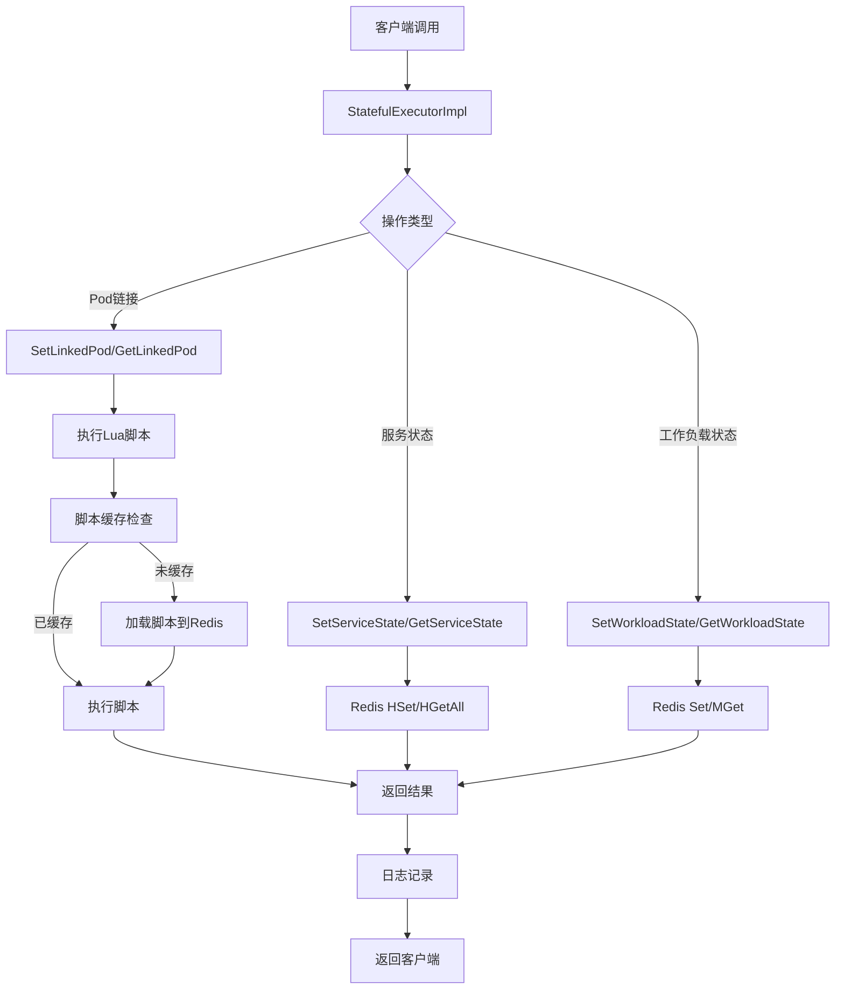

# 有状态服务执行器模块 - 任务状态概览

## 1. 任务列表

| 任务 | 状态 | 优先级 | 完成度 | 责任人 | 预计完成时间 | 备注 |
|------|------|--------|--------|--------|--------------|------|
| Task-01 | ✅ 已完成 | 🔴 高 | 100% | AI助手 | 2025-01-27 | 核心接口定义与数据结构设计 |
| Task-02 | ✅ 已完成 | 🔴 高 | 100% | AI助手 | 2025-01-27 | Redis连接池与Lua脚本管理 |
| Task-03 | ✅ 已完成 | 🔴 高 | 100% | AI助手 | 2025-01-27 | 核心业务逻辑实现 |
| Task-04 | ✅ 已完成 | 🟡 中 | 100% | AI助手 | 2025-01-27 | 错误处理与日志系统 |
| Task-05 | ❌ 未开始 | 🟡 中 | 0% | 待分配 | - | 单元测试与集成测试 |
| Task-06 | ❌ 未开始 | 🟢 低 | 0% | 待分配 | - | 性能优化与监控 |

## 2. 目录结构图

```
route/
├── interfaces.go                    # 所有接口定义（StatefulExecutor等）
├── types.go                         # 所有数据模型定义（服务状态、Pod链接、工作负载状态等）
└── executor/
    ├── lua_scripts/                    # Lua脚本文件
    │   ├── statefulSetLink.lua         # 设置Pod链接
    │   ├── statefulTrySetLink.lua      # 尝试设置Pod链接
    │   ├── statefulSetLinkIfAbsent.lua # 条件设置Pod链接
    │   ├── statefulRemoveLink.lua      # 移除Pod链接
    │   ├── statefulRemoveLinkWithId.lua # 根据ID移除Pod链接
    │   ├── statefulGetLinkIfPersist.lua # 获取持久化链接
    │   ├── statefulComputeLinkIfAbsent.lua # 计算并设置链接
    │   ├── statefulGetServicePod.lua   # 获取服务Pod信息
    │   ├── statefulGetService.lua      # 获取服务信息
    │   ├── statefulSetState.lua        # 设置状态
    │   └── statefulGetLinkService.lua  # 获取链接服务
    ├── stateful_executor.go             # 有状态执行器完整实现（单文件架构）
    ├── interface_test.go                # 接口实现测试
    ├── README.md                        # 项目说明
    └── CHANGELOG.md                     # 变更日志
```

## 3. 类图

```mermaid
classDiagram
    class StatefulExecutor {
        <<interface>>
        +SetServiceState(ctx, namespace, serviceName, podId, state) error
        +GetServiceState(ctx, namespace, serviceName) (map[int]string, error)
        +SetWorkloadState(ctx, namespace, serviceName, state) error
        +GetWorkloadState(ctx, namespace, serviceNames) (map[string]string, error)
        +SetLinkedPod(ctx, namespace, uid, serviceName, podId, persistSeconds) (int, error)
        +TrySetLinkedPod(ctx, namespace, uid, serviceName, podId, persistSeconds) (bool, int, error)
        +GetLinkedPod(ctx, namespace, uid, serviceName) (int, error)
        +RemoveLinkedPod(ctx, namespace, uid, serviceName, persistSeconds) (bool, error)
        +GetLinkService(ctx, namespace, uid) (map[string]int, error)
    }

    class StatefulExecutorImpl {
        -redisClient *redis.Client
        -logger log.Logger
        -scriptCache map[string]string
        +NewStatefulExecutor(client, logger) *StatefulExecutorImpl
        +SetServiceState(ctx, namespace, serviceName, podId, state) error
        +GetServiceState(ctx, namespace, serviceName) (map[int]string, error)
        +SetWorkloadState(ctx, namespace, serviceName, state) error
        +GetWorkloadState(ctx, namespace, serviceNames) (map[string]string, error)
        +SetLinkedPod(ctx, namespace, uid, serviceName, podId, persistSeconds) (int, error)
        +TrySetLinkedPod(ctx, namespace, uid, serviceName, podId, persistSeconds) (bool, int, error)
        +GetLinkedPod(ctx, namespace, uid, serviceName) (int, error)
        +RemoveLinkedPod(ctx, namespace, uid, serviceName, persistSeconds) (bool, error)
        +GetLinkService(ctx, namespace, uid) (map[string]int, error)
        -executeScript(ctx, scriptName, keys, args) (interface{}, error)
        -preloadScripts(ctx) error
        -createUidKeysAndArgs(namespace, uid, serviceName) ([]string, []interface{})
        -parseIntResult(result interface{}) (int, error)
        -parseBoolResult(result interface{}) (bool, error)
    }

    class LuaScripts {
        <<embedded>>
        +statefulSetLink.lua
        +statefulTrySetLink.lua
        +statefulSetLinkIfAbsent.lua
        +statefulRemoveLink.lua
        +statefulRemoveLinkWithId.lua
        +statefulGetLinkIfPersist.lua
        +statefulComputeLinkIfAbsent.lua
        +statefulGetServicePod.lua
        +statefulGetService.lua
        +statefulSetState.lua
        +statefulGetLinkService.lua
    }

    class RedisClient {
        <<external>>
        +Set(ctx, key, value, expiration) error
        +Get(ctx, key) *StringCmd
        +HSet(ctx, key, field, value) error
        +HGetAll(ctx, key) *StringStringMapCmd
        +ScriptLoad(script) *StringCmd
        +Eval(script, keys, args) *Cmd
    }

    class Logger {
        <<interface>>
        +Log(level, keyvals ...any)
    }

    StatefulExecutor <|-- StatefulExecutorImpl
    StatefulExecutorImpl --> RedisClient
    StatefulExecutorImpl --> Logger
    StatefulExecutorImpl --> LuaScripts
```

## 4. 调用流程图



## 5. 任务依赖关系

```
Task-01 (接口定义) → Task-02 (Redis管理) → Task-03 (业务逻辑) → Task-04 (错误处理)
    ↓
Task-05 (测试) → Task-06 (性能优化)
```

## 6. 技术栈说明

- **语言**: Go 1.21+
- **框架**: Kratos v2
- **Redis**: go-redis/v9
- **日志**: Kratos log.Logger
- **脚本**: Lua + embed.FS
- **架构**: 单文件架构，减少模块复杂度

## 7. 验收标准

- [x] 所有接口方法实现完整
- [x] Lua脚本正确嵌入和执行
- [x] Redis操作原子性和一致性
- [x] 错误处理完善
- [x] 日志记录规范
- [x] 代码编译通过
- [ ] 单元测试覆盖 ≥80%
- [ ] 性能测试达标
- [ ] 集成测试通过

## 8. 风险控制

- **架构风险**: 单文件架构可能增加文件大小，已控制在合理范围内
- **性能风险**: Lua脚本执行性能，已通过脚本缓存优化
- **维护风险**: 代码集中，便于维护和调试

## 9. 下一步计划

1. **Task-05**: 实现单元测试和集成测试
2. **Task-06**: 性能优化和监控指标
3. **文档完善**: API文档和使用示例
4. **性能调优**: 基于测试结果的性能优化

## 10. 架构调整说明

### 最新调整 (2025-01-27)
- **单文件架构**: 将所有功能整合到 `stateful_executor.go` 中
- **移除抽象层**: 删除 `RedisManager`、`ErrorHandler` 等不必要的抽象
- **直接依赖**: 直接使用 `*redis.Client` 和 `log.Logger`
- **脚本嵌入**: 使用 `embed.FS` 嵌入Lua脚本

### 调整后的优势
1. **减少复杂度**: 从多个文件合并为单一文件
2. **提升性能**: 减少接口调用开销
3. **便于维护**: 所有相关代码集中在一个文件中
4. **符合Go哲学**: 简单直接，避免过度抽象

---

**最后更新**: 2025-01-27  
**更新人**: AI助手  
**版本**: v1.4.0