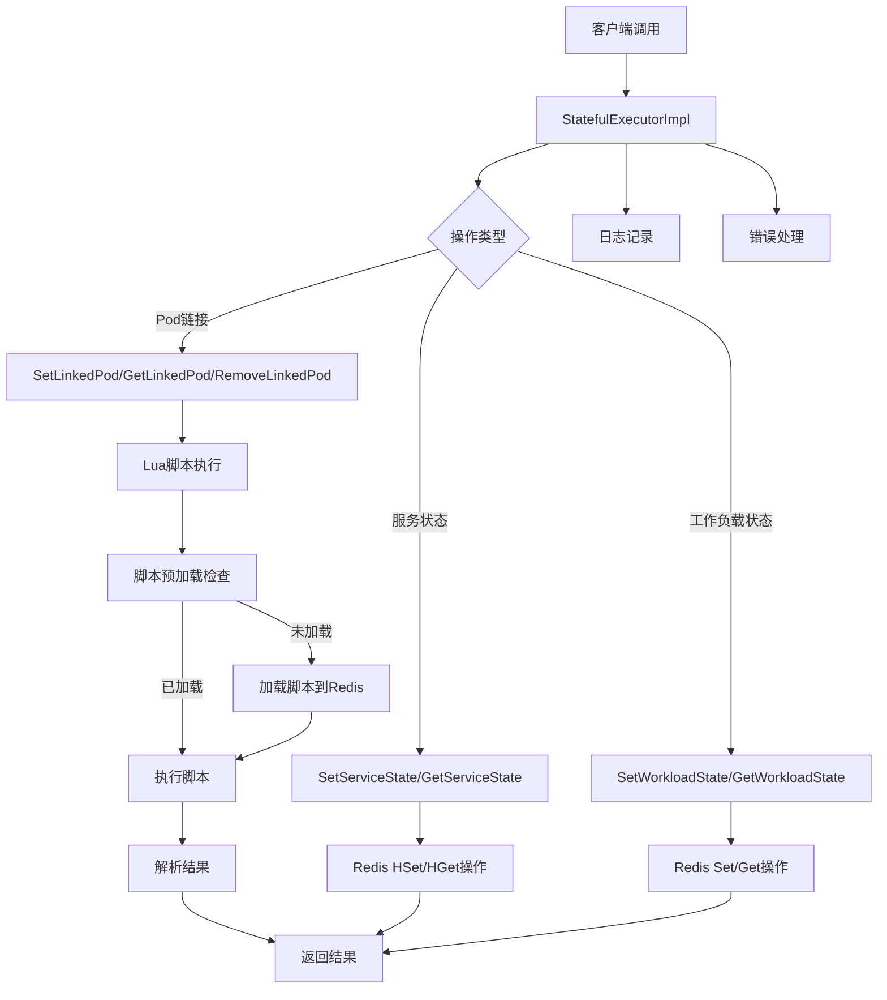

# 有状态服务Redis工具模块 - 任务状态概览

## 1. 任务列表

| 任务 | 状态 | 优先级 | 完成度 | 责任人 | 预计完成时间 | 备注 |
|------|------|--------|--------|--------|--------------|------|
| Task-01 | ✅ 已完成 | 🔴 高 | 100% | AI助手 | 2025-01-27 | 核心接口定义与数据结构设计 |
| Task-02 | ✅ 已完成 | 🔴 高 | 100% | AI助手 | 2025-01-27 | Redis连接池与Lua脚本管理 |
| Task-03 | ✅ 已完成 | 🔴 高 | 100% | AI助手 | 2025-01-27 | 核心业务逻辑实现 |
| Task-04 | ✅ 已完成 | 🟡 中 | 100% | AI助手 | 2025-01-27 | 错误处理与日志系统 |
| Task-05 | ❌ 未开始 | 🟡 中 | 0% | 待分配 | - | 单元测试与集成测试 |
| Task-06 | ❌ 未开始 | 🟢 低 | 0% | 待分配 | - | 性能优化与监控 |

## 2. 目录结构图

```
route/
├── interfaces.go                    # 所有接口定义（StatefulExecutor等）
├── types.go                         # 所有数据模型定义（服务状态、Pod链接、工作负载状态等）
└── executor/
    ├── lua_scripts/                    # Lua脚本文件
    │   ├── statefulSetLink.lua         # 设置Pod链接
    │   ├── statefulTrySetLink.lua      # 尝试设置Pod链接
    │   ├── statefulSetLinkIfAbsent.lua # 条件设置Pod链接
    │   ├── statefulRemoveLink.lua      # 移除Pod链接
    │   ├── statefulRemoveLinkWithId.lua # 根据ID移除Pod链接
    │   ├── statefulGetLinkIfPersist.lua # 获取持久化链接
    │   ├── statefulComputeLinkIfAbsent.lua # 计算并设置链接
    │   ├── statefulGetServicePod.lua   # 获取服务Pod信息
    │   ├── statefulGetService.lua      # 获取服务信息
    │   ├── statefulSetState.lua        # 设置状态
    │   └── statefulGetLinkService.lua  # 获取链接服务
    ├── stateful_executor.go             # 有状态执行器完整实现（接口、Redis管理、业务逻辑、错误处理、日志）
    ├── interface_test.go                # 接口实现测试
    ├── example_v9_usage.go             # 使用示例
    ├── README.md                        # 项目说明
    └── docs/                           # 文档
        ├── README.md                   # 项目说明
        └── API.md                      # API文档
```

## 3. 类图

```mermaid
classDiagram
    class StatefulExecutor {
        <<interface>>
        +SetServiceState(ctx, namespace, serviceName, podId, state) error
        +GetServiceState(ctx, namespace, serviceName) (map[int]string, error)
        +SetWorkloadState(ctx, namespace, serviceName, state) error
        +GetWorkloadState(ctx, namespace, serviceNames) (map[string]string, error)
        +SetLinkedPod(ctx, namespace, uid, serviceName, podId, persistSeconds) (int, error)
        +TrySetLinkedPod(ctx, namespace, uid, serviceName, podId, persistSeconds) (bool, int, error)
        +GetLinkedPod(ctx, namespace, uid, serviceName) (int, error)
        +RemoveLinkedPod(ctx, namespace, uid, serviceName, persistSeconds) (bool, error)
        +GetLinkService(ctx, namespace, uid) (map[string]int, error)
    }

    class StatefulExecutorImpl {
        -redisClient *redis.Client
        -logger log.Logger
        -scriptCache map[string]string
        -scriptSHAs map[string]string
        +NewStatefulExecutor(client, logger) *StatefulExecutorImpl
        +SetServiceState(ctx, namespace, serviceName, podId, state) error
        +GetServiceState(ctx, namespace, serviceName) (map[int]string, error)
        +SetWorkloadState(ctx, namespace, serviceName, state) error
        +GetWorkloadState(ctx, namespace, serviceNames) (map[string]string, error)
        +SetLinkedPod(ctx, namespace, uid, serviceName, podId, persistSeconds) (int, error)
        +TrySetLinkedPod(ctx, namespace, uid, serviceName, podId, persistSeconds) (bool, int, error)
        +GetLinkedPod(ctx, namespace, uid, serviceName) (int, error)
        +RemoveLinkedPod(ctx, namespace, uid, serviceName, persistSeconds) (bool, error)
        +GetLinkService(ctx, namespace, uid) (map[string]int, error)
        -executeScript(ctx, scriptName, keys, args) (interface{}, error)
        -preloadScripts(ctx) error
        -createUidKeysAndArgs(namespace, uid, serviceName) ([]string, []interface{})
        -parseIntResult(result interface{}) (int, error)
        -parseBoolResult(result interface{}) (bool, error)
    }

    class LuaScripts {
        <<embedded>>
        +statefulSetLink.lua
        +statefulTrySetLink.lua
        +statefulSetLinkIfAbsent.lua
        +statefulRemoveLink.lua
        +statefulRemoveLinkWithId.lua
        +statefulGetLinkIfPersist.lua
        +statefulComputeLinkIfAbsent.lua
        +statefulGetServicePod.lua
        +statefulGetService.lua
        +statefulSetState.lua
        +statefulGetLinkService.lua
    }

    class RedisClient {
        <<external>>
        +Set(ctx, key, value, expiration) error
        +Get(ctx, key) *StringCmd
        +HSet(ctx, key, field, value) error
        +HGet(ctx, key, field) *StringCmd
        +HGetAll(ctx, key) *StringStringMapCmd
        +Del(ctx, keys) *IntCmd
        +Expire(ctx, key, expiration) *BoolCmd
        +TTL(ctx, key) *DurationCmd
        +EvalSha(ctx, sha1, keys, args) *Cmd
    }

    class Logger {
        <<interface>>
        +Info(msg string, args ...interface{})
        +Error(msg string, args ...interface{})
        +Debug(msg string, args ...interface{})
        +Warn(msg string, args ...interface{})
    }

    StatefulExecutor <|.. StatefulExecutorImpl : implements
    StatefulExecutorImpl *-- LuaScripts : embeds
    StatefulExecutorImpl *-- RedisClient : uses
    StatefulExecutorImpl *-- Logger : uses
```

## 4. 调用流程图



## 5. 任务依赖关系

```
Task-01 (核心接口定义) 
    ↓
Task-02 (Redis连接池与Lua脚本管理)
    ↓
Task-03 (核心业务逻辑实现)
    ↓
Task-04 (错误处理与日志系统)
    ↓
Task-05 (单元测试与集成测试)
    ↓
Task-06 (性能优化与监控)
```

## 6. 技术栈说明

- **语言**: Go 1.21+
- **Redis客户端**: go-redis/v9
- **日志库**: Kratos log
- **Lua脚本**: 嵌入式文件系统 (embed.FS)
- **测试框架**: Go testing + testify
- **架构模式**: 单文件架构，功能内聚

## 7. 验收标准

- [x] 所有核心接口定义完整且符合Go语言规范
- [x] Redis连接池集成Lua脚本管理，功能完整
- [x] 连接池稳定且支持脚本预加载
- [x] Lua脚本执行正确且支持原子操作
- [x] 业务逻辑与Java版本功能完全一致
- [x] 错误处理机制完善且支持错误分类
- [x] 日志系统结构化且支持多级别
- [ ] 测试覆盖率≥80%
- [ ] 性能不低于Java版本
- [ ] 支持生产环境的监控和告警

## 8. 风险控制

- **技术风险**: 选择稳定的Go语言库和工具，单文件架构降低模块间耦合
- **业务风险**: 严格测试确保功能一致性，统一接口简化测试复杂度
- **性能风险**: 建立性能基准和监控机制，连接池复用提升性能
- **依赖风险**: 使用成熟的Redis客户端和日志库，减少外部依赖
- **架构风险**: 单文件架构增加文件复杂度，需要充分的单元测试和集成测试

## 9. 下一步计划

1. ✅ 完成Task-01的接口定义和数据结构设计
2. ✅ 实现Task-02的Redis连接池和Lua脚本管理
3. ✅ 开发Task-03的核心业务逻辑
4. ✅ 集成Task-04的错误处理和日志系统
5. 🔄 编写Task-05的测试用例
6. 🔄 优化Task-06的性能和监控

---

## 10. 架构调整说明

### 最新调整 (2025-01-27)
- **单文件架构**: 将所有功能集成到 `stateful_executor.go` 单一文件中
- **接口分离**: 接口定义移至 `route/interfaces.go`，实现保持在 `executor/` 目录
- **Lua脚本嵌入**: 使用Go的 `embed.FS` 将Lua脚本直接嵌入到二进制文件中
- **功能内聚**: 相关功能集中管理，便于调试和优化

### 单文件架构的优势
1. **减少文件数量**: 从多个小文件合并为单一功能完整的文件
2. **降低复杂度**: 减少模块间接口调用，简化架构
3. **提升性能**: 减少对象创建开销，内联优化
4. **便于维护**: 相关功能集中管理，便于调试和优化
5. **部署简单**: 单一文件，减少部署复杂度

### 注意事项
- 需要确保 `stateful_executor.go` 文件不会过大，建议控制在1500行以内
- 如果功能继续增长，可考虑按功能模块再次拆分
- 保持接口的向后兼容性
- 确保代码的可读性和可维护性

---

**最后更新**: 2025-01-27  
**更新人**: AI助手  
**版本**: v2.0.0