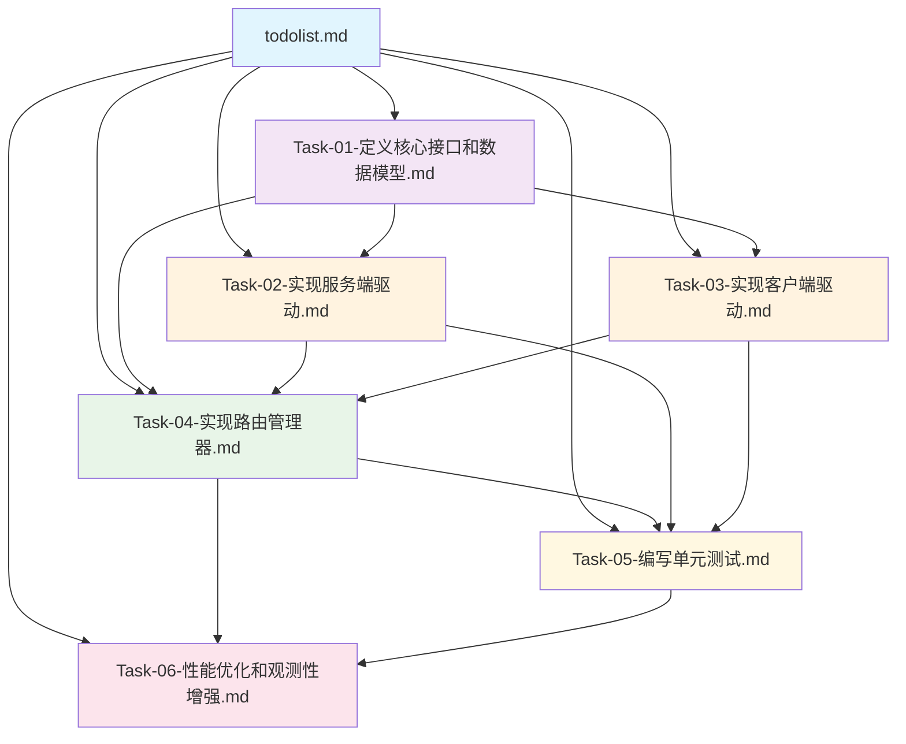
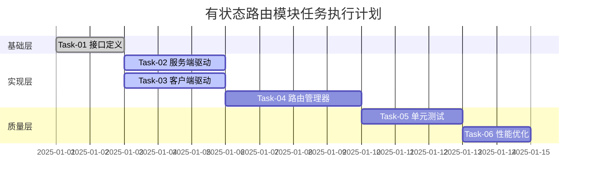
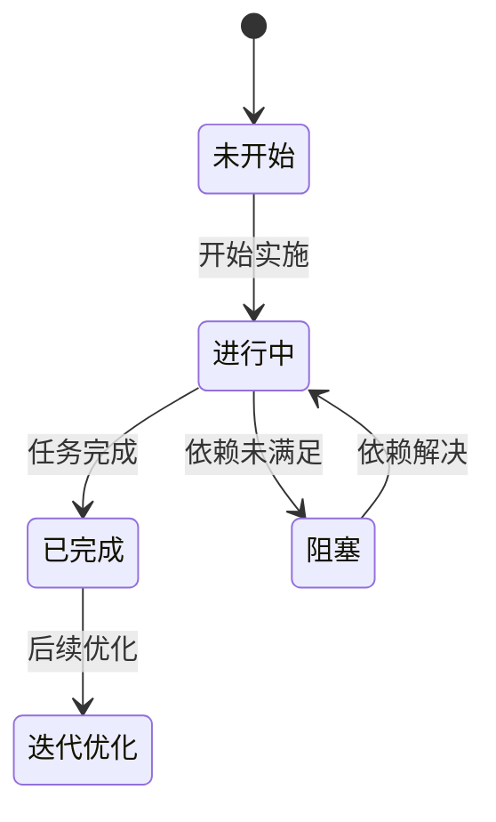

# 有状态路由模块 - 任务文档关系说明

## 📋 文档概览

本目录包含有状态路由模块的完整任务规划文档，基于 **6A 工作流程** 设计，确保任务目标明确、依赖清晰、实施有序。

## 🔗 文档关系图

## 📚 文档依赖关系

### 第一层：基础定义
- **`todolist.md`** - 总任务清单，定义整体架构和文件规划
- **`Task-01-定义核心接口和数据模型.md`** - 定义所有核心接口和数据结构

### 第二层：核心实现
- **`Task-02-实现服务端驱动.md`** - 依赖 Task-01 的接口定义
- **`Task-03-实现客户端驱动.md`** - 依赖 Task-01 的接口定义
- **`Task-04-实现路由管理器.md`** - 依赖 Task-01、Task-02、Task-03 的实现

### 第三层：质量保障
- **`Task-05-编写单元测试.md`** - 依赖所有核心实现完成
- **`Task-06-性能优化和观测性增强.md`** - 依赖基础功能稳定运行

## 🎯 任务执行顺序

## 🔄 任务状态流转

## 📁 文件结构对应关系

| 任务文档 | 对应实现文件 | 包名 | 职责 |
|---------|-------------|------|------|
| Task-01 | `route/interfaces.go` `route/types.go` | `package route` | 接口定义、数据模型 |
| Task-02 | `route/driver/server_driver.go` | `package driver` | 服务端驱动实现 |
| Task-03 | `route/driver/client_driver.go` | `package driver` | 客户端驱动实现 |
| Task-04 | `route/state/route_manager.go` `route/state/load_balancer.go` `route/state/health_checker.go` `route/state/failover_handler.go` | `package state` | 核心路由管理 |
| Task-05 | `route/test/*_test.go` | `package test` | 单元测试覆盖 |
| Task-06 | `route/state/metrics/` `route/state/tracing/` `route/state/cache/` | `package metrics` `package tracing` `package cache` | 性能优化、观测性 |

## 🔍 关键依赖点

### 接口依赖
- **Task-02 & Task-03** 必须实现 **Task-01** 定义的接口
- **Task-04** 需要组合 **Task-02 & Task-03** 的实现
- **Task-05** 需要所有核心模块实现完成

### 数据依赖
- **ServiceState** 和 **RoutingState** 在所有任务中共享
- **Redis** 连接池配置在 **Task-02** 中定义，其他任务复用
- **错误类型** 在 **Task-01** 中统一定义

### 配置依赖
- **Redis** 配置信息在 **Task-02** 中管理
- **负载均衡策略** 在 **Task-04** 中配置
- **健康检查参数** 在 **Task-04** 中设置

## 📊 进度跟踪

- **总体进度**: 13.3% (1/6 任务完成)
- **核心接口**: 80% 完成
- **驱动实现**: 0% 完成
- **路由管理**: 0% 完成
- **测试覆盖**: 0% 完成
- **性能优化**: 0% 完成

## 🚀 下一步行动

1. **立即执行**: Task-02 和 Task-03 可以并行开发
2. **等待依赖**: Task-04 需要等待 Task-02 和 Task-03 完成
3. **质量保障**: Task-05 在所有核心功能完成后开始
4. **性能优化**: Task-06 在系统稳定运行后进行

## 📝 注意事项

- 每个任务完成后，需要更新 `todolist.md` 中的状态
- 接口变更需要同步更新所有依赖的任务文档
- 新增依赖需要评估对现有任务的影响
- 性能优化建议在基础功能稳定后进行

---

*最后更新: 2025-01-01*
*维护者: 待分配*
