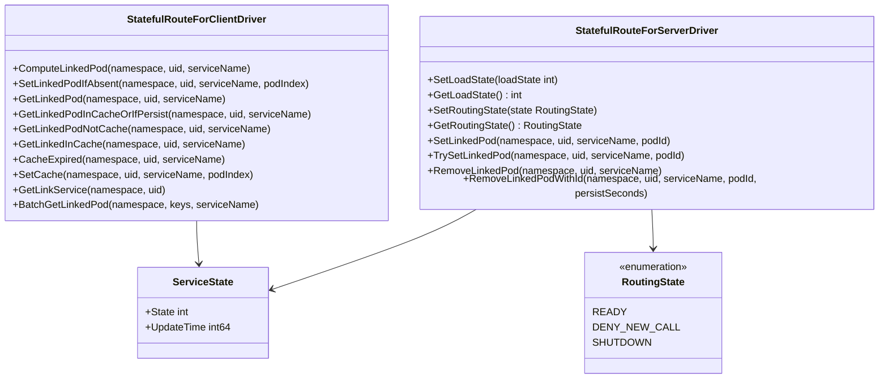
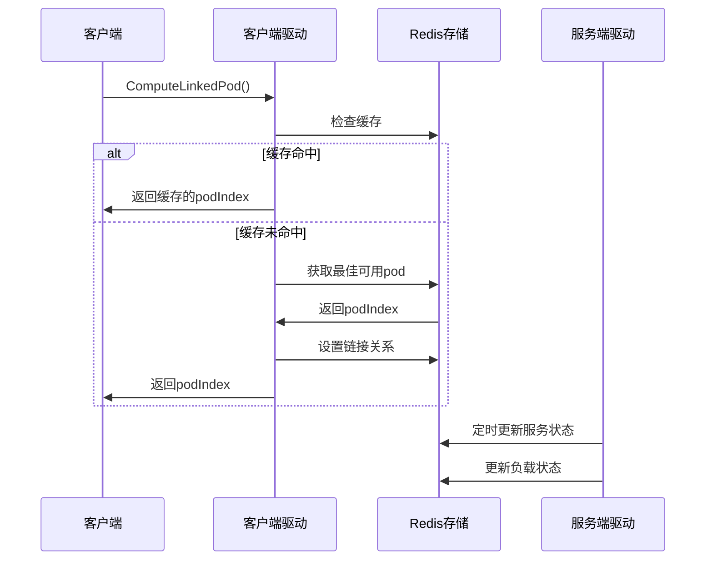

# 有状态路由模块迁移任务清单

## 1. 功能目录结构图及文件规划信息

```
route/
├── interfaces.go           # 接口定义
├── types.go               # 数据模型定义 
├── state/                  # 核心实现
│   └── route_manager.go   # 路由管理器
├── driver/                # 驱动层
│   ├── server_driver.go   # 服务端驱动实现
│   ├── client_driver.go   # 客户端驱动实现
└── test/                 # 单元测试
```

## 2. 类图



## 3. 调用流程图



## 4. 任务列表

| 任务 | 状态 | 优先级 | 完成度 | 责任人 | 预计完成时间 | 备注 |
|---|---|-----|-----|-----|-----|---|
| Task-01 | 🔄 进行中 | 🔴 高 | 80% | 待分配 | - | 定义核心接口和数据模型 |
| Task-02 | ❌ 未开始 | 🔴 高 | 0% | 待分配 | - | 实现服务端驱动（StatefulRouteForServerDriver） |
| Task-03 | ❌ 未开始 | 🔴 高 | 0% | 待分配 | - | 实现客户端驱动（StatefulRouteForClientDriver） |
| Task-04 | ❌ 未开始 | 🟡 中 | 0% | 待分配 | - | 实现路由管理器 |
| Task-05 | ❌ 未开始 | 🟡 中 | 0% | 待分配 | - | 编写单元测试 |
| Task-06 | ❌ 未开始 | 🟢 低 | 0% | 待分配 | - | 性能优化和观测性增强 |

## 5. 迁移说明

- **已存在实现**：routeInfoDriver和StatefulRedisExecutor已有对应实现，不需要重新创建
- **核心功能**：有状态路由管理，支持pod状态管理、用户链接管理、负载均衡
- **技术栈**：Go + Kratos + GORM + Redis
- **设计原则**：保持Java版本功能逻辑一致，符合Go/Kratos设计哲学
