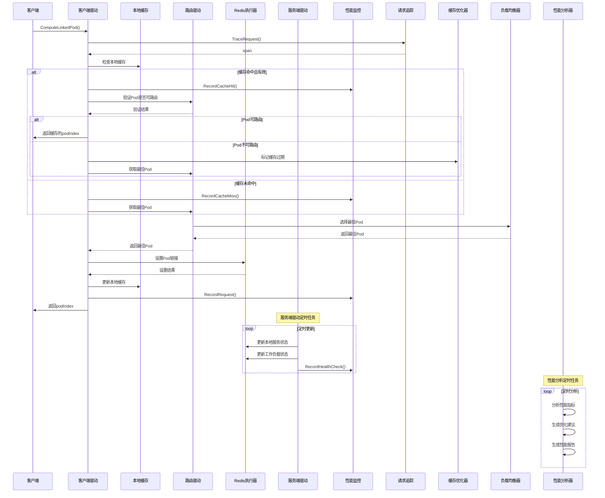

# State模块开发任务清单

> **重要说明**：State模块实现有状态路由的客户端和服务端驱动，这些功能在Java版本中已经完整实现，需要转换为Go版本。

## 版本信息
- **当前版本**: v1.0.0
- **最后更新**: 2025-01-27
- **更新内容**: 根据当前开发情况更新任务状态和目录结构

## 1. 功能目录结构图及文件规划信息

```
route/
├── interfaces.go           # 核心接口定义（RouteInfoDriver、StatefulExecutor、ServiceStateCache）
├── types.go               # 数据模型定义（StatefulServiceState、LoadState、RoutingState等） 
├── driver/                # 路由驱动层（已完成）
│   ├── client_driver.go        # 客户端驱动实现（StatefulRouteForClientDriver）
│   └── server_driver.go        # 服务端驱动实现（StatefulRouteForServerDriver） 
├── executor/              # Redis执行器（已完成）
│   ├── stateful_executor.go # StatefulExecutorImpl实现
│   └── lua_scripts/      # Lua脚本集合
├── cache/                 # 缓存组件（已完成）
│   ├── state_cache.go     # ServiceStateCache实现
│   └── cache_optimizer.go # 缓存优化器（新增）
├── metrics/               # 性能监控模块（新增）
│   └── performance_monitor.go # Prometheus性能监控器
├── tracing/               # 请求追踪模块（新增）
│   └── request_tracer.go  # OpenTelemetry请求追踪器
├── loadbalancer/          # 负载均衡优化模块（新增）
│   └── optimized_load_balancer.go # 智能负载均衡器
└── analysis/              # 性能分析模块（新增）
    └── performance_analyzer.go # 性能分析器
```

## 2. 类图

```mermaid
classDiagram
    class StatefulRouteForClientDriver {
        +Init() error
        +ComputeLinkedPod(ctx, namespace, uid, serviceName) (int, error)
        +GetLinkedPod(ctx, namespace, uid, serviceName) (int, error)
        +GetLinkedPodInCacheOrIfPersist(ctx, namespace, uid, serviceName) (int, error)
        +GetLinkedPodNotCache(ctx, namespace, uid, serviceName) (int, error)
        +GetLinkedInCache(ctx, namespace, uid, serviceName) (int, error)
        +CacheExpired(ctx, namespace, uid, serviceName) error
        +SetCache(ctx, namespace, uid, serviceName, podIndex) error
        +GetLinkService(ctx, namespace, uid) (map[string]int, error)
        +BatchGetLinkedPod(ctx, namespace, keys, serviceName) (map[int][]string, error)
        +SetLinkedPodIfAbsent(ctx, namespace, uid, serviceName, podIndex) (int, error)
    }
    
    class StatefulRouteForServerDriver {
        +Init() error
        +SetLoadState(ctx, loadState int) error
        +GetLoadState(ctx) (int, error)
        +SetRoutingState(ctx, state RoutingState) error
        +GetRoutingState(ctx) (RoutingState, error)
        +SetLinkedPod(ctx, namespace, uid, serviceName, podId) (int, error)
        +TrySetLinkedPod(ctx, namespace, uid, serviceName, podId) (int, error)
        +RemoveLinkedPod(ctx, namespace, uid, serviceName) error
        +RemoveLinkedPodWithId(ctx, namespace, uid, serviceName, podId, persistSeconds) error
        +Start(ctx) error
        +Stop(ctx) error
    }
    
    class StatefulRouteForClientDriverImpl {
        -statefulExecutor StatefulExecutor
        -routeInfoDriver RouteInfoDriver
        -userPodIndexCache Cache~string,int~
        -serverInfo ServerInfo
        +Init() error
        +ComputeLinkedPod(ctx, namespace, uid, serviceName) (int, error)
        +GetLinkedPod(ctx, namespace, uid, serviceName) (int, error)
        +GetLinkedInCache(ctx, namespace, uid, serviceName) (int, error)
        +CacheExpired(ctx, namespace, uid, serviceName) error
        +SetCache(ctx, namespace, uid, serviceName, podIndex) error
        +GetLinkService(ctx, namespace, uid) (map[string]int, error)
        +BatchGetLinkedPod(ctx, namespace, keys, serviceName) (map[int][]string, error)
        +SetLinkedPodIfAbsent(ctx, namespace, uid, serviceName, podIndex) (int, error)
    }
    
    class StatefulRouteForServerDriverImpl {
        -statefulExecutor StatefulExecutor
        -baseConfig BaseConfig
        -routeInfoDriver RouteInfoDriver
        -loadState int
        -routingState RoutingState
        -podIndex int
        +Init() error
        +SetLoadState(ctx, loadState int) error
        +GetLoadState(ctx) (int, error)
        +SetRoutingState(ctx, state RoutingState) error
        +GetRoutingState(ctx) (RoutingState, error)
        +SetLinkedPod(ctx, namespace, uid, serviceName, podId) (int, error)
        +TrySetLinkedPod(ctx, namespace, uid, serviceName, podId) (int, error)
        +RemoveLinkedPod(ctx, namespace, uid, serviceName) error
        +RemoveLinkedPodWithId(ctx, namespace, uid, serviceName, podId, persistSeconds) error
        +Start(ctx) error
        +Stop(ctx) error
    }
    
    class RouteInfoDriverImpl {
        -statefulExecutor StatefulExecutor
        -stateCache ServiceStateCache
        -config BaseConfig
        -serviceState map[string]ServiceState
        -podStates map[int]WorkloadState
        +Init() error
        +GetServiceBestPod(ctx, namespace, serviceName) (int, error)
        +IsPodRoutable(namespace, serviceName, podId) bool
        +IsPodAvailable(namespace, serviceName, podId) bool
        +GetServiceState(ctx, namespace, serviceName) (map[int]string, error)
        +GetPodLoadScore(ctx, namespace, serviceName, podId) (int, error)
    }
    
    class PerformanceMonitor {
        -metrics PerformanceMetrics
        -customMetrics map[string]prometheus.Collector
        +RecordRequest(duration, success)
        +RecordCacheHit()
        +RecordCacheMiss()
        +SetCacheSize(size)
        +RecordLoadBalancerRequest(duration)
        +RecordHealthCheck(duration, success)
        +AddCustomMetric(name, collector) error
        +GetMetrics() map[string]interface{}
    }
    
    class RequestTracer {
        -tracer trace.Tracer
        +TraceRequest(ctx, operation, attributes) (context.Context, trace.Span)
        +TraceCacheOperation(ctx, operation, key, hit) (context.Context, trace.Span)
        +TraceLoadBalancerOperation(ctx, operation, serviceName, podCount) (context.Context, trace.Span)
        +TraceHealthCheck(ctx, serviceName, podId, success) (context.Context, trace.Span)
        +AddEvent(span, name, attributes)
        +SetStatus(span, success, description)
        +RecordError(span, err)
    }
    
    class CacheOptimizer {
        -cache *cache.Cache
        -strategy CacheStrategy
        -config CacheConfig
        -stats CacheStats
        +Get(key) (interface{}, bool)
        +Set(key, value, expiration)
        +Delete(key)
        +Flush()
        +GetStats() *CacheStats
    }
    
    class OptimizedLoadBalancer {
        -strategy LoadBalancingStrategy
        -config LoadBalancerConfig
        -pods map[int]*PodInfo
        -roundRobinCounter int
        -stats LoadBalancerStats
        +AddPod(podId, weight)
        +RemovePod(podId)
        +SelectPod(ctx) (int, error)
        +UpdatePodStats(podId, connectionCount, responseTime)
        +SetPodHealth(podId, healthy)
        +GetStats() *LoadBalancerStats
    }
    
    class PerformanceAnalyzer {
        -rules []*PerformanceRule
        -metricsHistory []*PerformanceMetrics
        -config AnalyzerConfig
        +AddRule(rule *PerformanceRule)
        +AddMetrics(metrics *PerformanceMetrics)
        +Analyze(ctx) ([]*PerformanceIssue, error)
        +GenerateSuggestions(issues []*PerformanceIssue) []*OptimizationSuggestion
        +GenerateReport(ctx) (*PerformanceReport, error)
    }
    
    StatefulRouteForClientDriver <|-- StatefulRouteForClientDriverImpl
    StatefulRouteForServerDriver <|-- StatefulRouteForServerDriverImpl
    StatefulRouteForClientDriverImpl --> StatefulExecutor
    StatefulRouteForClientDriverImpl --> RouteInfoDriver
    StatefulRouteForServerDriverImpl --> StatefulExecutor
    StatefulRouteForServerDriverImpl --> RouteInfoDriver
    RouteInfoDriverImpl --> StatefulExecutor
    RouteInfoDriverImpl --> ServiceStateCache
```

## 3. 调用流程图



## 4. 任务列表

| 任务 | 状态 | 优先级 | 完成度 | 责任人 | 预计完成时间 | 备注 |
|---|---|-----|-----|-----|-----|---|
| Task-01 | ✅ 已完成 | 🔴 高 | 100% | 待分配 | 2025-01-27 | 定义核心接口和数据模型 |
| Task-02 | ✅ 已完成 | 🔴 高 | 100% | 待分配 | 2025-01-27 | 实现服务端驱动 |
| Task-03 | ✅ 已完成 | 🔴 高 | 100% | 待分配 | 2025-01-27 | 实现客户端驱动 |

| Task-05 | ✅ 已完成 | 🟢 低 | 100% | 待分配 | 2025-01-27 | 性能优化和观测性增强 |

## 5. 核心功能说明

### 客户端驱动功能
- **Pod计算**: 计算最佳可用Pod，支持缓存和Redis查询
- **链接管理**: 管理用户与Pod的链接关系
- **缓存策略**: 本地缓存优化，支持过期和更新

### 服务端驱动功能
- **状态管理**: 管理本地Pod的服务状态、负载状态、路由状态
- **定时更新**: 定时更新服务状态和工作负载状态
- **链接操作**: 支持Pod链接的设置、尝试设置、移除等操作
- **配置验证**: 验证基础配置的有效性


### 性能优化和观测性功能
- **性能监控**: Prometheus指标收集，包括请求、缓存、负载均衡、健康检查等
- **请求追踪**: OpenTelemetry链路追踪，支持缓存操作、负载均衡、健康检查等
- **缓存优化**: 多种缓存策略（LRU、LFU、TTL、自适应），智能驱逐和命中率优化
- **负载均衡优化**: 多种算法（轮询、最少连接、加权轮询、最少响应时间），智能健康检查
- **性能分析**: 基于规则的性能分析，自动生成优化建议和性能报告

### 关键特性
- **缓存优化**: 客户端本地缓存减少Redis查询，支持多种优化策略
- **状态一致性**: 服务端定时更新确保状态一致性
- **智能路由**: 基于负载状态和健康状态的智能Pod选择
- **全面监控**: 完整的性能指标、链路追踪和性能分析
- **可扩展性**: 模块化设计，支持插件化扩展

## 6. 技术架构

- **语言**: Go 1.21+
- **框架**: Kratos v2
- **缓存**: go-cache + 自定义优化策略
- **存储**: Redis（通过StatefulExecutor）
- **监控**: Prometheus指标收集
- **追踪**: OpenTelemetry链路追踪
- **异步**: 基于context和goroutine的异步操作

## 7. 与现有模块的集成

### 依赖模块
- **RouteInfoDriver**: 用于路由决策和状态查询
- **StatefulExecutor**: 用于Redis操作和状态持久化
- **ServiceStateCache**: 用于状态缓存

### 新增模块
- **StatefulRouteForClientDriver**: 客户端驱动接口和实现
- **StatefulRouteForServerDriver**: 服务端驱动接口和实现

- **PerformanceMonitor**: 性能监控器
- **RequestTracer**: 请求追踪器
- **CacheOptimizer**: 缓存优化器
- **OptimizedLoadBalancer**: 负载均衡优化器
- **PerformanceAnalyzer**: 性能分析器

---

**最后更新**: 2025-01-27  
**更新人**: AI助手  
**版本**: v1.1.0
