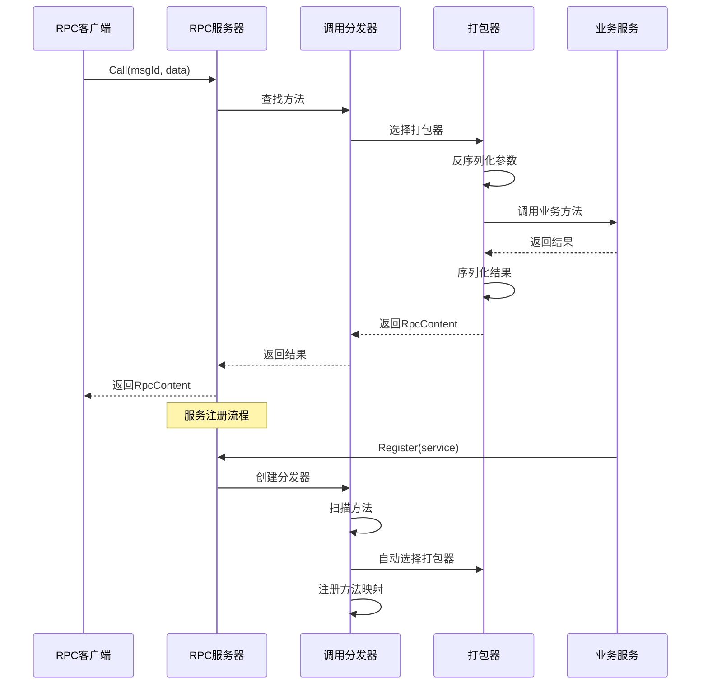

# RPC模块开发任务清单

> **重要说明**：RPC模块实现基于反射的通用RPC框架，支持多种序列化格式（Proto、JSON、MessagePack），具有自动打包器选择、服务注册和方法调用功能。

## 版本信息
- **当前版本**: v1.0.0
- **最后更新**: 2025-01-27
- **更新内容**: 根据当前开发情况创建任务清单和目录结构

## 1. 功能目录结构图及文件规划信息

```
rpc/
├── interfaces.go           # 核心接口定义（Packer、RpcContent、RpcClientDriver、RpcServerDriver）
├── types.go               # 数据模型定义（RpcType、FunInfo、ParamInfo、RpcContentType等）
├── server.go              # RPC服务器实现（rpcServer、CallDispatcher）
├── client.go              # RPC客户端实现（rpcClient、连接管理、调用逻辑）
├── packers.go             # 打包器实现（BytesPacker、JsonPacker、自动选择逻辑）
├── packer.go              # 打包器接口定义
├── call.go                # 调用分发器实现（CallDispatcher、方法注册）
├── call_server.go         # gRPC服务端实现（RouterServiceServer）
├── requirements.md        # 需求文档
└── tests/                 # 测试文件目录
    ├── server_test.go     # 服务器测试
    ├── client_test.go     # 客户端测试
    └── packer_test.go     # 打包器测试
```

## 2. 类图

```mermaid
classDiagram
    class Packer {
        <<interface>>
        +Name() string
        +Match(fun *FunInfo) bool
        +UnSerialize(content RpcContent, fun *FunInfo) ([]interface{}, error)
        +Serialize(fun *FunInfo, returnValues []any) (RpcContent, error)
        +Call(ctx context.Context, req RpcContent, fun *FunInfo) (RpcContent, error)
    }
    
    class RpcContent {
        <<interface>>
        +Type() RpcContentType
        +Data() any
    }
    
    class RpcClientDriver {
        <<interface>>
        +Call(ctx context.Context, msgId string, data RpcContent) (RpcContent, error)
    }
    
    class RpcServerDriver {
        <<interface>>
        +OnCall(ctx context.Context, srcService string, msgId string, data RpcContent) (RpcContent, error)
        +Register(service any) error
    }
    
    class BytesPacker {
        +Name() string
        +Match(fun *FunInfo) bool
        +UnSerialize(content RpcContent, fun *FunInfo) ([]interface{}, error)
        +Serialize(fun *FunInfo, returnValues []any) (RpcContent, error)
        +Call(ctx context.Context, req RpcContent, fun *FunInfo) (RpcContent, error)
    }
    
    class JsonPacker {
        +Name() string
        +Match(fun *FunInfo) bool
        +UnSerialize(content RpcContent, fun *FunInfo) ([]interface{}, error)
        +Serialize(fun *FunInfo, returnValues []any) (RpcContent, error)
        +Call(ctx context.Context, req RpcContent, fun *FunInfo) (RpcContent, error)
    }
    
    class rpcServer {
        -rpcType RpcType
        -funToService map[string]*CallDispatcher
        -services map[string]*CallDispatcher
        +Register(service any) error
        +OnCall(ctx, srcService, msgId, data) (RpcContent, error)
    }
    
    class rpcClient {
        -conn *grpc.ClientConn
        -client rpc.RouterServiceClient
        -stream rpc.RouterService_StreamCallClient
        -stateful bool
        -srcService string
        +Call(ctx, msgId, data) (RpcContent, error)
        +Close() error
    }
    
    class CallDispatcher {
        -name string
        -RpcMethod map[string]*FunInfo
        +RegisterMethod(name string, method interface{}) error
        +Dispatch(ctx, msgId, data) (RpcContent, error)
    }
    
    class FunInfo {
        +Name string
        +Method reflect.Value
        +Param []ParamInfo
        +ReturnParam []ParamInfo
        +Packer Packer
        +ParamTypes() []reflect.Type
        +ReturnTypes() []reflect.Type
    }
    
    class Content {
        +CType RpcContentType
        +Dt T
        +Type() RpcContentType
        +Data() any
    }
    
    Packer <|.. BytesPacker
    Packer <|.. JsonPacker
    RpcContent <|.. Content
    RpcServerDriver <|.. rpcServer
    RpcClientDriver <|.. rpcClient
    rpcServer --> CallDispatcher
    CallDispatcher --> FunInfo
    FunInfo --> Packer
    rpcClient --> Content
```

## 3. 调用流程图



## 4. 任务列表

| 任务 | 状态 | 优先级 | 完成度 | 责任人 | 预计完成时间 | 备注 |
|---|---|-----|-----|-----|-----|---|
| Task-01 | ✅ 已完成 | 🔴 高 | 100% | 待分配 | 2025-01-27 | 定义核心接口和数据模型 |
| Task-02 | ✅ 已完成 | 🔴 高 | 100% | 待分配 | 2025-01-27 | 实现RPC服务器和调用分发器 |
| Task-03 | ✅ 已完成 | 🔴 高 | 100% | 待分配 | 2025-01-27 | 实现RPC客户端和连接管理 |
| Task-04 | ✅ 已完成 | 🔴 高 | 100% | 待分配 | 2025-01-27 | 实现打包器和自动选择机制 |
| Task-05 | ✅ 已完成 | 🔴 高 | 100% | 待分配 | 2025-01-27 | 实现gRPC服务端和客户端 |
| Task-06 | ✅ 已完成 | 🟡 中 | 100% | 待分配 | 2025-01-27 | 编写单元测试和集成测试 |

## 5. 核心功能说明

### RPC服务器功能
- **服务注册**: 支持任意Go结构体的自动注册和方法扫描
- **调用分发**: 基于msgId的方法路由和参数分发
- **反射支持**: 利用Go反射机制实现动态方法调用
- **错误处理**: 统一的错误处理和返回机制

### RPC客户端功能
- **连接管理**: 支持gRPC连接和服务发现
- **状态管理**: 有状态和无状态服务支持
- **流式调用**: 支持gRPC流式通信
- **超时控制**: 完善的超时和重试机制

### 打包器功能
- **自动选择**: 基于方法签名自动选择合适打包器
- **多格式支持**: Proto、JSON、MessagePack三种序列化格式
- **类型匹配**: 智能的参数类型匹配和验证
- **扩展性**: 支持自定义打包器注册

### 调用分发器功能
- **方法注册**: 动态方法注册和映射管理
- **参数解析**: 自动参数类型解析和验证
- **打包器选择**: 智能打包器选择和缓存
- **错误处理**: 完整的错误处理和日志记录

### 关键特性
- **反射驱动**: 基于Go反射的通用RPC框架
- **自动选择**: 智能的打包器自动选择机制
- **类型安全**: 完整的类型检查和验证
- **高性能**: 反射结果缓存和优化
- **可扩展**: 支持自定义打包器和编解码器

## 6. 技术架构

- **语言**: Go 1.21+
- **框架**: Kratos v2
- **传输**: gRPC协议
- **序列化**: Proto、JSON、MessagePack
- **反射**: Go标准库reflect包
- **服务发现**: Kratos注册中心
- **错误处理**: Kratos统一错误处理

## 7. 与现有模块的集成

### 依赖模块
- **transport/grpc**: gRPC传输协议支持
- **encoding**: 多种编解码器支持
- **errors**: 统一错误处理
- **log**: 日志记录
- **metadata**: 元数据管理
- **registry**: 服务注册和发现

### 新增模块
- **Packer**: 打包器接口和实现
- **RpcContent**: RPC内容类型定义
- **RpcServerDriver**: RPC服务器接口和实现
- **RpcClientDriver**: RPC客户端接口和实现
- **CallDispatcher**: 调用分发器
- **FunInfo**: 方法信息管理

---

**最后更新**: 2025-01-27  
**更新人**: AI助手  
**版本**: v1.0.0
