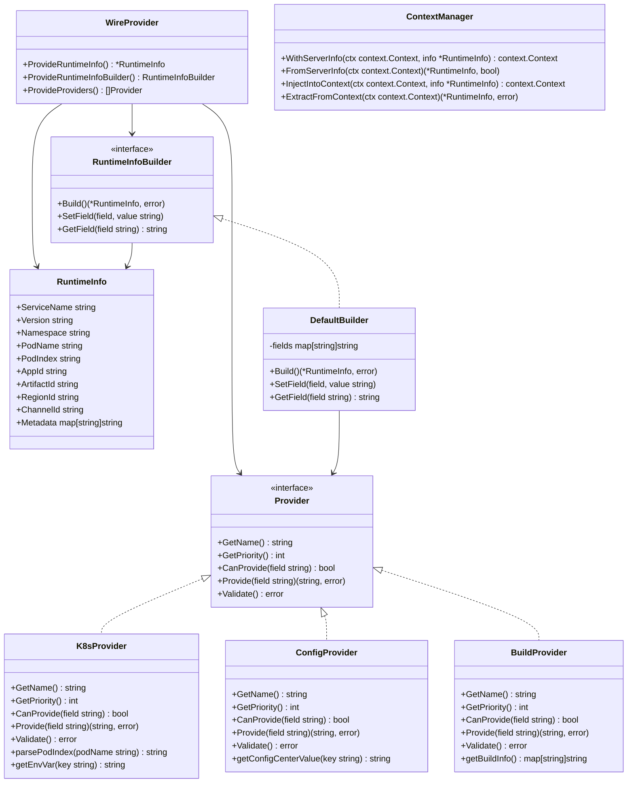
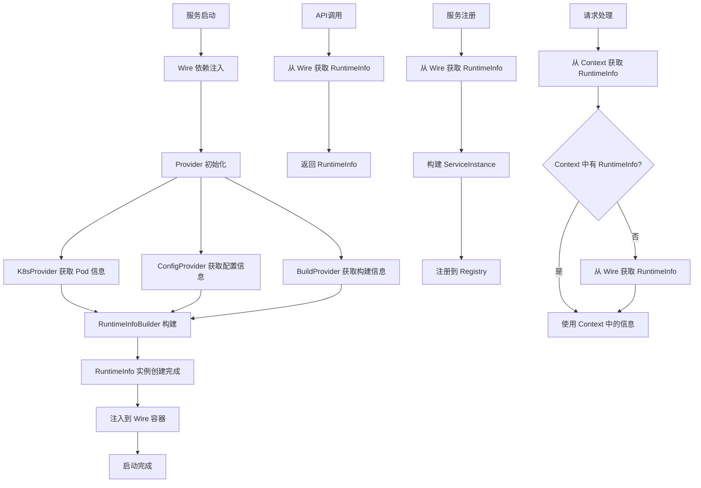

# RuntimeInfo 模块迁移任务清单

## 1. 功能目录结构图及文件规划信息

```
runtime/
├── types.go                 # 核心数据模型定义
├── interfaces.go            # 接口定义，支持不同 Provider
├── context.go              # Context 注入支持
├── wire.go                 # Wire 依赖注入配置
├── builder.go              # RuntimeInfo 构建器实现
├── provider/
│   ├── k8s_provider.go     # 从 k8s ENV 获取 Pod 信息
│   ├── config_provider.go  # 从配置中心获取 appId/artifactId/regionId/channelId
│   └── build_provider.go   # 从构建信息获取版本等
# API 功能统一放在外部 api/runtime/ 目录
# 参考项目统一 API 结构：
# api/
# ├── runtime/              # RuntimeInfo 相关 API
# │   ├── runtime.proto     # gRPC/HTTP 接口定义
# │   ├── runtime.pb.go     # 生成的 protobuf 代码
# │   ├── runtime_grpc.pb.go # 生成的 gRPC 代码
# │   └── runtime_http.pb.go # 生成的 HTTP 代码
# ├── entity/               # 实体相关 API
# ├── metadata/             # 元数据相关 API
# └── rpc/                  # RPC 相关 API
# 配置结构定义在 types.go 中
├── example/
│   └── main.go             # 示例代码
└── README.md               # 模块说明
```

## 2. 类图



## 3. 调用流程图



## 4. 任务列表

| 任务 | 状态 | 优先级 | 完成度 | 责任人 | 预计完成时间 | 备注 |
|------|------|--------|--------|--------|--------------|------|
| Task-01 | ❌ 未开始 | 🔴 高 | 0% | 待分配 | - | 定义核心数据模型和接口 |
| Task-02 | ❌ 未开始 | 🔴 高 | 0% | 待分配 | - | 实现 K8s Provider（Pod 信息） |
| Task-03 | ❌ 未开始 | 🔴 高 | 0% | 待分配 | - | 实现本地环境信息 Provider |
| Task-04 | ❌ 未开始 | 🔴 高 | 0% | 待分配 | - | 实现配置中心集成 Provider |
| Task-05 | ❌ 未开始 | 🔴 高 | 0% | 待分配 | - | 实现构建信息 Provider（版本等） |
| Task-06 | ❌ 未开始 | 🔴 高 | 0% | 待分配 | - | 实现 RuntimeInfoBuilder 构建器 |
| Task-07 | ❌ 未开始 | 🔴 高 | 0% | 待分配 | - | 实现 Wire 依赖注入配置 |
| Task-08 | ❌ 未开始 | 🟡 中 | 0% | 待分配 | - | 实现 ServerInfo Context 注入支持 |
| Task-09 | ❌ 未开始 | 🟡 中 | 0% | 待分配 | - | 实现 gRPC/HTTP API |
| Task-10 | ❌ 未开始 | 🟡 中 | 0% | 待分配 | - | 编写单元测试 |
| Task-11 | ❌ 未开始 | 🟢 低 | 0% | 待分配 | - | 性能优化和观测性增强 |

## 5. 迁移说明

本模块从 Java 的 `RootModuleImpl` 迁移到 Go，主要包含：

1. **数据模型迁移**：`ServerInfo` → `RuntimeInfo`
2. **接口方法迁移**：`getServerInfo()`, `getInstName()`, `isLocalDebug()`
3. **架构重构**：使用 Wire 依赖注入，支持多 Provider 组合
4. **Provider 分离**：K8s Provider 获取 Pod 信息，配置中心 Provider 获取业务配置，构建 Provider 获取版本信息
5. **构建器模式**：使用 RuntimeInfoBuilder 组合多个 Provider 的信息
6. **生命周期管理**：启动时初始化、PostConstruct 逻辑，启动后不再更新
7. **Context 注入**：ServerInfo 的 Context 注入和提取支持
8. **API 统一管理**：API 功能统一放在外部 `api/runtime/` 目录，遵循项目统一规范
9. **配置结构统一**：配置结构定义统一放在 `types.go` 中，避免分散管理
10. **Wire 注入**：使用 Google Wire 进行依赖注入，支持在任何地方注入 RuntimeInfo

## 6. 技术栈

- **框架**：Kratos
- **依赖注入**：Google Wire
- **数据存储**：环境变量、配置中心、构建信息
- **API**：gRPC + HTTP
- **测试**：Go testing + testify
- **配置**：环境变量 + 配置中心（Apollo/Nacos）
- **观测性**：Prometheus + OpenTelemetry
- **设计原则**：启动时初始化，启动后不再更新，多 Provider 组合，Wire 注入

## 7. Context 注入功能设计

### 7.1 核心接口

```go
// context.go
type serverInfoKey struct{}

// WithServerInfo 将 ServerInfo 注入到 context
func WithServerInfo(ctx context.Context, info *RuntimeInfo) context.Context {
    return context.WithValue(ctx, serverInfoKey{}, info)
}

// FromServerInfo 从 context 中获取 ServerInfo
func FromServerInfo(ctx context.Context) (*RuntimeInfo, bool) {
    info, ok := ctx.Value(serverInfoKey{}).(*RuntimeInfo)
    return info, ok
}

// InjectIntoContext 注入 RuntimeInfo 到 Context
func InjectIntoContext(ctx context.Context, info *RuntimeInfo) context.Context {
    return WithServerInfo(ctx, info)
}

// ExtractFromContext 从 Context 中提取 RuntimeInfo
func ExtractFromContext(ctx context.Context) (*RuntimeInfo, error) {
    info, ok := FromServerInfo(ctx)
    if !ok {
        return nil, errors.New("RuntimeInfo not found in context")
    }
    return info, nil
}
```

### 7.2 使用场景

1. **中间件注入**：在 HTTP/gRPC 中间件中自动注入 RuntimeInfo
2. **请求追踪**：在请求处理过程中传递运行时信息
3. **日志记录**：在日志中自动包含服务实例信息
4. **监控指标**：在监控指标中标识服务实例
5. **服务发现**：在服务注册时包含运行时信息

### 7.3 集成方式

- **Kratos 中间件**：通过中间件自动注入 RuntimeInfo
- **gRPC 拦截器**：在 gRPC 调用中自动处理
- **HTTP 中间件**：在 HTTP 请求中自动注入
- **任务调度**：在后台任务中传递运行时信息
