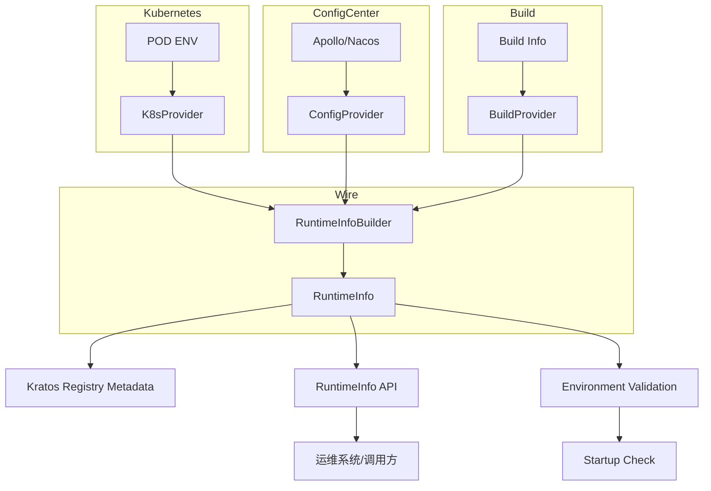

# RuntimeInfo 模块需求文档

## 1. 项目背景

在基于 Kratos 构建的微服务系统中，服务实例通常运行在 Kubernetes 集群中。每个 Pod 实例都具有独立的运行时上下文信息，如服务名、命名空间、PodName、PodIndex、AppId、ArtifactId、RegionId 等。这些信息在以下场景中非常关键：

- **服务发现与路由**：按 PodIndex 做哈希路由，支持 StatefulSet 部署
- **运维可观测性**：按 Namespace/Pod/Region 显示运行信息
- **灰度与分流**：基于 metadata 做策略分配
- **配置管理**：从配置中心获取应用配置信息
- **环境验证**：确保 regionId 与 namespace 匹配

目前缺乏一个统一的模块来采集、维护并暴露这些运行时信息，导致代码重复、信息获取不一致，给调试和运维带来困难。

### 目标

- 提供一个 **runtimeinfo 模块**，统一封装运行时信息的采集与暴露
- 与 Kratos 的服务注册 (`registry.ServiceInstance`) 和 K8s 部署机制紧密结合
- 支持配置中心集成，提供环境验证和配置管理能力

### 范围

- 维护"当前服务实例"的运行时信息，不负责全局 CMDB 管理
- 通过 API/Metadata 提供服务发现与外部系统的调用支持
- 支持配置中心集成和本地环境回退

## 2. 功能目标

提供统一的运行时信息接口，所有服务可无差异访问自身信息。

### 启动时自动加载并解析

- Pod 环境变量（POD_NAME、POD_NAMESPACE、TPF_NAMESPACE 等）
- 配置中心信息（appId、artifactId、regionId、channelId 等）
- 构建信息（版本、构建时间等）

### 核心功能

- 将运行时信息注入 Kratos 注册中心的 Metadata，支持服务发现和路由
- 对外暴露查询接口（HTTP/gRPC），支持运维系统调用
- 环境验证：确保 regionId 与 namespace 匹配，防止配置错误

### 可量化指标

- 服务启动后 runtimeinfo 能在 **100ms** 内完成初始化
- runtimeinfo 提供的 API 在 **1ms** 内返回本地信息
- **100%** 覆盖以下字段：ServiceName、Version、Namespace、PodName、PodIndex、AppId、ArtifactId、RegionId

## 3. 功能需求（FR）

| 编号 | 功能描述 | 优先级 | 验收标准 |
|------|----------|--------|----------|
| FR-01 | 提供统一调用接口协议（RuntimeInfo 结构体 + Getter 接口） | 🔴 高 | 任意模块均可调用 `runtimeinfo.Get()` 获取实例信息 |
| FR-02 | 支持从 K8s DownwardAPI 注入环境变量获取运行时信息 | 🔴 高 | 能正确解析 POD_NAME、POD_NAMESPACE、TPF_NAMESPACE，并计算 PodIndex |
| FR-03 | 将运行时信息注入 Kratos 服务注册的 Metadata | 🔴 高 | 在 etcd/consul/nacos/k8s registry 中可见 namespace/podIndex/regionId 信息 |
| FR-04 | 提供 gRPC/HTTP API 接口查询运行时信息 | 🔴 高 | `/server/info` 返回 JSON，包含完整的服务信息 |
| FR-05 | 支持配置中心集成，获取 appId、artifactId、regionId 等配置 | 🔴 高 | 能从配置中心读取配置，支持本地环境回退 |
| FR-06 | 环境验证：检查 regionId 是否与 namespace 匹配 | 🔴 高 | 启动时验证配置一致性，不匹配时阻止服务启动 |
| FR-07 | 支持本地调试模式，提供默认值回退 | 🟡 中 | 本地开发时能提供合理的默认值 |
| FR-08 | 允许自定义扩展字段（zone、channel、自定义标签） | 🟢 低 | Metadata 可额外添加 key-value |

## 4. 非功能需求（NFR）

- **可扩展性**：允许扩展更多运行时信息字段（如节点 IP、zone、region、channel）
- **隔离性**：不同服务的 runtimeinfo 互不影响，独立维护
- **灵活性**：支持非 K8s 环境，回退到本地 hostname/配置文件
- **通用性**：独立 Go 模块，可复用在任意 Kratos 服务中
- **配置驱动**：支持配置中心集成，动态获取配置信息
- **环境感知**：自动识别运行环境，提供相应的信息获取策略

## 5. 核心设计规则

1. **单一职责**：只负责采集和暴露运行时信息
2. **接口优先**：提供统一接口，不暴露内部实现
3. **可扩展性**：允许增加字段与数据源
4. **模块边界清晰**：不做配置管理或服务治理
5. **观测性内建**：支持 Prometheus metrics，暴露基本运行时标签
6. **失败优雅降级**：若无法获取 PodIndex/Namespace，自动降级为默认值
7. **配置验证**：启动时验证关键配置的一致性
8. **环境适配**：支持 Kubernetes 和本地开发环境

## 6. 核心设计

### 架构图



### 核心接口

#### RuntimeInfo 结构体

```go
// RuntimeInfo 结构体 - 对应 Java ServerInfo
type RuntimeInfo struct {
    ServiceName string            // 服务名称
    Version     string            // 版本信息
    Namespace   string            // 命名空间
    PodName     string            // Pod 名称
    PodIndex    string            // Pod 索引
    AppId       string            // 应用 ID
    ArtifactId  string            // 构建产物 ID
    RegionId    string            // 区域 ID
    ChannelId   string            // 渠道 ID
    Metadata    map[string]string // 扩展元数据
}

// Provider 接口 - 支持不同信息源
type Provider interface {
    // GetName 获取 Provider 名称
    GetName() string
    
    // GetPriority 获取 Provider 优先级（数字越小优先级越高）
    GetPriority() int
    
    // CanProvide 检查是否能提供指定字段
    CanProvide(field string) bool
    
    // Provide 提供指定字段的值
    Provide(field string) (string, error)
    
    // Validate 验证 Provider 配置
    Validate() error
}

// RuntimeInfoBuilder 运行时信息构建器
type RuntimeInfoBuilder interface {
    // Build 构建完整的 RuntimeInfo
    Build() (*RuntimeInfo, error)
    
    // SetField 设置指定字段
    SetField(field, value string)
    
    // GetField 获取指定字段
    GetField(field string) string
}

// 对外访问 - 通过 Wire 注入
var runtimeInfo *RuntimeInfo

// Get 获取运行时信息（Wire 注入后使用）
func Get() *RuntimeInfo
func GetServerInfo() *RuntimeInfo
func GetInstName() string
func IsLocalDebug() bool
```

### 数据模型与协议

#### gRPC/HTTP API

```protobuf
message ServerInfo {
    string serviceName = 1;
    string version = 2;
    string namespace = 3;
    string podName = 4;
    string podIndex = 5;
    string appId = 6;
    string artifactId = 7;
    string regionId = 8;
    string channelId = 9;
    map<string,string> metadata = 10;
    bool localDebug = 11;
}
```

#### HTTP 返回 JSON

```json
{
    "serviceName": "game-server",
    "version": "v1.0.0",
    "namespace": "default",
    "podName": "game-server-0",
    "podIndex": "0",
    "appId": "game-server-prod",
    "artifactId": "game-server",
    "regionId": "default-region-001",
    "channelId": "official",
    "metadata": {
        "zone": "cn-shanghai",
        "workloadReplicas": "3"
    },
    "localDebug": false
}
```

### 使用示例

```go
// 通过 Wire 注入获取运行时信息
type MyService struct {
    runtimeInfo *RuntimeInfo
}

func NewMyService(runtimeInfo *RuntimeInfo) *MyService {
    return &MyService{runtimeInfo: runtimeInfo}
}

func (s *MyService) HandleRequest() {
    fmt.Println("Service:", s.runtimeInfo.ServiceName, "PodIndex:", s.runtimeInfo.PodIndex)
    fmt.Println("Region:", s.runtimeInfo.RegionId, "AppId:", s.runtimeInfo.AppId)
}

// 在 Kratos 应用中使用
func main() {
    app := kratos.New(
        kratos.Name("my-service"),
        kratos.Server(
            http.NewServer(),
            grpc.NewServer(),
        ),
    )
    
    // Wire 会自动注入 RuntimeInfo
    app.Run()
}

// Kratos 注册时
instance := &registry.ServiceInstance{
    Name: runtimeInfo.ServiceName,
    Version: runtimeInfo.Version,
    Metadata: map[string]string{
        "namespace": runtimeInfo.Namespace,
        "podIndex":  runtimeInfo.PodIndex,
        "regionId":  runtimeInfo.RegionId,
        "appId":     runtimeInfo.AppId,
    },
}
```

## 7. 约束与边界

### 依赖模块

- Kratos registry
- K8s DownwardAPI 或环境变量
- 配置中心客户端（可选）
- 构建信息（BuildProperties）

### 功能边界

- 只负责"当前实例"的运行时信息，不做全局服务管理
- 支持配置中心集成，但不负责配置的持久化存储
- 提供环境验证，但不负责配置的修复

### 支持场景

- Kubernetes StatefulSet/Deployment
- 本地开发环境
- 配置中心集成环境

## 8. 模块目录规划与文件预期

```
runtime/
├── types.go              # 核心数据模型定义
├── interfaces.go         # 接口定义，支持不同 Provider
├── wire.go               # Wire 依赖注入配置
├── builder.go            # RuntimeInfo 构建器实现
├── provider/
│   ├── k8s_provider.go  # 从 k8s ENV 获取 Pod 信息
│   ├── config_provider.go # 从配置中心获取 appId/artifactId/regionId/channelId
│   └── build_provider.go # 从构建信息获取版本等
├── api/
│   ├── runtime.proto     # gRPC/HTTP 接口定义
│   └── handler.go        # API 实现
├── example/
│   └── main.go           # 示例代码
└── README.md             # 模块说明
```

## 9. 验收标准

### 基础功能

- ✅ 本地启动时能正确打印 runtimeinfo 信息
- ✅ 在 K8s StatefulSet 中能正确解析 PodIndex
- ✅ Kratos 注册中心 Metadata 包含 namespace/podIndex/regionId
- ✅ `/server/info` API 正确返回 JSON

### 配置集成

- ✅ 能从配置中心读取 appId、artifactId、regionId
- ✅ 支持本地环境回退到默认值
- ✅ 启动时验证 regionId 与 namespace 匹配

### 环境适配

- ✅ 在非 K8s 环境下，能回退到默认值（namespace=default, podIndex=0）
- ✅ 支持本地调试模式，提供合理的默认值
- ✅ 环境变量缺失时能优雅降级

### 性能要求

- ✅ 服务启动后 runtimeinfo 能在 **100ms** 内完成初始化
- ✅ runtimeinfo 提供的 API 在 **1ms** 内返回本地信息
- ✅ 配置验证在启动时快速完成，不影响服务启动时间