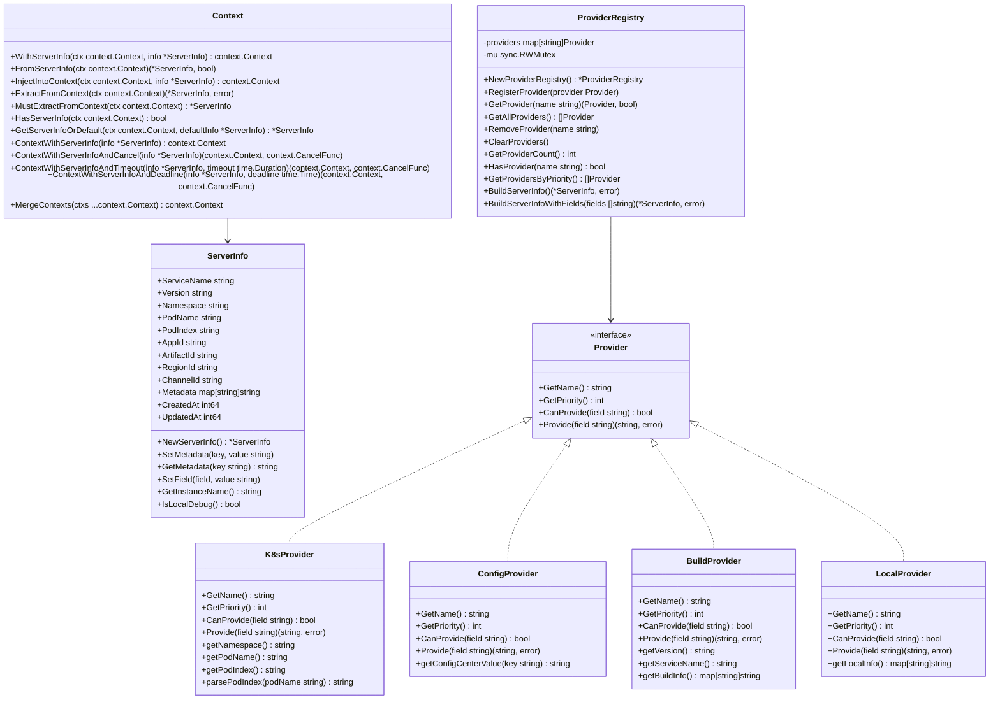

# ServerInfo 模块任务清单

## 1. 功能目录结构图及文件规划信息

```
serverinfo/
├── types.go                 # 核心数据模型定义
├── interfaces.go            # 接口定义，支持不同 Provider
├── context.go              # Context 注入支持
├── wire.go                 # Wire 依赖注入配置
├── registry.go             # Provider 注册表实现
├── provider/
│   ├── k8s_provider.go     # 从 k8s ENV 获取 Pod 信息
│   ├── config_provider.go  # 从配置中心获取 appId/artifactId/regionId/channelId
│   ├── build_provider.go   # 从构建信息获取版本等
│   └── local_provider.go   # 本地环境信息
├── todo/                   # 任务文档
└── README.md               # 模块说明
```

## 2. 类图



## 3. 调用流程图

```mermaid
flowchart TD
    A[应用启动] --> B[创建 ProviderRegistry]
    B --> C[注册各种 Provider]
    C --> D[K8sProvider]
    C --> E[ConfigProvider]
    C --> F[BuildProvider]
    C --> G[LocalProvider]
    
    H[构建 ServerInfo] --> I[调用 registry.BuildServerInfo()]
    I --> J[按优先级获取 Provider]
    J --> K[遍历 Provider 获取字段值]
    K --> L[设置 ServerInfo 字段]
    L --> M[返回完整的 ServerInfo]
    
    N[Context 注入] --> O[调用 WithServerInfo]
    O --> P[将 ServerInfo 注入 Context]
    P --> Q[在请求处理中使用]
    
    R[请求处理] --> S[从 Context 获取 ServerInfo]
    S --> T{Context 中有 ServerInfo?}
    T -->|是| U[使用 Context 中的信息]
    T -->|否| V[从注册表构建 ServerInfo]
    V --> U
```

## 4. 任务列表

| 任务 | 状态 | 优先级 | 完成度 | 责任人 | 预计完成时间 | 备注 |
|------|------|--------|--------|--------|--------------|------|
| Task-01 | ✅ 已完成 | 🔴 高 | 100% | 待分配 | - | 定义核心数据模型和接口 |
| Task-02 | ✅ 已完成 | 🔴 高 | 100% | 待分配 | - | 实现 K8s Provider（Pod 信息） |
| Task-03 | ✅ 已完成 | 🔴 高 | 100% | 待分配 | - | 实现本地环境信息 Provider |
| Task-04 | ✅ 已完成 | 🔴 高 | 100% | 待分配 | - | 实现配置中心集成 Provider |
| Task-05 | ✅ 已完成 | 🔴 高 | 100% | 待分配 | - | 实现构建信息 Provider（版本等） |
| Task-06 | ✅ 已完成 | 🔴 高 | 100% | 待分配 | - | 实现 Provider 注册表 |
| Task-07 | ✅ 已完成 | 🔴 高 | 100% | 待分配 | - | 实现全局注册表配置 |
| Task-08 | ✅ 已完成 | 🟡 中 | 100% | 待分配 | - | 实现 ServerInfo Context 注入支持 |
| Task-09 | 🔄 进行中 | 🟡 中 | 80% | 待分配 | - | 编写单元测试 |
| Task-10 | ❌ 未开始 | 🟢 低 | 0% | 待分配 | - | 性能优化和观测性增强 |

## 5. 迁移说明

本模块从 Java 的 `RootModuleImpl` 迁移到 Go，主要包含：

1. **数据模型迁移**：`ServerInfo` → `ServerInfo`
2. **接口方法迁移**：`getServerInfo()`, `getInstName()`, `isLocalDebug()`
3. **架构重构**：使用 Provider 注册表管理，支持多 Provider 组合
4. **Provider 分离**：K8s Provider 获取 Pod 信息，配置中心 Provider 获取业务配置，构建 Provider 获取版本信息
5. **注册表模式**：使用 ProviderRegistry 管理所有 Provider，支持优先级排序
6. **生命周期管理**：启动时初始化、PostConstruct 逻辑，启动后不再更新
7. **Context 注入**：ServerInfo 的 Context 注入和提取支持
8. **内部功能模块**：作为内部功能模块，不对外提供API接口，专注于服务器信息管理
9. **配置结构统一**：配置结构定义统一放在 `types.go` 中，避免分散管理
10. **Provider 注册表**：使用 ProviderRegistry 管理 Provider，支持在任何地方构建 ServerInfo

## 6. 技术栈

- **框架**：Kratos
- **依赖注入**：Provider 注册表 + Google Wire（可选）
- **数据存储**：环境变量、配置中心、构建信息
- **API**：无（内部功能模块）
- **测试**：Go testing + testify
- **配置**：环境变量 + 配置中心（Apollo/Nacos）
- **观测性**：Prometheus + OpenTelemetry
- **设计原则**：启动时初始化，启动后不再更新，多 Provider 组合，Provider 注册表管理

## 7. Context 注入功能设计

### 7.1 核心接口

```go
// context.go
type serverInfoKey struct{}

// WithServerInfo 将 ServerInfo 注入到 context
func WithServerInfo(ctx context.Context, info *ServerInfo) context.Context {
	return context.WithValue(ctx, serverInfoKey{}, info)
}

// FromServerInfo 从 context 中获取 ServerInfo
func FromServerInfo(ctx context.Context) (*ServerInfo, bool) {
	info, ok := ctx.Value(serverInfoKey{}).(*ServerInfo)
	return info, ok
}

// InjectIntoContext 注入 ServerInfo 到 Context
func InjectIntoContext(ctx context.Context, info *ServerInfo) context.Context {
    return WithServerInfo(ctx, info)
}

// ExtractFromContext 从 Context 中提取 ServerInfo
func ExtractFromContext(ctx context.Context) (*ServerInfo, error) {
    info, ok := FromServerInfo(ctx)
    if !ok {
        return nil, fmt.Errorf("ServerInfo not found in context")
    }
    return info, nil
}
```

### 7.2 使用场景

1. **中间件注入**：在 HTTP/gRPC 中间件中自动注入 ServerInfo
2. **请求追踪**：在请求处理过程中传递服务器信息
3. **日志记录**：在日志中自动包含服务实例信息
4. **监控指标**：在监控指标中标识服务实例
5. **服务发现**：在服务注册时包含运行时信息

### 7.3 集成方式

- **Kratos 中间件**：通过中间件自动注入 ServerInfo
- **gRPC 拦截器**：在 gRPC 调用中自动处理
- **HTTP 中间件**：在 HTTP 请求中自动注入
- **任务调度**：在后台任务中传递服务器信息

## 8. 当前实现状态

### ✅ 已完成功能

1. **核心数据模型**：ServerInfo 结构体及所有基础方法
2. **Provider 接口**：完整的 Provider 接口定义
3. **Provider 实现**：K8s、Config、Build、Local 四个 Provider
4. **注册表管理**：ProviderRegistry 支持注册、管理、构建 ServerInfo
5. **Context 注入**：完整的 Context 注入和提取功能
6. **Wire 支持**：简化的 Wire 配置
7. **基础测试**：核心功能的单元测试

### 🔄 进行中功能

1. **单元测试**：Provider 测试需要环境变量配置优化
2. **测试覆盖率**：需要提高测试覆盖率

### ❌ 待实现功能

1. **性能优化**：Provider 缓存机制
2. **观测性增强**：监控指标和日志优化
3. **错误处理**：更完善的错误处理机制

## 9. 下一步计划

1. **完善测试**：修复 Provider 测试中的环境变量问题
2. **性能优化**：添加 Provider 结果缓存
3. **观测性**：集成 Prometheus 指标和结构化日志
4. **文档完善**：添加使用示例和最佳实践
